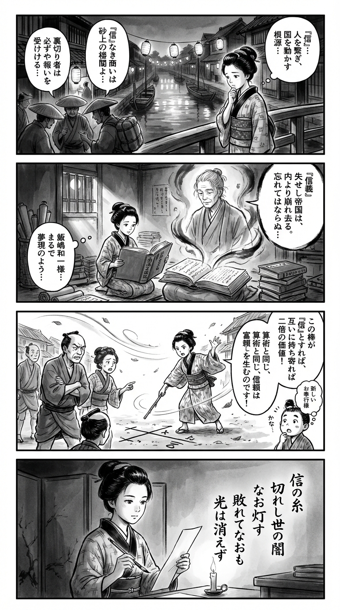

---
---
> **Language**: [日本語](../ja/飯嶋和一-南海王国記_review.html) | [English](../en/飯嶋和一-南海王国記_review.html) | [繁體中文](../zh-tw/飯嶋和一-南海王国記_review.html)
>
> [← Top / トップページ](../../)

## 📖 Book Information
- **Title**: 南海王国記  
- **Author**: 飯嶋和一  
- **ASIN**: B0FJW13CT8  
- **URL**: [https://www.amazon.co.jp/dp/B0FJW13CT8](https://www.amazon.co.jp/dp/B0FJW13CT8)  

---

## Dialogue

### Panel 1
**Scene**: In a quiet Edo backstreet at dusk, a young townsgirl in a kimono pauses by a lantern-lit canal. She overhears merchants arguing about trust and betrayal in trade. The wind stirs the paper lanterns and ripples the water as she reflects on how the single character “信” — trust — shapes both people and nations.  
**Dialogue**: (She murmurs to herself) “What is a world without trust…?”

### Panel 2
**Scene**: In her small study, scrolls and Dutch books lie scattered. She opens a heavy volume titled *Chronicles of the Southern Seas*. From its pages, the imagined figure of an elderly scholar materializes — calm-eyed, modestly robed, his presence half-real, half-ink dream. He seems to speak softly about faith, justice, and the fall of corrupt empires.  
**Dialogue**: (The scholar’s voice) “When trust fades, even the mightiest realm crumbles.”

### Panel 3
**Scene**: Inspired, the townsgirl gathers her quarrelling neighbors. On the ground, she draws a line in the dirt, explaining with arithmetic and logic how shared trust multiplies value — just as nations prosper through faith. Her sleeves flutter in the wind as she speaks earnestly. A child, misunderstanding, bows and whispers, “Is she the new magistrate?”  
**Dialogue**: (Townsgirl) “When we trust each other, our worth grows together.”

### Panel 4
**Scene**: Night deepens. By candlelight, she writes a tanka on a narrow strip of paper, her eyes calm yet resolute, reflecting the flame’s glow.  
**Dialogue**: (Softly) “Even in darkness, trust can still shine.”  
**Tanka (translation)**:  
Threads of trust, once torn,  
still light the world’s darkened night—  
defeated, yet still,  
the flame endures unbroken,  
its quiet glow never fades.  
**Tanka (original)**:  
信の糸　  
切れし世の闇　  
なお灯す　  
敗れてなおも　  
光は消えず

## 🎯 Core of the Book
*南海王国記* is a historical epic set during the turbulent transition from the Ming to the Qing dynasty in East Asia. It portrays the “rebirth of a nation through faith and integrity.” The protagonist, Zheng Chenggong, witnesses the collapse of the corrupt Ming dynasty and strives to base both politics and human relationships on the Confucian principle of *xin* (trust and faith).  

However, his idealistic path is obstructed by harsh realities—his father Zheng Zhilong’s betrayal, the pressure of the Qing forces, and the disillusionment of the people. Through this conflict between ideal and reality, loyalty and filial duty, the individual and the state, Iijima Kazuichi presents a profound spiritual proposition: “True victory lies within defeat.”  

This work transcends the boundaries of a mere historical novel, inviting readers to reflect deeply on the relationship between governance and ethics, faith and power.

---

## 💡 Key Insights
- **“Faith” as the foundation of society**  
  Zheng Chenggong insists that “faith and integrity are what make us human,” and he strives to uphold this principle in politics, economics, and warfare alike. The warning that the loss of trust leads to the collapse of a nation conveys a timeless ethical message that resonates even today.  

- **The collapse of political ethics destroys nations**  
  The fall of the Ming dynasty is depicted as the inevitable result of rulers obsessed with maintaining power while neglecting the people. Through this history, Iijima illustrates how the absence of humane governance corrodes society from within.  

- **The emergence of a new order through maritime commerce**  
  Zheng Zhilong and other maritime merchants create an economic sphere that transcends national boundaries, hinting at the potential of private enterprise to forge new orders. The rise of civilian agency amid state decline mirrors the ethical challenges of globalization today.  

- **The conflict between loyalty and filial piety as a test of ethics**  
  Zheng Chenggong’s defiance of his father’s surrender to the Qing symbolizes the human choice to uphold faith over blood ties. By reinterpreting Confucian values, the novel explores how personal conviction can be elevated into universal justice.  

- **Spiritual victory within defeat**  
  Even after the dream of an ideal state collapses, Zheng Chenggong’s faith endures in the hearts of the people. This perspective—that ethical values are preserved through defeat—illuminates the enduring dignity of humanity.

---

## 🔍 Relevance to the Modern World
In today’s world, crises of trust are evident in politics, business, and personal relationships alike. The theme of “the loss and restoration of faith” in *南海王国記* serves as an allegory for how power exercised without ethics can destroy communities.  

Moreover, the formation of transnational economic zones in the global economy parallels the maritime networks of the late Ming period. Through history, Iijima compels us to reconsider the fragility of prosperity built without integrity.  

Zheng Chenggong’s unwavering pursuit of ideals, even in the face of defeat, also serves as a critique of modern leadership that prioritizes short-term results. The story quietly advocates for leadership grounded in ethics and trust.

---

## 🚀 Practical Applications
- **Make integrity your guiding principle**  
  Prioritizing trust over short-term gain leads to long-term stability. When individuals and organizations make decisions rooted in faith and reliability, they build sustainable relationships.  

- **Cultivate ethical leadership**  
  Like Zheng Chenggong, leaders should value the righteousness of their means over the success of their ends. A commitment to trust rather than power is what sustains true organizational strength.  

- **Balance ideals and reality**  
  While holding onto ideals is vital, real progress requires practical strategy and flexibility. The harmony between idealism and pragmatism is key to solving modern challenges.  

- **Learn ethics from history**  
  The fall of the Ming dynasty and Zheng Chenggong’s defeat illustrate the fate of power devoid of ethics. History should be read not merely as the past but as a warning to the present.  

- **Preserve and pass on ideals**  
  Like Zhu Zhiyu, who continued to transmit his ideas even in defeat, the effort to pass down values such as integrity and public-mindedness forms the foundation of culture and education. This continuity of thought sustains the renewal of society.

---

## ⭐ Overall Evaluation
*南海王国記* is a grand historical epic that depicts the intersection of ethics and politics, ideals and reality, through the lives of those who upheld faith amid the torrents of history. Iijima Kazuichi’s prose transcends historical fact to vividly portray humanity’s inner spiritual struggle.  

Combining the scale of historical fiction with the depth of philosophical inquiry, this book serves as a timeless mirror for readers—especially leaders and thinkers—who seek to question ethics in the modern age. The experience of finding light within defeat invites readers to reexamine their own sense of “faith.”

---

&copy; shioki | [CC BY-NC-SA 4.0](https://creativecommons.org/licenses/by-nc-sa/4.0/)
