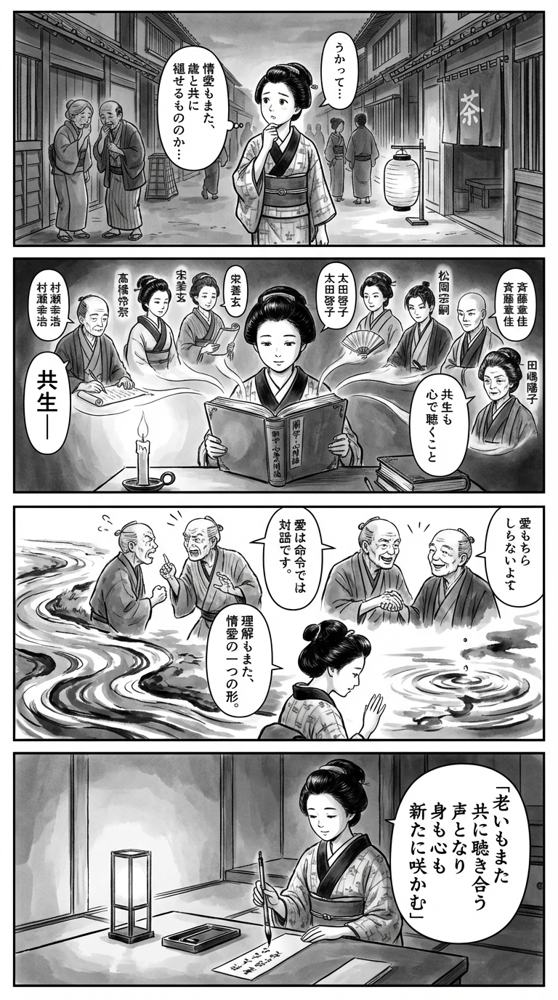

> **Language**: [日本語](../ja/５０歳からの性教育_review.html) | [English](../en/５０歳からの性教育_review.html) | [繁體中文](../zh-tw/５０歳からの性教育_review.html)
>
> [← Top / トップページ](../../)

## 📖 Book Information
- **Title**: ５０歳からの性教育  
- **Author**: 村瀬幸浩, 髙橋怜奈, 宋美玄, 太田啓子, 松岡宗嗣, 斉藤章佳, and 田嶋陽子  
- **ASIN**: B0C5XDNJQD  
- **URL**: [https://www.amazon.co.jp/dp/B0C5XDNJQD](https://www.amazon.co.jp/dp/B0C5XDNJQD)  

---

<picture>
  <source srcset="../../images/reviews/５０歳からの性教育_4panel.webp" type="image/webp">
  
</picture>

## Dialogue

### Panel 1
**Scene**: The townsgirl strolls through an Edo street at dusk, overhearing older couples whispering shyly about aging and love. She pauses by a paper lantern, looking puzzled and murmuring about how even affection seems to fade with the years. The background features wooden houses, a small teahouse, and townsfolk passing by.
**Dialogue**: "Even love seems to fade with the years..."

### Panel 2
**Scene**: Inside a candle-lit study, the townsgirl opens a thick imported book titled in Dutch and Japanese about “relations of the body and spirit.” From the pages, seven imagined figures of wise teachers emerge, each depicted as Edo-style scholars: a calm elder scribe, a poised healer, a thoughtful midwife, a resolute woman lawyer, a youthful androgynous philosopher, a stern monk-like counselor, and a dignified elder lady. They softly discuss “coexistence” and “listening with the heart.”
**Dialogue**: "Coexistence... listening with the heart..."

### Panel 3
**Scene**: The townsgirl visits a riverside where two elders are arguing. She gently intervenes, offering insights from her reading — that love is not command but conversation. The argument softens, and they share laughter. She gazes at the water's reflection, realizing that understanding is also a kind of affection. Bold ink strokes symbolize rippling empathy in the composition.
**Dialogue**: "Love is not command, but conversation."

### Panel 4
**Scene**: In her quiet room under lamplight, the townsgirl writes a waka on a narrow tanzaku, her eyes serene. The short poem appears in elegant brush calligraphy.
**Dialogue**: (none)
**Tanka (translation)**: "Aging too, becomes a voice that listens together, both body and spirit, blooming anew."
**Tanka (original)**: 「老いもまた  
　共に聴き合う  
　声となり  
　身も心も  
　新たに咲かむ」

## 🎯 The Core of This Book
『50歳からの性教育』 is a re-educational book aimed at individuals entering the later stages of life, encouraging them to reassess their way of living through the lens of "sex." It reframes menopause and bodily changes not as an "end" but as the "beginning of new relationships," promoting self-understanding and understanding of others through sexuality.

At the heart of this book lies a clear awareness of the shift from "domination" to "coexistence." By redefining sex not merely in terms of "reproduction" or "pleasure," but as a mirror reflecting social structures and gender imbalances, it proposes the reconstruction of mature human relationships.

The authors, a diverse group of professionals including doctors, lawyers, and educators, discuss issues ranging from personal bodies to social systems. Readers can gain wisdom to redesign their relationships with others through "sex education."

---

## 💡 Key Insights
- **Shift to "Pleasurable Coexistence"**  
  Sexuality in later life transitions from an emphasis on "excitement" to one on "intimacy." This represents a mature relationship that deepens emotional connections while accepting physical changes.

- **"Domineering" is an Extension of Control**  
  Sexual domination is closely linked to everyday "arrogance" and "superiority." Letting go of a dominating attitude is the first step toward transforming not just sexuality but life as a whole.

- **The Importance of Reclaiming "Feel"**  
  A culture that suppresses men's emotions fosters a lack of empathy and a breeding ground for harmful behavior. Verbalizing one's emotions and listening to others' feelings are key to reducing violence.

- **"Sex Education" as Social Redesign**  
  Sex education is not merely about knowledge transfer; it is an endeavor to learn how to build relationships between individuals. It is redefined as an education that reassesses relationships within families, workplaces, and society as a whole.

- **"Listening Skills" as a Responsibility of the Powerful**  
  Criticizing the cultural conditioning of "even if you don't like it, you still like it," the book emphasizes the importance of those in power accurately hearing the words of others. The ability to listen becomes a turning point toward a coexistence society.

---

## 🔍 Relevance to Contemporary Context
In modern Japan, discussions around menopause and sexuality are still often considered taboo. However, with the improvement of women's quality of life and the expansion of the femtech market, a shift in consciousness is underway. The reevaluation of "sex and health" among middle-aged and older generations resonates with the trends of social inclusion and gender equality.

The "sex education from age 50" proposed in this book responds precisely to this contemporary shift. By sharing menopause as a "social issue" rather than just an "individual problem," and by reconstructing relationships with others through sexuality, it offers practical insights for enriching human relationships in a super-aged society.

Moreover, understanding LGBTQ+ and diverse sexualities as "not distant issues" but as "the realities of our neighbors" is an essential attitude for building an inclusive society.

---

## 🚀 Suggestions for Practice
1. **Learn About Menopause as "Your Own Issue"**  
   Understanding the bodily changes of partners and colleagues can foster supportive relationships. Knowledge breeds imagination and serves as a power to prevent isolation.

2. **Expand the Definition of Sex**  
   Focus on touch and physical affection rather than limiting it to penetration or ejaculation. This practice nurtures emotional intimacy while accepting bodily changes.

3. **Cultivate the Habit of Expressing "Feel"**  
   By not suppressing emotions and sharing them verbally, we can prevent violence and misunderstandings. Valuing one's own emotions is the first step toward empathy for others.

4. **Train Your "Listening Skills"**  
   Consciously practice accurately receiving the words of others. Those in stronger positions can correct relational asymmetries by adopting a listening attitude.

5. **View Diverse Sexualities as "Close Issues"**  
   Imagine sexual minorities not as "distant beings" but as people who are part of everyday life. Understanding and imagination are the most reliable ways to reduce discrimination.

---

## ⭐ Overall Evaluation
『50歳からの性教育』 is a mature book that reconsiders sexuality as "the reconstruction of a way of living." For older readers, it serves as a compass for positively embracing changes in their bodies and relationships.

Additionally, it holds significant educational value by illuminating social issues such as sexual violence and gender imbalance through personal consciousness transformation. This book encourages intellectual dialogue to break the silence surrounding sexuality, promoting the acts of "listening," "speaking," and "supporting" each other.

---

&copy; shioki | [CC BY-NC-SA 4.0](https://creativecommons.org/licenses/by-nc-sa/4.0/)
