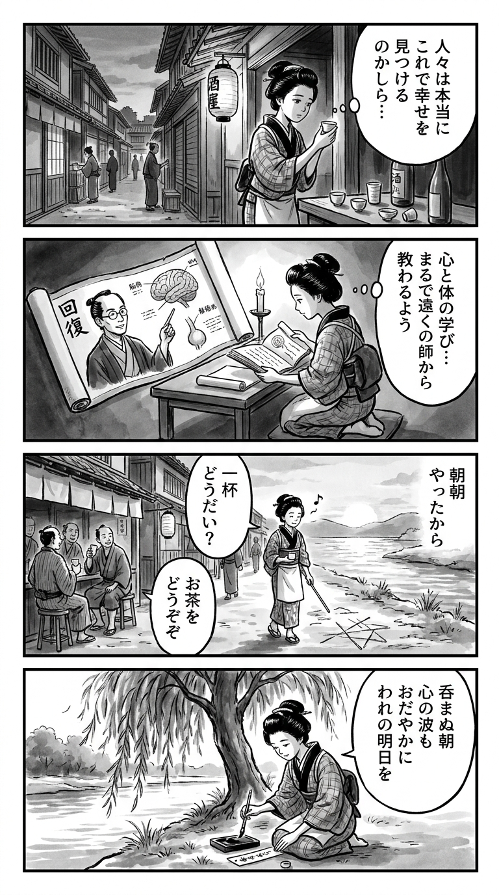

> **Language**: [日本語](../ja/「そろそろ、お酒やめようかな」と思ったときに読む本_review.html) | [English](../en/「そろそろ、お酒やめようかな」と思ったときに読む本_review.html) | [繁體中文](../zh-tw/「そろそろ、お酒やめようかな」と思ったときに読む本_review.html)
>
> [← Top / トップページ](../../)

## 📖 書籍情報
- **タイトル**: 「そろそろ、お酒やめようかな」と思ったときに読む本  
- **著者**: 垣渕 洋一  
- **ASIN**: B08R61NWL3  
- **URL**: [https://www.amazon.co.jp/dp/B08R61NWL3](https://www.amazon.co.jp/dp/B08R61NWL3)

---

<picture>
  <source srcset="../../images/reviews/「そろそろ、お酒やめようかな」と思ったときに読む本_4panel.webp" type="image/webp">
  
</picture>
## 🎯 この本の核心
本書は、アルコール依存の構造と回復のプロセスを、医学と心理学の両面から解き明かす実践的なガイドである。著者の垣渕洋一は、依存症を「意志の弱さ」ではなく「治療すべき病」として捉え、科学的根拠と臨床的知見をもとに、読者が自らの飲酒行動を見つめ直すための手がかりを提示している。  

特に、禁酒の過程を「脳の再学習」として説明する点が特徴的であり、単なる精神論ではなく、身体と心の変化を段階的に理解する構成となっている。また、依存症からの回復を「治癒」ではなく「回復」と定義し、仲間や環境の支えを重視する姿勢が貫かれている。

---

## 💡 キーインサイト
- **依存症の見極めは「翌朝」にある**  
　翌朝の体調と行動が、単なる飲みすぎと依存症を分ける重要なサインである。朝酒で症状が落ち着くようなら、すでに依存の段階に入っていると警鐘を鳴らす。

- **アルコールの健康メリットは幻想**  
　著者は「肉体的な健康という視点でのメリットはゼロ」と断言する。飲酒文化に根付いた「適量なら健康に良い」という通念を覆し、科学的根拠に基づく再考を促す。

- **禁酒は「90日」で脳が再学習する**  
　禁酒は意志ではなく習慣の再構築であり、90日間の継続が鍵となる。脳が「飲まなくてもよい」状態を学ぶ過程を理解することで、禁酒の継続が現実的な目標となる。

- **依存症は「治癒」ではなく「回復」**  
　タクアンの比喩に象徴されるように、依存症は元に戻るものではないが、適切な支援によって「回復」は可能である。この視点が、自己否定から希望への転換を導く。

- **禁酒は人生の再投資である**  
　飲酒に費やしていた時間とエネルギーを取り戻すことが、人生の再構築につながる。禁酒は節制ではなく、幸福の再定義であると本書は説く。

---

## 🔍 現代的文脈との関連
本書の問題意識は、現代社会の健康志向と「飲まない生き方」の拡大に深く結びついている。近年、若年層を中心に“sober curious”という断酒・節酒のライフスタイルが広がり、職場や友人関係でも飲酒を前提としない交流が一般化しつつある。  

また、ノンアルコール飲料市場の拡大や、アルコールの健康リスクに関する科学的議論の進展も、本書の主張を裏づける社会的背景である。垣渕はその潮流を先取りするかのように、「飲まないこと」をポジティブな選択として描き、依存症だけでなく“飲まない生き方”そのものを提案している。

---

## 🚀 実践への提案
1. **飲酒欲求のピークを「先送り」でやりすごす**
   欲求の波は30分〜1時間で収まるため、その間を別の活動で埋める。科学的根拠に基づくこの方法は、衝動的な飲酒を防ぐ現実的な戦略である。

2. **週末の過ごし方を意識的に変える**
   家族との外出や趣味の時間を計画的に組み込むことで、飲酒を中心とした生活リズムを断ち切る。新たな充足感を得ることが、禁酒の継続を支える。

3. **「見える化」で自己認知を高める**
   飲酒量や気分を記録し、自分の行動を客観視する。認知行動療法的な手法により、無意識の習慣を意識的に書き換えることができる。

4. **仲間や支援グループに参加する**
   同じ経験を持つ人々との交流は、孤立を防ぎ、共感による心理的安定をもたらす。社会的つながりは回復の基盤である。

5. **禁酒のメリットを言語化する**
   「飲まないことで得た幸福」を具体的に書き出すことで、モチベーションが維持される。これは行動変容を持続させる心理的な補強となる。

---

## ⭐ 総合評価
本書は、アルコール依存という個人の問題を、社会的・文化的文脈の中で再定義した意欲的な一冊である。医学的知見と心理的洞察を融合させ、「飲まないこと」を幸福の選択として提示する点に独自性がある。  

特に、「回復」という概念を通じて、読者に自己否定ではなく自己回復の視点を与える点が印象的である。飲酒習慣を見直したい人だけでなく、依存や習慣の変化に関心を持つすべての読者にとって、人生の再構築を考えるための実用的かつ哲学的な手引きとなるだろう。

---

&copy; shioki | [CC BY-NC-SA 4.0](https://creativecommons.org/licenses/by-nc-sa/4.0/)
