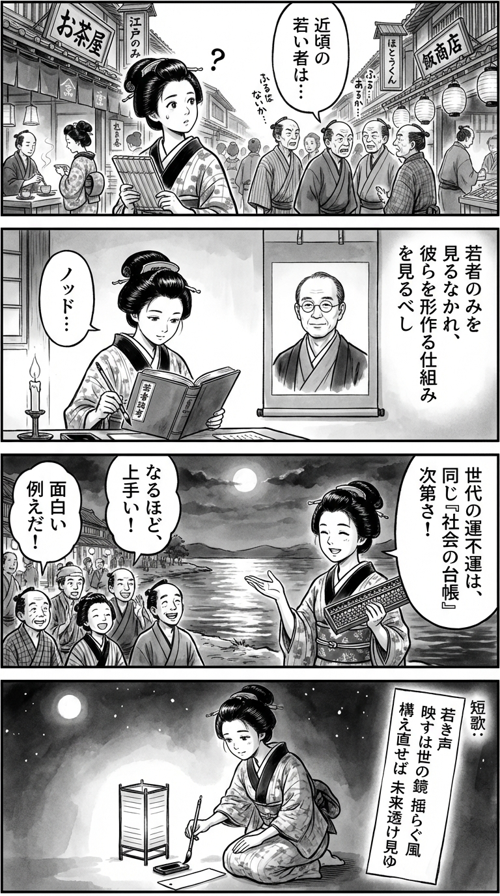

> **Language**: [日本語](../ja/「今どきの若者」のリアル_review.html) | [English](../en/「今どきの若者」のリアル_review.html) | [繁體中文](../zh-tw/「今どきの若者」のリアル_review.html)
>
> [← Top / トップページ](../../)

## 📖 書籍情報
- **タイトル**: 「今どきの若者」のリアル  
- **著者**: 山田 昌弘  
- **ASIN**: B0CN6QVHBS  
- **URL**: [https://www.amazon.co.jp/dp/B0CN6QVHBS](https://www.amazon.co.jp/dp/B0CN6QVHBS)

---

<picture>
  <source srcset="../../images/reviews/「今どきの若者」のリアル_4panel.webp" type="image/webp">
  
</picture>
## 🎯 この本の核心
本書は、現代日本における「若者像」を通して、社会構造の歪みと価値観の変容を読み解く社会分析である。著者・山田昌弘は、世代間の不平等、労働環境の変化、ジェンダー格差、そしてAI時代の言語変容といった多層的な課題を、データと実例をもとに明らかにしていく。  

単なる「若者批判」や「世代論」にとどまらず、若者の生きづらさを社会構造的に捉え直す点に本書の特徴がある。若者の承認欲求や「いい子症候群」、SNSによる自己表現の歪みを、時代の必然として位置づけることで、読者に「今の社会の鏡」としての若者像を提示している。

---

## 💡 キーインサイト
- **構造的不平等としての世代間対立**  
　若者と高齢者の対立は、単なる価値観の違いではなく、社会保障制度の偏りという構造的問題に根ざしている。著者はこの「構造的不平等」を直視することが、真の世代間理解の出発点であると指摘する。  

- **「いい子症候群」と承認文化の罠**  
　若者が「目立つこと」を恐れ、「褒められる」ことすら負担に感じる背景には、SNS時代の承認圧力がある。表面的な「共感」や「いいね」が、内面の孤立感を深める構造を描き出す。  

- **「ゆるい職場」とキャリア不安の二律背反**  
　働き方改革が進む一方で、過度な心理的安全性が若者の成長機会を奪っている。居心地の良さと自己成長の間で揺れる若者の葛藤は、現代労働の縮図である。  

- **AI時代に求められる「問う力」**  
　AIが文章を生成する時代において、人間に残された創造性は「問いを立てる力」にある。著者は教育や仕事の現場で、この能力を育む必要性を強調する。  

- **地方若者の「脱・東京」志向**  
　地方の若者が都市への憧れを失い、地域内外のネットワークを活用して新しい生き方を模索している点を描く。これは、中央集権的な社会構造の再編を示唆する兆しでもある。

---

## 🔍 現代的文脈との関連
本書の主張は、近年の若者研究や社会動向とも深く響き合う。Z世代の「デジタル疲れ」や「スマホ依存」、そして「打たれ弱い」とされるステレオタイプの再検証など、現代の若者をめぐる議論は多岐にわたる。山田はこれらの現象を、単なる世代特性ではなく社会構造の反映として捉える。  

また、若者の「脱・東京」志向や「プライベート重視」の価値観は、ポスト成長社会における新しい生の形を示している。SNSによる承認文化やAIとの共存といったテーマは、今後の教育・労働・地域社会のあり方を再考させる重要な視座を提供している。

---

## 🚀 実践への提案
1. **構造的視点から世代間対話を始める**
   感情的な「若者批判」や「老害論」ではなく、社会保障制度や雇用構造の偏りを理解することが、共通の土台を築く第一歩となる。

2. **「失敗の共有」を通じた共感の再構築**
   年長者が自身の挫折や試行錯誤を語ることで、若者が「完璧でなくてもいい」と感じられる文化を育む。これは「いい子症候群」からの解放にもつながる。

3. **キャリアの「安全性」と「成長性」を両立させる職場づくり**
   心理的安全性だけでなく、越境的な学びや挑戦機会を設けることで、若者のキャリア不安を軽減し、組織の活力を高める。

4. **教育現場で「問う力」を育てる**
   AI時代において、情報処理よりも「問いの質」が重要となる。探究型学習やディスカッションを通じて、思考の主体性を育む教育改革が求められる。

5. **地方でのハイブリッドなつながりを推進する**
   オンラインとリアルを融合した地域コミュニティを構築し、地方の若者が「地元にいながら世界とつながる」実感を持てる環境を整える。

---

## ⭐ 総合評価
『「今どきの若者」のリアル』は、世代論を超えて日本社会の構造的課題を照らし出す一冊である。著者は若者を「問題」としてではなく、「社会の変化を映す鏡」として描き、その背後にある制度・文化・心理の複雑な絡み合いを解きほぐす。  

本書は、教育者、企業人事、政策立案者、そして親世代にとっても必読の書である。読後には、「若者を理解する」とは何か、「社会を変える」とはどういうことかを、改めて考えさせられるだろう。

---

&copy; shioki | [CC BY-NC-SA 4.0](https://creativecommons.org/licenses/by-nc-sa/4.0/)
