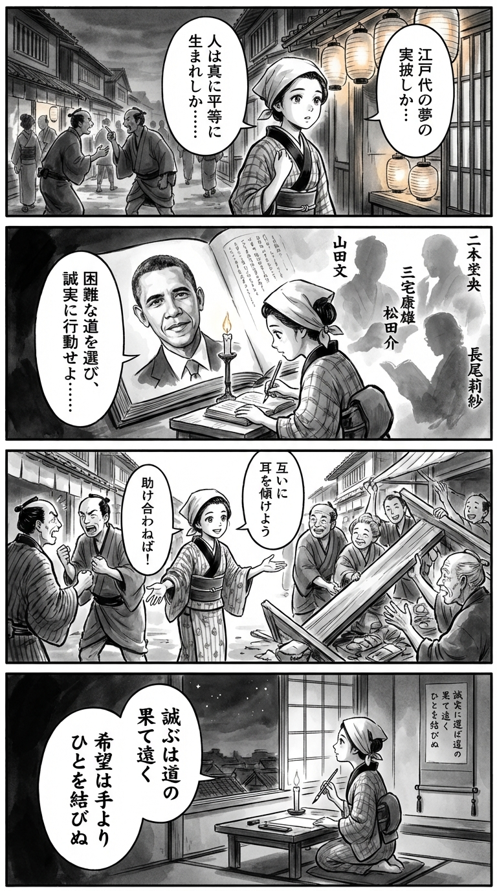

---
---
> **Language**: [日本語](../ja/【電子合本版】約束の地　大統領回顧録１ 上下_review.html) | [English](../en/【電子合本版】約束の地　大統領回顧録１ 上下_review.html) | [繁體中文](../zh-tw/【電子合本版】約束の地　大統領回顧録１ 上下_review.html)
>
> [← Top / トップページ](../../)

## 📖 書籍情報
- **タイトル**: 【電子合本版】約束の地　大統領回顧録１ 上下  
- **著者**: バラク・オバマ, 山田文, 三宅康雄, 長尾莉紗, 高取芳彦, 藤田美菜子, 柴田さとみ, 山田美明, 関根光宏, 芝瑞紀, and 島崎由里子  
- **ASIN**: B08TWPSYTK  
- **URL**: [https://www.amazon.co.jp/dp/B08TWPSYTK](https://www.amazon.co.jp/dp/B08TWPSYTK)  

---

## 🎯 この本の核心
『約束の地』は、バラク・オバマが自らの人生と政治的歩みを通して、アメリカという国家の「理念」を再定義しようとする壮大な試みである。彼は「すべての人間は生まれながらにして平等である」という独立宣言の原点に立ち返り、分断が深まる社会の中で民主主義の再生を模索する。  

同時に本書は、権力者としての自己省察の記録でもある。オバマは成功や挫折を包み隠さず描き、誠実さと共感を軸にしたリーダーシップのあり方を提示する。政治とは権力のゲームではなく、理想と現実の狭間で「誠実に選び続ける」行為であることを、彼は自らの経験をもって証明している。  

さらに、彼の語る「希望」は単なる感情ではなく、行動と責任によって支えられるものだ。若い世代への信頼、共同体の力への信念が、全編を貫く希望の源泉として描かれている。

---

## 💡 キーインサイト
- **民主主義は制度ではなく関係性である**  
　オバマは、民主主義を「他人を持ち上げる力」として描く。制度や選挙の仕組みではなく、人々の相互理解と連帯が民主主義を支えるという洞察は、現代の分断社会において極めて示唆的だ。  

- **誠実さはリーダーシップの核心である**  
　ミシェル・オバマの言葉「厳しい道を選ぶ人」は、彼の政治哲学を象徴する。容易な妥協よりも誠実な選択を重ねることが、信頼を生み、社会を前進させる力になる。  

- **失敗は成長の契機である**  
　敗北を「してはいけないことの例」として語るオバマの姿勢は、失敗を恥ではなく学びとする文化の重要性を示す。政治に限らず、個人の成長にも通じる普遍的な教訓だ。  

- **希望は行動によって現実化する**  
　「希望以上のものが必要だ」という言葉に象徴されるように、理想は行動を通してのみ実を結ぶ。希望を掲げるだけでなく、それを社会的実践に変える責任が強調されている。  

- **共同体が個人を超える力を持つ**  
　アイオワでの党員集会の描写に見られるように、政治の本質は「人々が共に動くこと」にある。個人の信念が共同体の意志と響き合うとき、社会は変化する。

---

## 🔍 現代的文脈との関連
2020年代以降、アメリカ社会は再び分断と不信の波に揺れている。医療制度改革（オバマケア）の再評価、人種正義をめぐる議論、LGBTQ権利の拡大など、オバマ政権期に始まった課題は今も続いている。彼の回顧録は、こうした現代の政治的・文化的課題を読み解くための「原点資料」としての価値を持つ。  

また、気候変動や国際協調の問題において、オバマの「希望と現実の狭間での誠実な選択」は、ポスト・トランプ時代のリーダーシップ像を考える上で重要な指針となる。日本における多様性推進や市民政治の議論にも通じる普遍的なメッセージが、彼の言葉には息づいている。

---

## 🚀 実践への提案
- **背景を隠さず語る勇気を持つ**  
　決断の裏にある文脈を共有することで、信頼が生まれる。組織や社会の中でも、透明性を重んじる姿勢が対話を促進する。  

- **失敗をデータとして扱う**  
　敗北や挫折を恐れず、次の行動の糧にする。オバマの「復活力」は、変化の時代を生き抜くための実践的知恵である。  

- **多様な声を聴く努力を続ける**  
　机上の理論よりも現場の声に耳を傾けることが、真の理解をもたらす。社会的課題の解決にもこの姿勢が不可欠だ。  

- **希望を行動に変える**  
　理想を掲げるだけでなく、日々の行動に落とし込む。「Yes We Can」はスローガンではなく、行動の哲学として捉えるべきだ。  

- **分断を超える対話を設計する**  
　異なる立場の人々をつなぐ橋を意識的に架けることが、民主主義の再生につながる。対話の場を設けること自体が、政治的行為となる。

---

## ⭐ 総合評価
『約束の地』は、単なる政治回顧録を超えた「民主主義の再定義書」である。オバマの語る誠実さと希望は、政治家だけでなく、組織のリーダー、教育者、そして市民一人ひとりに通じる普遍的な価値を示している。  

読む者は、理想と現実のあいだで揺れながらも信念を貫く人間の姿に触れるだろう。分断の時代にあって、他者とともに未来を築くための「約束」を思い出させてくれる一冊である。

---

&copy; shioki | [CC BY-NC-SA 4.0](https://creativecommons.org/licenses/by-nc-sa/4.0/)
