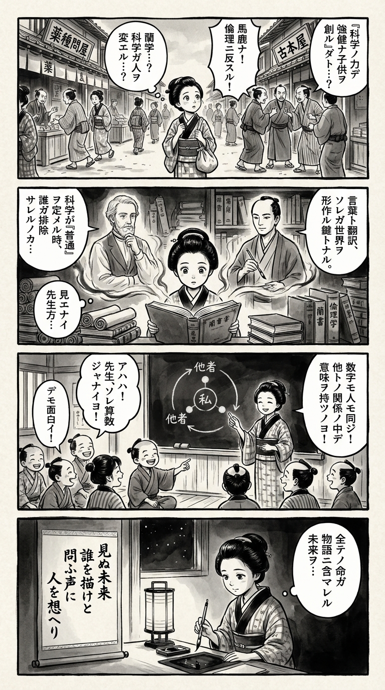

> **Language**: [日本語](../ja/あなたが消された未来――テクノロジーと優生思想の売り込みについて_review.html) | [English](../en/あなたが消された未来――テクノロジーと優生思想の売り込みについて_review.html) | [繁體中文](../zh-tw/あなたが消された未来――テクノロジーと優生思想の売り込みについて_review.html)
>
> [← Top / トップページ](../../)

## 📖 書籍情報
- **タイトル**: あなたが消された未来――テクノロジーと優生思想の売り込みについて  
- **著者**: ジョージ・エストライク and 柴田裕之  
- **ASIN**: B095SNY6YZ  
- **URL**: [https://www.amazon.co.jp/dp/B095SNY6YZ](https://www.amazon.co.jp/dp/B095SNY6YZ)

---

## 🎯 この本の核心
本書は、遺伝子編集や出生前診断などのバイオテクノロジーが、かつての優生思想を新たな形で再生産している現実を鋭く告発する。科学の進歩が「より良い人間をつくる」という名目のもとに、社会の中で誰が「正常」で誰が「異常」かを再定義していることを、著者は批判的に描き出す。  

また、障害者が議論の中で象徴的に扱われ、実際の人間として想像されない「不可視化」の構造を明らかにする。著者は、ダウン症の娘ローラとの生活を通じて、テクノロジーの倫理を個人の物語として再構成し、想像力と共感の倫理を提示する。  

本書の核心は、「誰が未来に含まれるのか」という問いである。科学の物語に隠された価値観を読み解き、未来を形づくる想像力の責任を読者に突きつける。

---

## 💡 キーインサイト
- **科学は物語として売られる**  
  科学技術は中立的な知識ではなく、「恩恵をもたらすストーリー」として売り込まれる。著者は、科学理解にはその物語構造を読み解く批判的リテラシーが不可欠であると説く。

- **障害の不可視化が倫理を歪める**  
  障害者はしばしば議論の中で「リスク」や「例外」として扱われ、実際の存在として想像されない。この不可視性が、社会の倫理的判断を狭めている。

- **市場が倫理を決める危険**  
  生命倫理の議論が市場原理に置き換えられ、消費者の選択が「倫理的な決定」として機能してしまう現実を批判する。倫理を公共的熟議の場に取り戻す必要がある。

- **「異常」は社会的構築物である**  
  遺伝子レベルでの「異常」分類は、科学的客観性を装いながら社会的差別を固定化する。著者は「正常／異常」という二分法の政治性を暴き出す。

- **未来を形づくる想像力の倫理**  
  「今日想像しそこなう人々は未来に存在しない」という警句が示すように、誰を未来に含めるかという想像力の問題こそが、テクノロジー時代の根源的な倫理課題である。

---

## 🔍 現代的文脈との関連
本書の問題意識は、AIによる遺伝子解析やNIPTの普及が進む現代において、ますます切実な意味を持つ。技術が「健康」「最適化」「リスク管理」といった言葉で包まれるとき、その背後に潜む優生的価値観は見えにくくなる。  

また、障害者の表象がメディアや広告の中で欠落している現状は、社会の想像力の限界を露呈している。著者の警告は、テクノロジー倫理を専門家の問題としてではなく、市民の想像力と責任の問題として再定義する試みである。  

現代社会において「誰が未来に含まれるのか」という問いは、AI、遺伝子、データの時代を生きる私たち全員に突きつけられている。

---

## 🚀 実践への提案
1. **科学の物語を批判的に読む**
   技術の恩恵を強調する言説の背後に、どのような価値観や排除が潜んでいるかを意識的に読み解く。これは市民が倫理的判断力を持つ第一歩である。

2. **障害者の声を社会的議論に組み込む**
   政策やメディアにおいて、障害当事者の語りを可視化する仕組みを整えることで、テクノロジーの方向性をより公正に設計できる。

3. **市場主導の倫理に抗う熟議の場を持つ**
   消費行動ではなく公共的対話によって、科学技術の是非を検討する文化を育む必要がある。

4. **メタファーの力を意識する**
   「DNA＝設計図」「遺伝子＝運命」といった比喩が現実をどう形づくるかを常に検証し、言葉の使い方に倫理的自覚を持つ。

5. **未来に誰を含めるかを問い続ける**
   教育・政策・メディアのあらゆる場で、社会的に不可視化された人々を想像に含める努力を絶やさないことが、共生社会への第一歩となる。

---

## ⭐ 総合評価
『あなたが消された未来』は、科学技術の進歩をめぐる倫理的盲点を、個人の物語と社会構造の交錯から描き出す稀有な書である。単なる技術批判ではなく、想像力の倫理という新しい視座を提示する点に本書の真価がある。  

テクノロジーを信奉する現代社会において、科学を「物語」として読み解く力を養うことの重要性を痛感させる。倫理・科学・社会の境界を問い直したい読者にとって、深い思索を促す一冊である。

---

&copy; shioki | [CC BY-NC-SA 4.0](https://creativecommons.org/licenses/by-nc-sa/4.0/)
