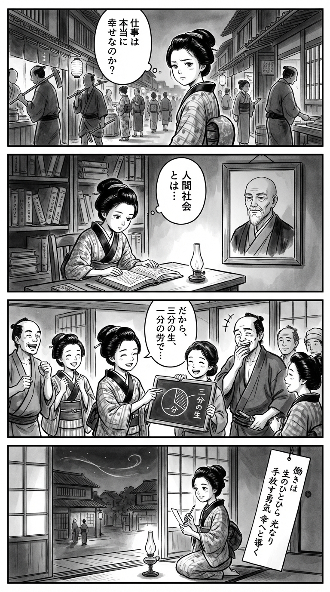

> **Language**: [日本語](../ja/あなたの会社、その働き方は幸せですか？_review.html) | [English](../en/あなたの会社、その働き方は幸せですか？_review.html) | [繁體中文](../zh-tw/あなたの会社、その働き方は幸せですか？_review.html)
>
> [← Top / トップページ](../../)

## 📖 書籍情報
- **タイトル**: あなたの会社、その働き方は幸せですか？  
- **著者**: 出口治明  
- **ASIN**: B08R5HG57Y  
- **URL**: [https://www.amazon.co.jp/dp/B08R5HG57Y](https://www.amazon.co.jp/dp/B08R5HG57Y)

---

<picture>
  <source srcset="../../images/reviews/あなたの会社、その働き方は幸せですか？_4panel.webp" type="image/webp">
  
</picture>
## 🎯 この本の核心
本書は、日本型経営の限界と働き方の幸福度を根本から問い直す対話である。著者・出口治明は、戦後日本の成功モデルが人口増加と偶然の産物であったことを明らかにし、その延長線上にある終身雇用や年功序列がもはや時代に適さないと断じる。  

同時に、ジェンダー不平等や教育の問題を「構造的欠陥」として捉え、個人が自立して生きるための知と態度を提示する。働くことを人生の一部として再定義し、「仕事は人生の3割」というリアリズムのもと、幸福と生産性の両立を目指す思想が貫かれている。

---

## 💡 キーインサイト
- **日本型経営は偶然の成功体験にすぎない**  
　高度成長期の成功は制度設計の成果ではなく、人口増と特需という偶然の結果だった。したがって、今の時代に同じ仕組みを維持することは合理的ではなく、構造改革が不可欠である。  

- **女性排除が「完全雇用」を支えていた**  
　戦後の労働安定は、女性を労働市場から締め出すことで成り立っていたという厳しい現実を突きつける。ジェンダー平等の実現は倫理的課題であると同時に、経済成長の前提条件でもある。  

- **テレワークを拒む組織は時代遅れ**  
　デジタル化に適応できない企業は、マネジメント能力の欠如を露呈している。働き方の柔軟化は単なる福利厚生ではなく、組織の知的生産性を測る試金石である。  

- **「あきらめ」は前向きな戦略である**  
　理想に固執せず、現実を受け入れて最善を尽くす姿勢が、長期的な幸福と成果をもたらす。これは自己効力感を高める実践的リアリズムでもある。  

- **教育は「生きるための武器」である**  
　社会制度や経済の原理を理解し、自立して判断できる力を育む教育こそが、持続可能な社会の基盤となる。知識の詰め込みではなく、構造を理解する知の再構築が求められている。

---

## 🔍 現代的文脈との関連
近年、働き方改革やテレワークの普及が進む一方で、長時間労働やメンタル不調など、働く人の幸福度は依然として低い水準にある。出口氏の提言は、こうした「改革の空洞化」に鋭く切り込むものであり、制度よりも意識と構造の変化を促す。  

また、ジェンダー平等や多様性の推進が国際的な潮流となる中で、日本社会の閉鎖性を打破する視点は、グローバルな人材競争の中でも重要な示唆を与える。個人の幸福と社会の持続可能性を結びつける思想として、本書は現代の働き方議論に再考の契機を与えている。

---

## 🚀 実践への提案
1. **仕事を「人生の3割」として位置づける**
   仕事に過剰な意味を求めず、生活全体のバランスを意識することで、燃え尽きや過労を防ぐ。幸福の基盤は、仕事外の時間にこそある。

2. **社会制度を理解し、変化を支持する**
   年金や雇用制度の仕組みを学び、社会的公正を支える改革に主体的に関わる。制度を知ることが、自分の働き方を守る第一歩となる。

3. **「あきらめ」を戦略的に使う**
   できないことを潔く手放し、できることに集中する。これは現実的な自己管理法であり、成果と満足度を両立させる鍵である。

4. **異質な環境に身を置く**
   異文化・異業種との交流を通じて、自分の前提を相対化する。多様な視点に触れることが、創造性と柔軟性を育む。

5. **教育を「生きるための学び」として再定義する**
   社会の仕組みを理解し、自立して判断できる力を養う。これはキャリア形成だけでなく、民主社会の成熟にもつながる。

---

## ⭐ 総合評価
『あなたの会社、その働き方は幸せですか？』は、制度疲労を起こした日本社会に対し、「幸福とは何か」「働くとは何か」を根源から問い直す書である。出口治明のリアリズムと上野千鶴子の社会構造分析が交差し、読者に思考の転換を迫る。  

単なる働き方改革論ではなく、個人の生き方と社会の設計を同時に考える哲学的実践書として読む価値がある。自分の働き方を見直したいすべての人にとって、現実を受け入れながら未来を描くための知的な羅針盤となるだろう。

---

&copy; shioki | [CC BY-NC-SA 4.0](https://creativecommons.org/licenses/by-nc-sa/4.0/)
