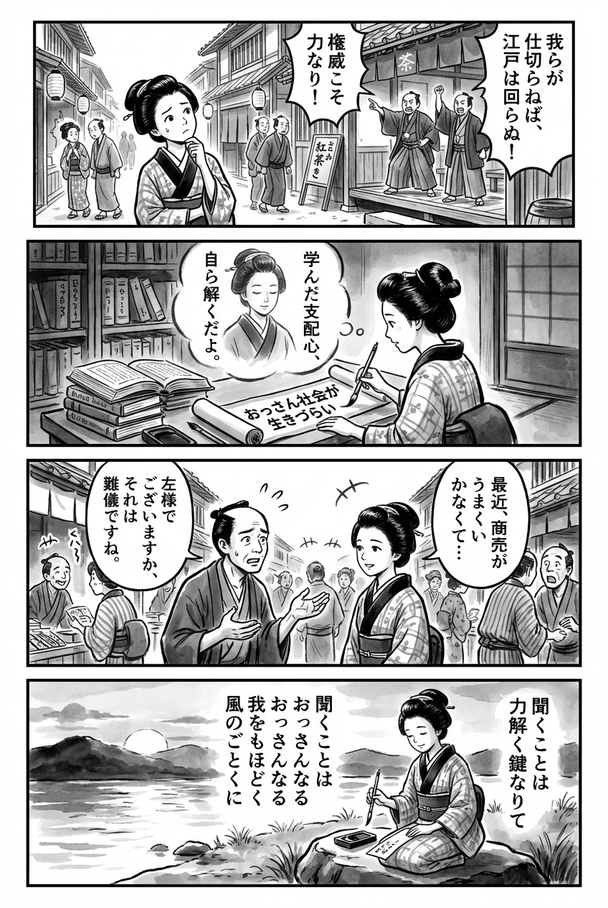

> **Language**: [日本語](../ja/おっさん社会が生きづらい_review.html) | [English](../en/おっさん社会が生きづらい_review.html) | [繁體中文](../zh-tw/おっさん社会が生きづらい_review.html)
>
> [← Top / トップページ](../../)

## 📖 書籍情報
- **タイトル**: おっさん社会が生きづらい  
- **著者**: 小島 慶子  
- **ASIN**: B0B8YLYS3S  
- **URL**: [https://www.amazon.co.jp/dp/B0B8YLYS3S](https://www.amazon.co.jp/dp/B0B8YLYS3S)

---

<picture>
  <source srcset="../../images/reviews/おっさん社会が生きづらい_4panel.webp" type="image/webp">
  
</picture>
## 🎯 この本の核心
『おっさん社会が生きづらい』は、「おっさん性」という社会的プログラムを個人の中に見出し、それをアンインストールするための知的・感情的プロセスを描いた書である。著者は「おっさん性」を特定の中年男性の特徴ではなく、社会全体に内在する学習された性質として捉える。  

本書は、男性が「強くあれ」「支配せよ」という呪縛に縛られる構造を暴き、それが本人をも苦しめることを明らかにする。フェミニズムと男性学の交差点に立ち、ケアと傾聴による関係性の再構築を提案することで、著者は「おっさん社会」を変えるための知的実践を提示している。

---

## 💡 キーインサイト
- **「おっさん性」は誰の中にもある社会的学習の産物**  
  性別や年齢を問わず、社会的報酬構造が「おっさん性」を育ててしまう。自分の中の支配的態度を自覚することが、変化の第一歩である。  

- **「男らしさ」の呪いが男性自身をも苦しめている**  
  「永遠の性的強者であれ」という社会的刷り込みは、男性に弱さを許さず、孤立を生む。著者はこの構造を「おっさん社会」の根幹として批判する。  

- **「聞く」ことが社会変革の出発点**  
  支配的な会話スタイルを手放し、相手の話を遮らずに聞くことが「おっさん性」のアンインストールにつながる。傾聴は単なるマナーではなく、社会変革の技法である。  

- **「愚痴」は回復のための知的・感情的技法**  
  愚痴を共有することは、弱さを認め合う行為であり、社会的癒しのプロセスでもある。男性が「弱音を吐いたら負け」という文化を超える鍵となる。  

- **「おばさん化」としての成熟**  
  「威張らない・嵩張らない・男を降りている」という「おばさん化」は、他者に開かれた成熟の形である。これは「おっさん性」の対極にある生のあり方として提示される。

---

## 🔍 現代的文脈との関連
現代日本では、ジェンダー平等や多様性の議論が進む一方で、依然として「男らしさ」「女らしさ」という規範が根強く残っている。小島慶子の本は、この構造的問題を「おっさん性」という概念で可視化し、個人の内面にまで浸透した社会的刷り込みを問い直す試みである。  

また、SNSや職場でのハラスメント問題、世代間の価値観の断絶など、「おっさん社会」の影響はあらゆる場面に及んでいる。著者の提案する「傾聴」「ケア」「おばさん化」は、こうした分断を超えるための実践的ヒントとして、現代社会において極めて示唆的である。

---

## 🚀 実践への提案
1. **「傾聴」と「ケアのコミュニケーション」を日常に取り入れる**
   相手の話を遮らず、評価や結論を急がずに耳を傾ける。これは支配的な会話文化を解体し、対等な関係を築く第一歩である。

2. **「愚痴る」ことを恥じない**
   愚痴は弱音ではなく、他者とつながるための知的技法である。安心して愚痴を共有できる関係性を築くことが、社会的回復を促す。

3. **「知的になることで傷つかない」ために構造を学ぶ**
   自らの痛みを社会構造の問題として理解することで、自己否定から抜け出せる。ジェンダーや権力の構造を学ぶことが、自由への第一歩となる。

4. **「おばさん化」＝威張らず、傾聴する成熟を目指す**
   威張らず、他者に開かれた姿勢を持つことが、「おっさん性」の対抗軸となる。成熟とは、支配を手放す勇気である。

5. **「シェア・ケア・フェア」を実践する**
   公平性と共感を重視するこの三原則は、家庭や職場での関係性を再構築するための実践的ガイドラインである。

---

## ⭐ 総合評価
『おっさん社会が生きづらい』は、ジェンダーや世代を超えて現代社会の息苦しさを解き明かす知的挑戦である。小島慶子は「おっさん性」という鋭い概念を通じ、誰もが内面化してきた支配的価値観を可視化し、それを癒しと対話によって乗り越える道を示す。  

本書は、男性にも女性にも、自らの中にある「おっさん性」を見つめ直す鏡となるだろう。読むことで、他者と共に生きるための新しい成熟の形を模索する契機を与えてくれる。

---

&copy; shioki | [CC BY-NC-SA 4.0](https://creativecommons.org/licenses/by-nc-sa/4.0/)
