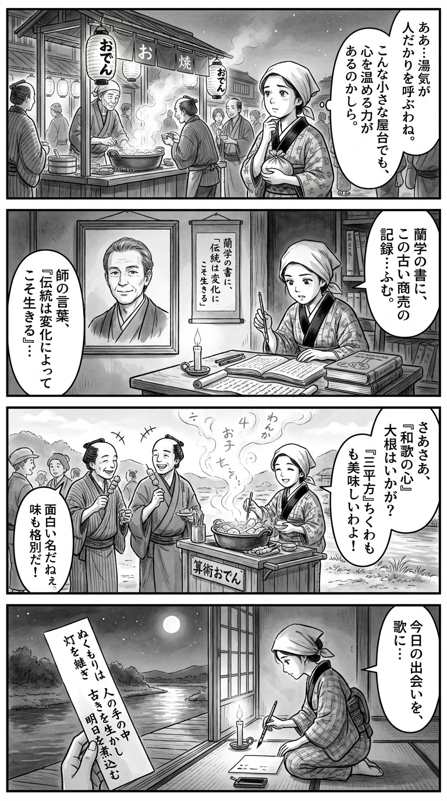

> **Language**: [日本語](../ja/おでんオデッセイ_review.html) | [English](../en/おでんオデッセイ_review.html) | [繁體中文](../zh-tw/おでんオデッセイ_review.html)
>
> [← Top / トップページ](../../)

## 📖 書籍情報
- **タイトル**: おでんオデッセイ  
- **著者**: 山本 幸久  
- **ASIN**: B0CLKZLWMK  
- **URL**: [https://www.amazon.co.jp/dp/B0CLKZLWMK](https://www.amazon.co.jp/dp/B0CLKZLWMK)

---

<picture>
  <source srcset="../../images/reviews/おでんオデッセイ_4panel.webp" type="image/webp">
  
</picture>
## 🎯 この本の核心
『おでんオデッセイ』は、地方都市・伊竹市を舞台に、屋台「かいっちゃん」を切り盛りする女性・静香の奮闘を通じて、地域再生と個人の再生を重ね合わせた物語である。  
地方の衰退や家業の継承といった現実的な課題を背景に、登場人物たちはそれぞれの立場で「自分の居場所」を見つけようとする。その過程で描かれるのは、制度ではなく人の情熱によって支えられる地域の姿である。  

また、伝統と革新の共存というテーマも物語の軸を成す。古き良き練物文化を守りつつ、時代に合わせて新しい発想を取り入れる姿勢は、現代社会における働き方や生き方のヒントを示している。静香の再出発は、読者自身の「未来への一歩」を象徴する旅路でもある。

---

## 💡 キーインサイト
- **地域再生は人の情熱で動く**  
　若菜のように、補助金や制度の枠を超えて現場を支える人の存在が、地域の持続性を決定づける。行政主導の再生策ではなく、個人の熱意が地域の鼓動を生み出すことを物語は教える。  

- **小さな商いにも大きな物語がある**  
　東京での華やかな仕事から離れ、十円単位の売上に悩む静香の姿は、規模ではなく「誇り」が仕事の価値を決めることを示す。小さな屋台にも人生のドラマが宿る。  

- **伝統は守るだけでなく進化させるもの**  
　母・真知子が季節ごとの練物を作るように、伝統を現代的に再解釈する柔軟さが継続の鍵となる。変化を恐れず、文化を「生かす」姿勢が未来を拓く。  

- **人との関係が自己を映す鏡になる**  
　静香が仲間や元恋人との関わりを通じて自分を見つめ直すように、人間関係は自己理解の場である。支え合いの中でこそ、人は自分の輪郭を知る。  

- **努力は未来を形づくる**  
　結果が保証されなくても前に進む姿勢が、登場人物たちの共通点である。「未来のために頑張らずにはいられない」という信念が、物語全体を貫く。

---

## 🔍 現代的文脈との関連
近年、地域食やご当地文化の再評価が進み、SNS上では「#おでん巡り」が若者の間で流行している。『おでんオデッセイ』が描く地方の屋台文化は、まさにこの潮流と共鳴する。地域の食や伝統を再発見し、そこに新しい価値を見出す動きが広がる中で、本作は「地域と人の再生」を文学的に体現している。  

また、食のサステナビリティや地産地消の観点からも、本作のテーマは現代的である。伝統を守りながらも革新を取り入れる姿勢は、気候変動や人口減少といった社会的課題への応答としても読める。静香たちの挑戦は、地方に限らず、あらゆる場所で生きる人々の「働く意味」を問い直す鏡となっている。

---

## 🚀 実践への提案
1. **地域の課題に関わるときは「制度より人」を意識する**
   現場の熱意や信頼関係こそが、長期的な成果を生む。地域再生の本質は人間関係の中にある。

2. **伝統を継ぐときは「変える勇気」を持つ**
   古い形を守るだけではなく、時代に合わせて再構築することで、文化は生き続ける。

3. **仕事の価値を「誇り」で測る**
   収益や規模ではなく、自分が胸を張れるかどうかを基準にすることで、仕事は生き方に変わる。

4. **人との関係を「支え合いの資産」として育てる**
   屋台の常連たちのように、日常のつながりが困難を乗り越える力になる。

5. **過去を抱えながらも未来へ進む**
   静香のように、過去の選択を否定せず、それを糧にして次の一歩を踏み出すことが人生を豊かにする。

---

## ⭐ 総合評価
『おでんオデッセイ』は、地方の小さな屋台を通じて「働くこと」「生きること」「つながること」を再定義する物語である。華やかさよりも地道な努力、人の温もり、そして再生の希望が静かに胸を打つ。  

読後には、誰もが自分の「居場所」や「仕事の意味」を見つめ直したくなるだろう。地方に生きる人、家業を継ぐ人、あるいは新しい挑戦を模索するすべての人にとって、本作は温かくも力強いエールとなる。

---

&copy; shioki | [CC BY-NC-SA 4.0](https://creativecommons.org/licenses/by-nc-sa/4.0/)
