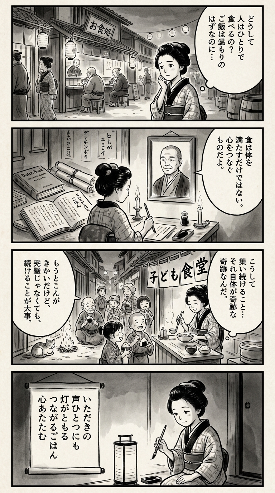

> **Language**: [日本語](../ja/とにもかくにもごはん_review.html) | [English](../en/とにもかくにもごはん_review.html) | [繁體中文](../zh-tw/とにもかくにもごはん_review.html)
>
> [← Top / トップページ](../../)

## 📖 書籍情報
- **タイトル**: とにもかくにもごはん  
- **著者**: 小野寺史宜  
- **ASIN**: B09BN9KX33  
- **URL**: [https://www.amazon.co.jp/dp/B09BN9KX33](https://www.amazon.co.jp/dp/B09BN9KX33)

---

<picture>
  <source srcset="../../images/reviews/とにもかくにもごはん_4panel.webp" type="image/webp">
  
</picture>
## 🎯 この本の核心
『とにもかくにもごはん』は、「食」を通して人と人が再びつながる過程を描いた作品である。舞台となるのは地域の子ども食堂。そこでは、孤独や喪失を抱えた大人たちが、子どもたちと「ごはん」を囲むことで、少しずつ心を取り戻していく。  

著者・小野寺史宜は、家庭や地域の関係性を「ごはん」という最小単位のコミュニケーションに凝縮させた。仕事や家庭の崩壊を経験した登場人物たちが、食卓を通じて「生きるとは何か」「普通とは何か」を問い直す姿は、現代社会の縮図そのものである。  

「続けること」「感謝すること」「他人の子も自分の子として見ること」──この物語は、そんな静かな倫理を日常の中に見出す優しい再生の物語である。

---

## 💡 キーインサイト
- **「食」は人をつなぐ最小単位のコミュニケーション**  
  食卓を囲むことは、言葉を超えた交流の形である。おいしいと伝えるだけで人の心が和らぎ、孤立した人々が再び社会とつながる。食は単なる栄養ではなく、信頼と共感の媒介である。  

- **「続けること」にこそ価値がある**  
  子ども食堂の理念「続けることそのものがゴール」は、成果主義に傾く現代への対抗軸を示す。完璧を求めず、継続すること自体が人と社会を支える行為である。  

- **「ありがとう」は場を変える力を持つ**  
  感謝の言葉は小さな奇跡を生む。人間関係が冷え込む時代において、「ありがとう」を口にすることが、他者との関係を再生させる最もシンプルで確かな方法である。  

- **「普通」を見直す視点**  
  「中の中が普通」という価値観は、社会的成功を追い求める風潮への批評である。自分の生活を肯定し、日常の中の幸福を見出すことが、真の豊かさにつながる。  

- **「働くこと」は生きるための手段である**  
  仕事中心の生き方が家族との断絶を生む現実を直視し、生活と人間関係を再定義する必要を訴える。働くことの意味を問い直す姿勢が、現代の疲弊した社会に静かな問いを投げかける。

---

## 🔍 現代的文脈との関連
本書の背景にある「子ども食堂」は、2010年代後半から全国的に広がり、地域の孤立や貧困に対する新たな支えとして注目されている。食を介したコミュニティ形成は、ポストコロナ時代の孤立対策としても重要なテーマであり、本作はその社会的意義を物語の形で提示している。  

また、SNSやデジタル環境が人間関係を希薄化させる現代において、「顔を合わせて食べる」という行為の価値は再評価されつつある。小野寺の筆致は、そんな時代に必要な「人と人の温度」を思い出させる。  

現代日本が抱える分断や孤独の問題に対し、本作は制度ではなく「日常の優しさ」で応える文学的処方箋である。

---

## 🚀 実践への提案
1. **日々の食卓を「対話の場」として意識する**
   食事を単なる作業ではなく、家族や仲間との関係を育む時間として捉える。小さな「いただきます」「ごちそうさま」が、関係性を温め直す第一歩となる。

2. **「ありがとう」を積極的に伝える**
   感謝の言葉を惜しまず使うことで、他者との信頼が生まれる。感謝は相手を癒やすだけでなく、自分自身の心を柔らかくする。

3. **完璧を求めず「続ける」ことを重視する**
   子ども食堂のように、結果よりも継続を大切にする。小さな行動を積み重ねることで、信頼や安心が自然と育まれる。

4. **「普通」の基準を自分の中に持つ**
   他人との比較ではなく、自分の満足や幸福を基準に生きる。日常の中にある「中の中」の幸せを見つけることが、心の安定につながる。

5. **地域との関わりを持つ**
   地域活動やボランティアに関わることで、孤立を防ぎ、他者との関係を築く。自分の「できること」を少しずつ提供することが、社会全体の温かさを支える。

---

## ⭐ 総合評価
『とにもかくにもごはん』は、派手な事件も奇抜な展開もない。しかし、その静けさの中に、現代人が忘れかけた「人と人のつながり」の本質がある。食卓を通して描かれる再生の物語は、読後にじんわりと温かさを残す。  

孤独を抱えるすべての人、あるいは「普通の幸せ」を見失いかけた人にこそ読んでほしい一冊である。小野寺史宜の筆は、日常の片隅にある希望をすくい上げ、私たちに「生きることの意味」を静かに問いかけてくる。

---

&copy; shioki | [CC BY-NC-SA 4.0](https://creativecommons.org/licenses/by-nc-sa/4.0/)
