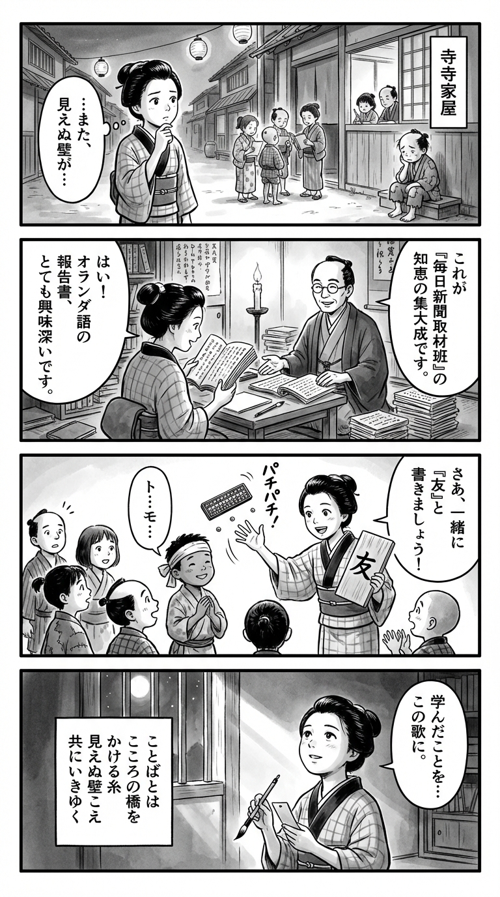

> **Language**: [日本語](../ja/にほんでいきる——外国からきた子どもたち_review.html) | [English](../en/にほんでいきる——外国からきた子どもたち_review.html) | [繁體中文](../zh-tw/にほんでいきる——外国からきた子どもたち_review.html)
>
> [← Top / トップページ](../../)

## 📖 書籍情報
- **タイトル**: にほんでいきる——外国からきた子どもたち  
- **著者**: 毎日新聞取材班  
- **ASIN**: B08R3J74TQ  
- **URL**: [https://www.amazon.co.jp/dp/B08R3J74TQ](https://www.amazon.co.jp/dp/B08R3J74TQ)

---

<picture>
  <source srcset="../../images/reviews/にほんでいきる——外国からきた子どもたち_4panel.webp" type="image/webp">
  
</picture>
## 🎯 この本の核心
『にほんでいきる』は、日本社会のなかで「見えない存在」とされてきた外国籍の子どもたちの現実を、丹念な取材を通して描き出したルポルタージュである。著者は、就学義務の枠外に置かれた子どもたちが教育機会を奪われ、社会から孤立していく構造的な問題を明らかにしている。  

日本語を理解できないことが学業の遅れや不登校、さらには非行や犯罪の温床となる現実を浮き彫りにしつつ、言葉を学ぶことで人生を再構築した少年たちの姿を通して、教育の持つ再生力を提示する。  

また、可児市や松阪市などの自治体の先進的な取り組みを紹介し、教育支援が地域社会の持続性を高めることを実証的に示す。全体を貫くのは、「誰一人取り残さない」という理念と、共生社会を築くための希望である。

---

## 💡 キーインサイト
- **制度の盲点が生む「見えない子どもたち」**  
  外国籍の子どもには就学義務がないという法制度の隙間が、行政の無関心を招いている。教育の空白は、社会的孤立と貧困の再生産を生む構造的問題である。  

- **言葉が人生を変える力を持つ**  
  少年院で日本語を学んだ少年の体験は、言語教育が自己再生の出発点であることを象徴している。言葉を得ることで、子どもたちは初めて社会とつながり、自らの未来を描くことができる。  

- **教育支援が地域を変える**  
  可児市の事例が示すように、教育支援は単なる福祉ではなく、地域の持続可能性を高める社会的投資である。支援を受けた子どもが納税者となり、地域社会を支える循環が生まれている。  

- **「見えない壁」が孤立を深める**  
  言葉や文化の違いが生む誤解は、子どもたちを自己否定へと追い込む。「見えない言葉の壁」という表現は、共生社会における最大の障壁を象徴している。  

- **共生社会はすべての人の幸福につながる**  
  「外国人が住みやすい街は、日本人にとっても住みやすい」という言葉に、本書の核心がある。共生の実現は特定の少数者のためではなく、社会全体の成熟を意味する。

---

## 🔍 現代的文脈との関連
本書の問題意識は、外国人住民が急増する現代日本においてますます切実な意味を持つ。茨城県や岡山県などでは、外国人児童生徒の増加に対応するため、多文化共生教育や日本語支援の体制整備が進められているが、全国的にはまだ地域格差が大きい。  

また、子どもの貧困率が依然として高い日本では、外国籍家庭の教育格差が社会的再生産の一因となっている。『にほんでいきる』が描く現実は、教育政策・地域福祉・労働政策の交差点にある課題を可視化し、共生社会を築く上での指針を与えている。

---

## 🚀 実践への提案
1. **外国籍の子どもへの就学支援を制度化する**
   教育の権利を国籍に関係なく保障する法的枠組みを整備することが必要である。制度の明確化が行政の責任を促し、教育機会の不平等を是正する。

2. **日本語教育を早期かつ体系的に提供する**
   言語習得の遅れは学習全体に影響するため、幼少期からの日本語教育支援が不可欠である。学校・地域・ボランティアが連携し、継続的な教育体制を構築すべきである。

3. **地域コミュニティによる支援ネットワークを広げる**
   可児市のように、学校を起点に地域全体で支援する仕組みを全国に展開することで、外国籍家庭の孤立を防ぎ、地域社会の活力を高められる。

4. **教育現場の多文化対応力を強化する**
   教員や支援者が文化的背景の違いを理解し、個々の子どもに寄り添う姿勢を持つことが重要である。多文化共生教育の研修や教材開発が求められる。

5. **進学・就労支援の拡充**
   外国籍の高校生の中退率の高さは、制度的支援の不足を示している。高校入試制度の柔軟化や職業訓練の提供により、社会参加への道を開くことが急務である。

---

## ⭐ 総合評価
『にほんでいきる』は、外国籍の子どもたちの「声なき声」を社会に届ける報道の力を再確認させる一冊である。取材班は、制度の盲点を突くだけでなく、支援者たちの努力と希望を通して、共生社会の可能性を描き出した。  

本書は、教育関係者や行政担当者だけでなく、地域社会に生きるすべての人に読まれるべき作品である。読む者に「私たちは誰を取り残しているのか」という問いを突きつけ、共に生きる社会のあり方を考えさせる力を持っている。

---

&copy; shioki | [CC BY-NC-SA 4.0](https://creativecommons.org/licenses/by-nc-sa/4.0/)
