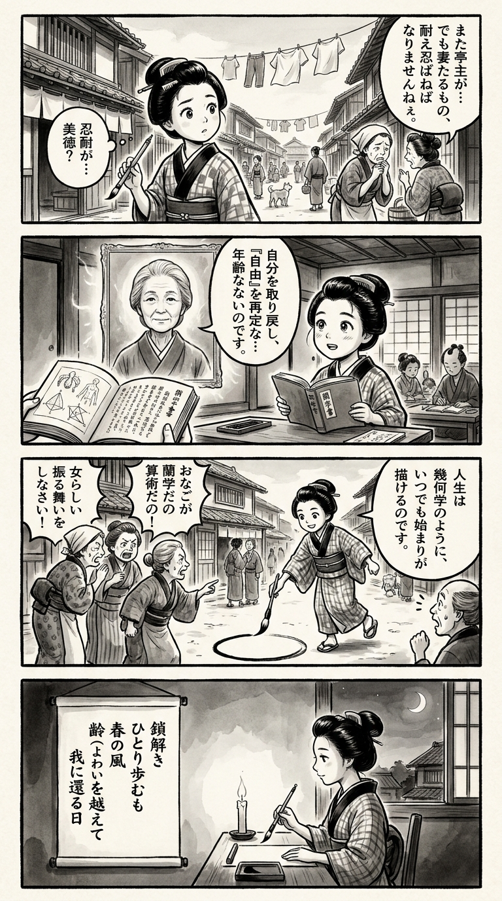

> **Language**: [日本語](../ja/もう別れてもいいですか_review.html) | [English](../en/もう別れてもいいですか_review.html) | [繁體中文](../zh-tw/もう別れてもいいですか_review.html)
>
> [← Top / トップページ](../../)

## 📖 書籍情報
- **タイトル**: もう別れてもいいですか  
- **著者**: 垣谷美雨  
- **ASIN**: B09PB8SG5R  
- **URL**: [https://www.amazon.co.jp/dp/B09PB8SG5R](https://www.amazon.co.jp/dp/B09PB8SG5R)

---

<picture>
  <source srcset="../../images/reviews/もう別れてもいいですか_4panel.webp" type="image/webp">
  
</picture>
## 🎯 この本の核心
『もう別れてもいいですか』は、結婚制度の中で「妻」という役割に縛られてきた女性たちが、離婚を通して自分自身を取り戻す物語である。垣谷美雨は、結婚が女性にとっていかに不自由な制度であるかを、日常の細部を通して鋭く描き出す。  

本書は「離婚＝不幸」という社会的通念を覆し、むしろそれを「再生」として描く。年齢や世間体に縛られず、自分の幸福を自分で選び取るという生き方を肯定する点に、著者の強い倫理的メッセージがある。  

また、田舎社会や家父長的価値観の中で押し付けられてきた「女らしさ」や「良妻賢母」像を批判し、女性が自らの尊厳を取り戻す過程をリアルに描写している。

---

## 💡 キーインサイト
- **結婚生活の「小さなこと」が象徴する抑圧**  
  干し柿のような些細な出来事が、長年積み重ねられた不平等の象徴として描かれる。日常の摩擦に潜む構造的な抑圧を可視化することで、読者は「家庭」という場の政治性を再認識する。  

- **離婚は「終わり」ではなく「始まり」**  
  離婚をタブー視する社会に対し、著者はそれを「再生」として描く。失うことではなく取り戻すこととしての離婚という視点は、現代女性の生き方に新しい可能性を提示する。  

- **「女らしさ」からの脱却**  
  「控えめ」「愛想笑い」といった社会的に刷り込まれた女性像を拒否し、自分の価値観で生きる覚悟を描く。これは単なるフェミニズムの主張ではなく、人間としての尊厳の回復である。  

- **年齢を理由にした諦めの否定**  
  「もう五十八歳だけど、まだ五十八歳だ」という言葉に象徴されるように、人生の再出発に年齢は関係ない。人生後半を「終わり」ではなく「始まり」とする視点は、読者に勇気を与える。  

- **孤独の再定義**  
  「夫がいても孤独」という現実を経て、孤独は恐れるものではなく自由の象徴として描かれる。孤独を受け入れることが、真の自立への第一歩であると示している。

---

## 🔍 現代的文脈との関連
現代日本では、離婚や再婚、単身生活が特別なものではなくなりつつある一方で、依然として「結婚して一人前」という価値観が根強く残る。本書はそのギャップを突き、社会的規範と個人の幸福の衝突を描き出す。  

また、SNSや地域社会における「世間体」の圧力は、現代でも形を変えて続いている。垣谷の筆致は、そうした見えない同調圧力に抗うための思想的武器として機能する。女性の生き方だけでなく、誰もが「自分の人生を誰のために生きるのか」を問い直す契機を与える作品である。

---

## 🚀 実践への提案
1. **世間体より自分の幸福を優先する**
   他人の目を気にして生きることは、自己犠牲の連鎖を生む。自分の幸福を最優先にすることが、真の自由の始まりである。

2. **嘘のない生活を目指す**
   嘘をつかないと成り立たない関係は、すでに破綻している。自分の本音を押し殺さずに生きることが、再生への第一歩となる。

3. **年齢を「制限」ではなく「経験」と捉える**
   年齢を理由に挑戦を諦めるのではなく、積み重ねた経験を新しい人生の糧とする視点が重要である。

4. **他人と比較しない**
   他人の基準で自分を測ることをやめ、自分の価値観で生きることが心の平穏をもたらす。

5. **孤独を恐れず、自由として受け入れる**
   一人でいる時間は欠落ではなく、自己を取り戻すための贅沢な時間である。孤独を恐れず、自分と向き合う勇気を持つことが大切だ。

---

## ⭐ 総合評価
『もう別れてもいいですか』は、結婚制度の中で見えにくかった女性の抑圧を可視化し、「離婚」という行為を再生の物語として描き直した意欲作である。垣谷美雨の筆は、社会批評としての鋭さと、登場人物への深い共感を併せ持つ。  

この作品は、結婚や家族に悩む人だけでなく、「自分の人生をどう生きるか」を問い直したいすべての読者に向けられている。読後には、静かな勇気とともに、自分の生を自分で選び取る力が湧いてくるだろう。

---

&copy; shioki | [CC BY-NC-SA 4.0](https://creativecommons.org/licenses/by-nc-sa/4.0/)
