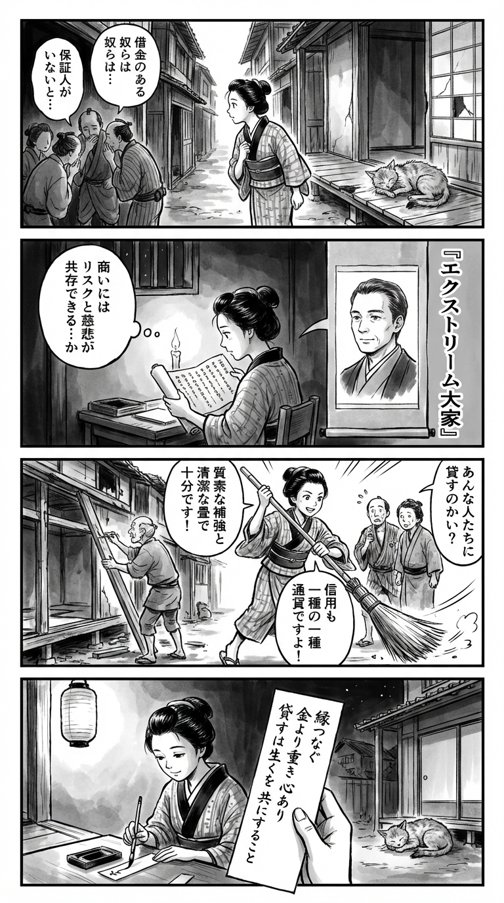

> **Language**: [日本語](../ja/エクストリーム大家_review.html) | [English](../en/エクストリーム大家_review.html) | [繁體中文](../zh-tw/エクストリーム大家_review.html)
>
> [← Top / トップページ](../../)

## 📖 書籍情報
- **タイトル**: エクストリーム大家  
- **著者**: 春川賢太郎  
- **ASIN**: B0CCVCVWNV  
- **URL**: [https://www.amazon.co.jp/dp/B0CCVCVWNV](https://www.amazon.co.jp/dp/B0CCVCVWNV)

---

<picture>
  <source srcset="../../images/reviews/エクストリーム大家_4panel.webp" type="image/webp">
  
</picture>
## 🎯 この本の核心
『エクストリーム大家』は、社会の周縁に生きる人々──カード破産者、前科者、生活保護受給者など──に住まいを提供する「極限の大家業」を描いた実録的ノンフィクションである。著者・春川賢太郎は、母から受け継いだこの仕事を通じて、社会的偏見と経済的現実の狭間で生きる人間の姿を浮かび上がらせる。  

本書の核心は、「リスクとリターンの再定義」にある。一般的な不動産投資が「安全・安定」を追求するのに対し、著者は「高リスク・高リターン」を受け入れ、現場対応力と人間関係の構築をもって利益を生み出す。そこには、単なる投資論を超えた「人間商売」としての哲学がある。

---

## 💡 キーインサイト
- **「ワケあり」入居者は安定した顧客になり得る**  
  社会的にリスクと見なされる層でも、実際には家賃を着実に支払う人が多い。偏見を取り払い、実態に基づく判断を行うことが、事業の安定化につながる。  

- **過剰なリフォームは自己満足**  
  入居者層のニーズを理解せずに高額な改修を行うことは無駄である。最低限の清潔感と機能性を保つことで、コストを抑えつつ満足度を維持できる。  

- **保証人不要が最大の訴求力**  
  信用情報に問題を抱える層にとって、形式的な保証よりも「即入居可」が何よりの魅力となる。条件設定の柔軟さが、入居率を左右する。  

- **「縁」が最大の資産**  
  不動産の価値よりも、入居者との関係性が事業の根幹を支える。信頼と対話を重ねることで、トラブル防止と長期的な安定収益を実現できる。  

- **社会貢献と経営の両立は現実的課題**  
  理想だけでは事業は続かない。経営を成立させることが、結果的に社会的支援の持続性を担保するという冷静な視点が貫かれている。

---

## 🔍 現代的文脈との関連
現代日本では、空き家問題や住宅弱者の増加が深刻化している。行政やNPOによる支援制度が整備されつつあるものの、現場では依然として「住まいを貸したくない層」が存在する。『エクストリーム大家』は、その空白地帯に踏み込み、制度の限界を補う民間の実践として注目に値する。  

また、経済格差や孤立が進む社会において、著者の姿勢は「共生のリアリズム」として読むことができる。社会貢献を掲げながらも、ビジネスとしての持続可能性を追求する姿勢は、現代の社会起業家精神とも通じる。

---

## 🚀 実践への提案
1. **ターゲット層に合わせた物件改修を行う**
   高額なリフォームよりも、清潔で修繕しやすい素材を選ぶことが重要である。入居者の実態に即した判断が、コスト削減と利回り向上を両立させる。

2. **ネットとNPOを活用した募集ルートを確立する**
   掲示板や支援団体など、従来の不動産仲介とは異なるチャネルを活用することで、安定した入居率を維持できる。

3. **入居者との関係構築を「管理業務」と位置づける**
   定期的な対話や相談対応を通じて、信頼関係を築くことがトラブル防止につながる。人間的な距離感の維持が鍵となる。

4. **経営と社会貢献のバランスを意識する**
   理想主義に陥らず、収益性を確保することで長期的な支援が可能になる。経営の健全性こそが社会的意義を支える基盤である。

5. **制度的支援を積極的に活用する**
   居住支援法人格の取得や補助金制度の利用により、リスクを抑えつつ事業の拡大を図ることができる。

---

## ⭐ 総合評価
『エクストリーム大家』は、不動産投資の実務書であると同時に、社会の周縁に生きる人々との共生を描いた人間ドラマでもある。著者の筆致は現場の泥臭さを隠さず、そこに宿る倫理と誇りを静かに照らし出す。  

この本は、単なる「ビジネス成功談」ではない。社会の見えない部分に光を当て、経済と人間の関係を問い直す一冊である。リスクを恐れずに現実と向き合う読者にこそ、深い示唆を与えるだろう。

---

&copy; shioki | [CC BY-NC-SA 4.0](https://creativecommons.org/licenses/by-nc-sa/4.0/)
