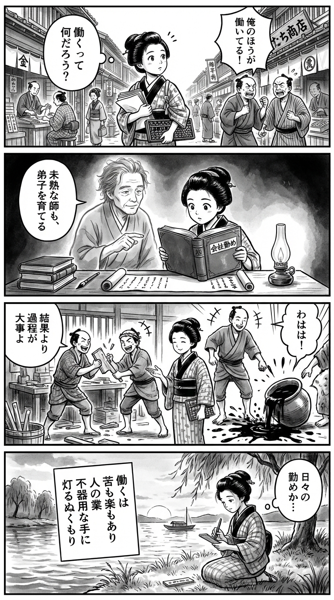

> **Language**: [日本語](../ja/カイシャデイズ_review.html) | [English](../en/カイシャデイズ_review.html) | [繁體中文](../zh-tw/カイシャデイズ_review.html)
>
> [← Top / トップページ](../../)

## 📖 書籍情報
- **タイトル**: カイシャデイズ  
- **著者**: 山本 幸久  
- **ASIN**: B009DEDUHO  
- **URL**: [https://www.amazon.co.jp/dp/B009DEDUHO](https://www.amazon.co.jp/dp/B009DEDUHO)

---

<picture>
  <source srcset="../../images/reviews/カイシャデイズ_4panel.webp" type="image/webp">
  
</picture>
## 🎯 この本の核心
『カイシャデイズ』は、中小企業「ココスペース」を舞台に、働く人々のリアルな日常と人間模様を描いた群像劇である。営業、設計、施工、経理といった多様な職種の人々が、それぞれの立場で「仕事とは何か」を問い続ける姿が描かれる。  

本作の中心にあるのは、理想や成功ではなく、現実の中で生きる人間の姿である。上司と部下、世代を超えた関係性の中で、価値観の衝突や継承が繰り返される。そこには、完璧ではない人間たちが不器用ながらも支え合い、仕事を通して自分を見つめ直す姿がある。  

山本幸久は、会社という共同体を「人間の縮図」として描き出し、働くことの喜びと苦しみ、誇りと無力感が交錯する現場の温度を見事にすくい取っている。

---

## 💡 キーインサイト
- **「仕事を生きる」という姿勢**  
　仕事は楽しむものでも、苦しむものでもなく、「生きること」そのものであるという視点が提示される。働くことを通じて人は自分を見つめ、他者と関わりながら生きる意味を模索する。  

- **不完全な上司の価値**  
　完璧ではない上司の存在が、部下に自立と成長を促す。高柳のような「教えるのが下手な人間」が持つ誠実さこそ、組織の人間的な魅力を形づくる。  

- **成果より過程に宿る創造の喜び**  
　「三年持てば万々歳」という現実の中でも、創ること自体に意味がある。結果の儚さを受け入れ、過程に価値を見出す姿勢が、働くことの本質を照らす。  

- **会社は人間関係の集合体**  
　理屈ではなく情で動く組織の姿が描かれる。「あの人だから仕方ない」という寛容さが、職場を支える見えない絆として機能している。  

- **若者の「仕事とは何か」という問い**  
　就活生・万里子の問いは、世代を超えて響く普遍的なテーマである。働く意味を見失いがちな現代人に、改めて「なぜ働くのか」を問う。

---

## 🔍 現代的文脈との関連
2020年代の日本社会では、リモートワークや副業解禁が進み、会社への帰属意識が急速に変化している。かつての「会社に生きる」時代から、「自分の生き方に会社をどう位置づけるか」という時代へと移りつつある。  

その中で『カイシャデイズ』が描く「会社という共同体の温度」は、失われつつある人間的なつながりの記録としても読める。Z世代が「会社員になりたくない」と語る現代において、本作は「それでも人は誰かと働く」ことの意味を静かに問いかける。  

山本の筆致は、働き方改革の時代にあっても変わらない「人間の不器用さと優しさ」を描き出し、効率や成果主義では測れない価値を再認識させる。

---

## 🚀 実践への提案
1. **完璧を目指さず誠実に向き合う**
   上司や同僚に対し、完璧さではなく誠実さで接すること。人間的な弱さを見せることで、職場に信頼と安心感が生まれる。

2. **結果より過程を重視する**
   成果が短命でも、その過程に意味を見出す姿勢を持つ。日々の努力や協働の中に、自分の成長と他者とのつながりを見いだすことができる。

3. **世代を超えて学び合う**
   若手は経験から、ベテランは新しい感性から学ぶ。双方向の学びが、組織に柔軟さと活力をもたらす。

4. **「しようがない」と笑える文化を育てる**
   他人の欠点を受け入れ、笑い飛ばせる余裕を持つこと。寛容さは、職場のストレスを和らげ、長く働ける環境をつくる。

5. **「仕事とは何か」を自分の言葉で定義する**
   他人や社会の基準に頼らず、自分自身の働く意味を見つける。キャリアの軸を自分で定義することが、迷いの少ない生き方につながる。

---

## ⭐ 総合評価
『カイシャデイズ』は、働くことの喜びと苦しみを等しく描いた、現代の労働文学の良作である。派手な成功物語ではなく、日常の中に潜む人間の温かさと不器用さを丁寧に掬い上げている。  

会社という小さな社会の中で、誰もが抱える矛盾や葛藤を見つめ直すきっかけを与えてくれる一冊だ。働く意味を見失いかけたとき、この物語は静かに背中を押してくれるだろう。

---

&copy; shioki | [CC BY-NC-SA 4.0](https://creativecommons.org/licenses/by-nc-sa/4.0/)
