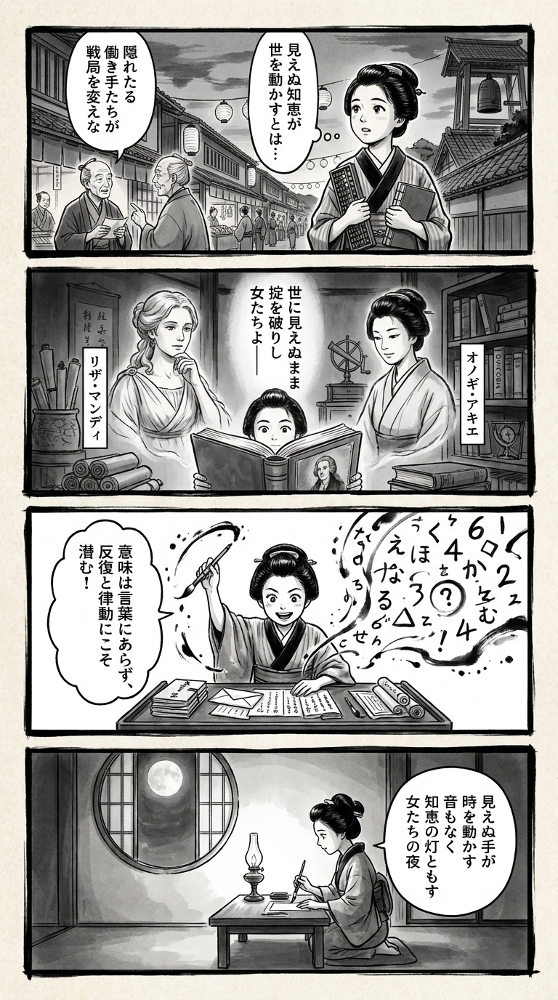

---
---
> **Language**: [日本語](../ja/コード・ガールズ――日独の暗号を解き明かした女性たち_review.html) | [English](../en/コード・ガールズ――日独の暗号を解き明かした女性たち_review.html) | [繁體中文](../zh-tw/コード・ガールズ――日独の暗号を解き明かした女性たち_review.html)
>
> [← Top / トップページ](../../)

## 📖 書籍情報
- **タイトル**: コード・ガールズ――日独の暗号を解き明かした女性たち  
- **著者**: ライザ・マンディ and 小野木明恵  
- **ASIN**: B099DQCDB8  
- **URL**: [https://www.amazon.co.jp/dp/B099DQCDB8](https://www.amazon.co.jp/dp/B099DQCDB8)

---

## 🎯 この本の核心
『コード・ガールズ』は、第二次世界大戦中、アメリカで極秘の暗号解読任務に従事した女性たちの知られざる物語を描くノンフィクションである。彼女たちは数学や外国語に秀でていたが、当時の社会では「教師」以外の職を期待されていなかった。  

しかし戦争が彼女たちの知的能力を必要としたとき、彼女たちは情報戦の最前線に立ち、戦局を左右する成果を上げた。本書は、女性たちが国家の命運を背負いながらも、その功績が長く秘匿されてきた歴史を掘り起こし、知的労働のジェンダー構造を問い直す。

---

## 💡 キーインサイト
- **女性の知性が戦争を動かした**  
  暗号解読の現場では、女性の分析力と直観が決定的な役割を果たした。銃弾ではなく、思考と忍耐が勝敗を分けたという視点は、知的労働の価値を再定義する。  

- **教育の力が社会を変える**  
  教師養成で培われた言語能力や論理的思考が、暗号解読という新たな領域で活かされた。教育が個人の可能性を超え、国家的成果に結びついた事例として示唆に富む。  

- **歴史に埋もれた女性たちの再評価**  
  戦後、功績の多くは男性の名で語られたが、実際には半数以上が女性によるものだった。本書は、沈黙の中にあった知的ヒロインたちを歴史に取り戻す試みである。  

- **情報戦と倫理の狭間**  
  敵の通信を読み解く行為には、倫理的ジレンマが伴う。だが、それを通じて「情報とは何か」「知ることの責任とは何か」を問う姿勢が浮かび上がる。  

- **知的協働の力**  
  女性たちは互いを支え合い、知識を共有しながら成果を生み出した。個人の天才ではなく、共同体の知恵が歴史を動かしたという視点が印象的である。

---

## 🔍 現代的文脈との関連
現代のSTEM分野や情報セキュリティの世界でも、女性の参画は依然として課題である。本書が描く「コード・ガールズ」の姿は、ジェンダーに縛られず知的能力を発揮することの意義を鮮やかに示している。  

また、AIやビッグデータの時代において、情報を「読む」ことの倫理や責任も再び問われている。暗号解読の倫理的葛藤は、現代のデータ利用やプライバシー問題と地続きのテーマとして響く。

---

## 🚀 実践への提案
1. **女性の知的労働を可視化する**
   過去の「無名の貢献者」たちの存在を踏まえ、現代では成果を記録・共有する仕組みを整えることが重要である。評価の透明性が、次世代のロールモデルを生む。

2. **異分野の知識を積極的に学ぶ**
   暗号解読に古典語や言語学が役立ったように、専門外の知識が創造的突破口を開く。学際的な学びが、思考の柔軟性を育てる。

3. **忍耐と協働の文化を育む**
   コード・ガールズたちは膨大な情報を前に、地道な努力を重ねた。現代の知的労働でも、短期的成果よりも継続的な協働が真の力を発揮する。

4. **情報倫理の教育を強化する**
   他者の通信を読むという行為の重みを理解することは、現代のデータ社会にも通じる。情報を扱う者としての倫理的自覚を育てることが不可欠である。

---

## ⭐ 総合評価
『コード・ガールズ』は、戦争史を再構築するだけでなく、知的労働とジェンダーの関係を根底から問い直す作品である。著者ライザ・マンディは、膨大な資料と証言をもとに、沈黙の中で戦った女性たちの声を蘇らせた。  

この本は、歴史・ジェンダー・情報社会に関心をもつ読者にとって必読の一冊である。読む者は、知性と勇気がいかに時代を動かすかを実感し、同時に「記録されなかった者たちの歴史」をどう語り継ぐかという問いに向き合うことになる。

---

&copy; shioki | [CC BY-NC-SA 4.0](https://creativecommons.org/licenses/by-nc-sa/4.0/)
