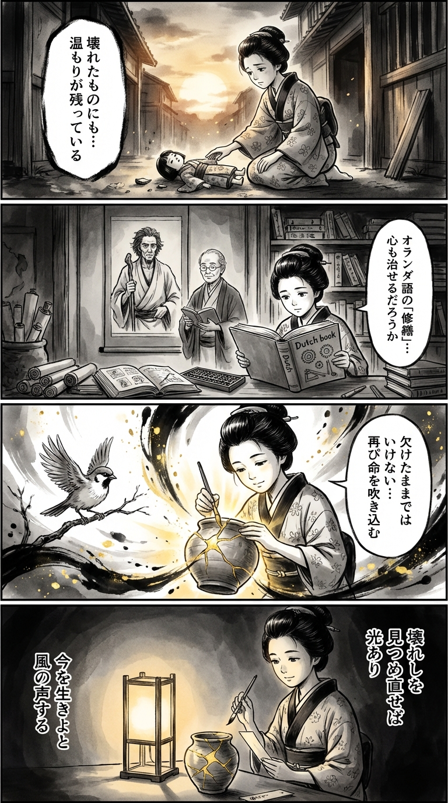

> **Language**: [日本語](../ja/サンセット・パーク_review.html) | [English](../en/サンセット・パーク_review.html) | [繁體中文](../zh-tw/サンセット・パーク_review.html)
>
> [← Top / トップページ](../../)

## 📖 書籍情報
- **タイトル**: サンセット・パーク  
- **著者**: ポール・オースター and 柴田元幸  
- **ASIN**: B085C7JG69  
- **URL**: [https://www.amazon.co.jp/dp/B085C7JG69](https://www.amazon.co.jp/dp/B085C7JG69)

---

<picture>
  <source srcset="../../images/reviews/サンセット・パーク_4panel.webp" type="image/webp">
  
</picture>
## 🎯 この本の核心
『サンセット・パーク』は、喪失、罪、そして再生をめぐる静かな群像劇である。主人公マイルズは「ボビーを押した」事故の罪悪感に囚われ、自己放棄の人生を送るが、ピラールとの出会いを通じて再び「生き直す」過程を歩む。  

物語の舞台となるサンセット・パークの廃屋は、社会からこぼれ落ちた者たちが一時的に身を寄せる避難所であり、壊れたものを修復する〈壊れた物たちの病院〉は、彼ら自身の心の再生を象徴している。  

オースターは、愛と倫理、孤独と連帯、芸術と記憶といったテーマを重層的に交錯させながら、人間がいかにして「今この瞬間」に希望を見出すのかを描き出す。

---

## 💡 キーインサイト
- **壊れたものに宿る人間性**  
　マイルズが廃墟や壊れた物に涙する場面は、人間の脆さと美しさを映し出す鏡である。壊れたものを見つめることが、自己再生の第一歩となる。  

- **罪と赦しの曖昧な境界**  
　マイルズは事故の真相を確定できずに苦しむが、赦しとは他者から与えられるものではなく、自己との対話の中でしか得られないことを示している。  

- **芸術は記憶の再生装置である**  
　写真や芸術を通じて、登場人物たちは失われたものと再び向き合う。芸術は過去を呼び戻し、死者と語り合うための儀式のように機能する。  

- **愛は倫理を超える生の力**  
　マイルズとピラールの関係は社会的禁忌を孕みつつも、生命の衝動として描かれる。愛は破滅と救済の両義性を持ち、彼を再び世界へと引き戻す。  

- **希望は「今」にしか存在しない**  
　過去の喪失や未来の不安を超えて、「今だけのために生きる」という決意が、物語の終盤で静かに響く。時間の不可逆性を受け入れることが、生の肯定に繋がる。

---

## 🔍 現代的文脈との関連
現代社会においても、「壊れたもの」としての人間の存在は普遍的なテーマである。経済的格差や社会的孤立が深まるなかで、サンセット・パークの住人たちの姿は、現代の都市に生きる私たちの鏡像のように映る。  

また、SNSやデジタル化によって「触れ合い」が希薄化する現代において、「人体は触れられる必要がある」という一節は、身体的・感情的なつながりの重要性を改めて思い起こさせる。  

さらに、芸術が記憶と再生の手段として描かれる点は、現代アートや写真文化の文脈にも通じる。過去を記録し、再構築する行為が、個人のアイデンティティと社会的連帯を支える鍵となる。

---

## 🚀 実践への提案
1. **壊れたものを見つめ直す**
   自分の中の欠けや痛みを避けずに見つめることが、再生の第一歩となる。喪失を否定せず、そこに意味を見出す姿勢を持つ。

2. **身体的・感情的な接触を恐れない**
   孤立しがちな現代において、他者と触れ合い、感情を共有することが心の健全さを保つ鍵となる。

3. **芸術的行為を通じて記憶と向き合う**
   写真を撮る、文章を書く、絵を描くといった行為は、過去の痛みを整理し、自己を再構築する手段となる。

4. **「今」に集中して生きる**
   過去の後悔や未来の不安に囚われず、現在の瞬間を意識的に生きることが、人生の再生を支える。

5. **小さな行動で社会とつながる**
   アリスのように無力さを感じても、声を上げ、行動することが倫理的責任である。行動そのものが希望の形となる。

---

## ⭐ 総合評価
『サンセット・パーク』は、壊れた世界の中でなお人間が希望を見出そうとする姿を描いた、ポール・オースターの到達点のひとつである。  

罪と赦し、孤独と連帯、愛と倫理といった普遍的テーマを、現代都市の廃墟を舞台に繊細かつ詩的に描き出す。読後には、壊れたものの中にこそ美と再生の可能性が宿るという静かな確信が残るだろう。

---

&copy; shioki | [CC BY-NC-SA 4.0](https://creativecommons.org/licenses/by-nc-sa/4.0/)
