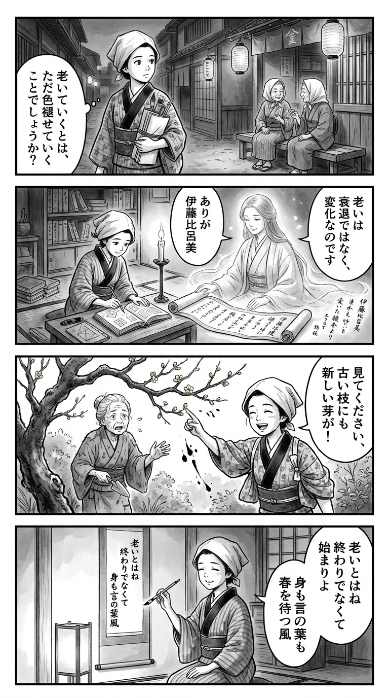

> **Language**: [日本語](../ja/ショローの女_review.html) | [English](../en/ショローの女_review.html) | [繁體中文](../zh-tw/ショローの女_review.html)
>
> [← Top / トップページ](../../)

## 📖 書籍情報
- **タイトル**: ショローの女  
- **著者**: 伊藤比呂美  
- **ASIN**: B097DJ3ZLS  
- **URL**: [https://www.amazon.co.jp/dp/B097DJ3ZLS](https://www.amazon.co.jp/dp/B097DJ3ZLS)

---

<picture>
  <source srcset="../../images/reviews/ショローの女_4panel.webp" type="image/webp">
  
</picture>
## 🎯 この本の核心
『ショローの女』は、詩人・伊藤比呂美が老いとともに変化する身体、言葉、そして生の意味を見つめ直すエッセイである。老いを喪失ではなく「変化の契機」として受け入れ、そこに新しい自由と自立の形を見出す姿勢が全編を貫いている。  

著者は、女性の言葉遣いや社会的立場の変化を通して、ジェンダーと文化の関係を掘り下げる。同時に、教育者として若者と向き合う中で、詩が持つ「生きる力」を再確認していく。  

孤独、自然、家族、身体といった主題が、日常の細部から立ち上がる。老いを語ることが、同時に「生きることをもう一度語ること」へと転化していく構成が印象的である。

---

## 💡 キーインサイト
- **老いは終わりではなく、始まりの契機である**  
  老いを「衰え」ではなく「成熟」として受け入れる姿勢が貫かれている。社会が老いを否定的に扱う中で、著者はその自然な変化を肯定し、自由の再発見として描く。  

- **言葉はジェンダーの鏡である**  
  「女言葉」の変遷を通して、女性の社会的立場や意識の変化を読み解く。言葉が変わることで、女性が自分をどう語るか、その自由度も変わることを示している。  

- **孤独は創造の源泉である**  
  孤独を恐れるのではなく、それを通して自分と向き合う時間を持つことの重要性を説く。孤独の中にこそ、詩や思索が生まれる余白がある。  

- **詩は生きることそのものである**  
  詩作を「眠らないでたどり着く作業」と捉え、日常の中に詩的な感受性を見出す。詩は単なる表現ではなく、存在を確かめる営みであると語る。  

- **「まず自分。それから他の人。」という生の順序**  
  自己犠牲ではなく、自己尊重を基盤とした生き方を提示する。自分を大切にすることが、他者への真の思いやりにつながるという倫理観が貫かれている。

---

## 🔍 現代的文脈との関連
日本社会では高齢化が進み、老いを個人の問題ではなく社会構造の問題として捉える動きが強まっている。特に女性の老後や介護、孤立といったテーマは、文学や社会批評の重要な焦点となっている。  

伊藤比呂美の作品は、老いを「衰え」ではなく「再生」として描く点で、現代のフェミニズム文学や老年文学の潮流と共鳴している。彼女の筆致は、身体の変化を語ることを通じて、社会が見落としがちな「生のリアリティ」を可視化する。  

また、デジタル化や孤立化が進む時代において、「生身の関係」や「人の手のぬくもり」を重視する視点は、現代人が忘れかけた人間的価値を思い出させる。

---

## 🚀 実践への提案
1. **自分の言葉で語る**
   他人の価値観や流行語に頼らず、自分の感情や経験を自分の言葉で表現する。これが自己理解と他者理解の第一歩となる。

2. **孤独を創造の時間に変える**
   孤独を恐れず、詩を書く、日記をつける、自然を観察するなど、自分と向き合う時間として活用する。孤独は内面を深める契機である。

3. **身体の声を聞く**
   年齢とともに変化する身体を否定せず、観察し、受け入れる。身体の状態を意識することは、心のバランスを整えることにもつながる。

4. **人の手が感じられるものを選ぶ**
   機械的な効率よりも、作り手の温もりを感じる選択を意識する。小さな店や手仕事の品を選ぶことで、日常に人間的な豊かさが戻る。

5. **直接の対話を大切にする**
   オンラインの便利さに流されず、顔を合わせて話す機会を持つ。そこにしか生まれない共感や理解が、心の支えとなる。

---

## ⭐ 総合評価
『ショローの女』は、老いを語ることを通じて「生きるとは何か」を再定義する書である。伊藤比呂美の率直でユーモラスな語り口は、読者に老いを恐れず、むしろ味わうように生きる勇気を与える。  

女性の身体、言葉、孤独、自然といったテーマを通して、現代社会の価値観を静かに問い直す。人生の後半に差しかかる人だけでなく、すべての世代に「自分の生をどう引き受けるか」を考えさせる一冊である。

---

&copy; shioki | [CC BY-NC-SA 4.0](https://creativecommons.org/licenses/by-nc-sa/4.0/)
