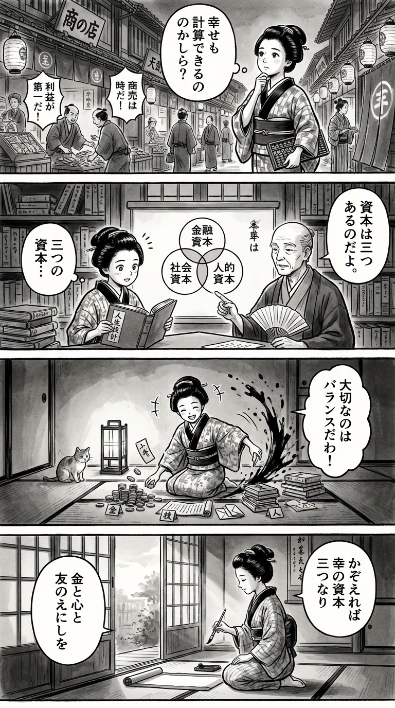

---
---
> **Language**: [日本語](../ja/シンプルで合理的な人生設計_review.html) | [English](../en/シンプルで合理的な人生設計_review.html) | [繁體中文](../zh-tw/シンプルで合理的な人生設計_review.html)
>
> [← Top / トップページ](../../)

## 📖 書籍情報
- **タイトル**: シンプルで合理的な人生設計  
- **著者**: 橘 玲  
- **ASIN**: B0BRYZ2XQJ  
- **URL**: [https://www.amazon.co.jp/dp/B0BRYZ2XQJ](https://www.amazon.co.jp/dp/B0BRYZ2XQJ)

---

## 🎯 この本の核心
『シンプルで合理的な人生設計』は、人生を「有限な資源の配分問題」として捉え、幸福を最大化するための合理的な意思決定を探る書である。橘玲は、時間・お金・労力といった資源をどう使うかが人生の質を決めるとし、経済学・心理学・進化論を横断してその最適解を提示する。  

本書の中心には「幸福の資本構造」という独自のフレームワークがある。金融資本・人的資本・社会資本という三つの基盤をバランスよく築くことが、長期的な幸福を支える鍵だと説く。理性と直観のバランスを重視し、完璧を求めず「満足化」することが、現実的で持続可能な幸福への道であると結論づけている。

---

## 💡 キーインサイト
- **幸福は「資本」の組み合わせで成立する**  
  幸福は一時的な感情ではなく、金融・人的・社会資本という三つの資本の構築によって支えられる。これにより、幸福を「再現可能な構造」として設計する視点が得られる。  

- **選択肢の多さは幸福を減らす**  
  現代社会では自由の拡大が必ずしも幸福を増やさない。選択肢が増えるほど後悔も増えるため、「選択のコスト」を減らすことが幸福の条件になる。  

- **直観と理性の共存が真の合理性を生む**  
  人間の直観は進化の過程で形成された「生存合理性」であり、理性と対立するものではない。両者をバランスよく使うことで、より現実的で柔軟な判断が可能になる。  

- **「強者の土俵」で戦わない戦略的生き方**  
  自分の得意分野や環境に合わせた「ニッチ戦略」が、長期的な成功と自由をもたらす。競争を避けることは逃避ではなく、合理的な生存戦略である。  

- **不確実性を受け入れる柔軟な合理性**  
  完璧な最適解は存在しないという前提に立ち、「妥当な選択」を積み重ねる姿勢が現実的な幸福を導く。合理性とは、変化に適応する力そのものなのだ。

---

## 🔍 現代的文脈との関連
本書の提唱する「幸福の資本構造」は、現代日本の経済的不安定化や働き方の多様化と深く響き合う。新NISAや副業ブームなど、資産形成や自己投資への関心が高まる中で、橘の理論は「生涯にわたって自分の資本を設計する」ための羅針盤となる。  

また、FIRE（早期リタイア）を超えて「長く働き続ける合理性」が注目される時代において、本書の「人的資本を最大化する」視点は現実的な幸福戦略として再評価されている。SNSや情報過多の社会で、選択をシンプルに保つという提案は、デジタル疲労を抱える現代人にとって極めて実践的な指針となる。

---

## 🚀 実践への提案
1. **優先順位を明確にし、非本質的な選択を自動化する**
   重要でない決定を減らすことで、時間と意志力を節約できる。日常の定型化が、真に価値ある活動への集中を可能にする。

2. **人的資本を一点集中で高める**
   自分の強みを磨き、専門性を深めることが、長期的な収入と心理的安定をもたらす。分散よりも「選択と集中」が幸福の鍵だ。

3. **ニッチ戦略で競争を避ける**
   他人と同じ土俵で戦うのではなく、自分の独自性が活きる分野を選ぶ。これにより、ストレスを減らしながら成果を上げられる。

4. **健康を最優先の投資対象とする**
   睡眠や運動は、すべての資本を支える基盤である。健康を軽視すれば、どんな合理性も崩壊する。

5. **AIやアルゴリズムを主体的に使いこなす**
   情報に流されるのではなく、ツールを選び、使い方を設計することが「ハックされない生き方」につながる。

---

## ⭐ 総合評価
『シンプルで合理的な人生設計』は、幸福を「感情」ではなく「設計可能な構造」として捉え直す知的挑戦である。経済学的な冷静さと心理学的な洞察を融合し、現代人の生きづらさを理論的に解きほぐす。  

読者はこの本を通じて、「何を選び、何を捨てるか」という人生の根本的な問いに向き合うことになる。感情論や自己啓発を超えた、実践的で再現性のある幸福論を求めるすべての人にとって、本書は確かな羅針盤となるだろう。

---

&copy; shioki | [CC BY-NC-SA 4.0](https://creativecommons.org/licenses/by-nc-sa/4.0/)
