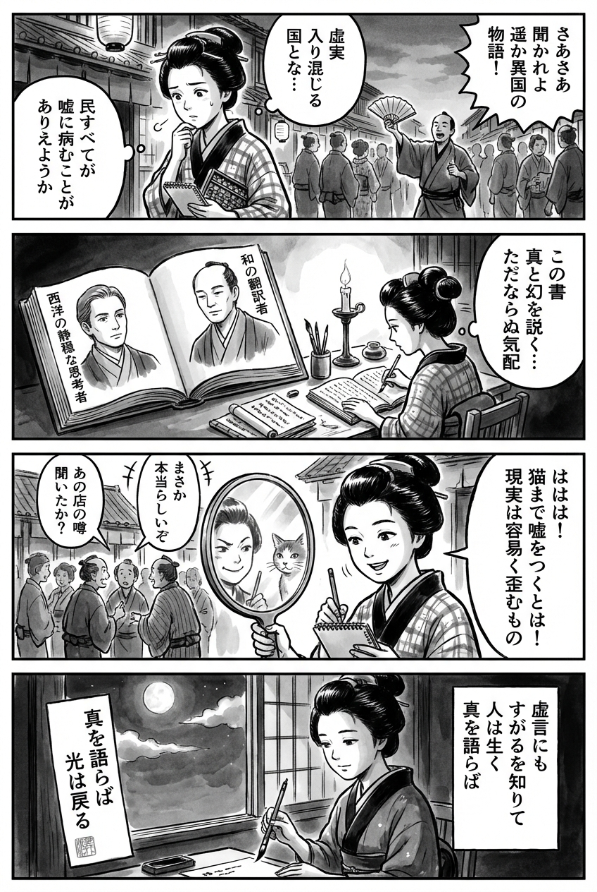

---
---
> **Language**: [日本語](../ja/ティム・オブライエン-春樹-虚言の国　　アメリカ・ファンタスティカ_review.html) | [English](../en/ティム・オブライエン-春樹-虚言の国　　アメリカ・ファンタスティカ_review.html) | [繁體中文](../zh-tw/ティム・オブライエン-春樹-虚言の国　　アメリカ・ファンタスティカ_review.html)
>
> [← Top / トップページ](../../)

## 📖 書籍情報
- **タイトル**: 虚言の国　　アメリカ・ファンタスティカ  
- **著者**: ティム・オブライエン and 村上 春樹  
- **ASIN**: B0DSBV86WM  
- **URL**: [https://www.amazon.co.jp/dp/B0DSBV86WM](https://www.amazon.co.jp/dp/B0DSBV86WM)  

---

## 🎯 この本の核心
『虚言の国　アメリカ・ファンタスティカ』は、虚偽が社会と個人を侵食する現代アメリカの寓話である。国家的な「噓の病」に罹った社会を背景に、主人公ボイド・ハルヴァーソンの自己欺瞞と崩壊の軌跡を描く。  

ティム・オブライエンは、真実と虚構の境界が溶ける瞬間を冷徹に観察し、村上春樹の翻訳がその不気味な滑らかさを日本語に移植している。噓が制度化され、真実が無力化された世界で、人間はどのように生き延びるのか——その問いが全編を貫いている。  

この物語は単なる政治風刺ではなく、虚構を生きることの必然と悲劇を描く哲学的寓話であり、「語ること」そのものが倫理的抵抗の最後の砦であることを示している。  

---

## 💡 キーインサイト
- **虚偽は社会的伝染病である**  
  虚言は個人の悪徳ではなく、社会全体に感染する病として描かれる。真実を嗅ぎ分ける力を失ったとき、民主主義は崩壊し、人間の倫理も麻痺する。  

- **虚構は人間の生存戦略である**  
  ボイドの「ぼくらはみんな幻想を必要としている」という言葉が示すように、虚構は単なる欺瞞ではなく、生き延びるための防衛機構である。真実を完全に追放することは、人間の想像力をも殺す。  

- **愛は救済ではなく、自己保存の手段に変質する**  
  登場人物たちは愛を通じて他者を理解するのではなく、自己を守るために愛を利用する。誠実さが消えた社会では、愛さえも虚構の一部となる。  

- **暴力と虚偽の共犯関係**  
  政治的腐敗や個人の暴力が同じ根から生じていることを示し、倫理の崩壊がどのように日常化するかを描く。噓が暴力の引き金となり、暴力がさらに噓を必要とする。  

- **語ることだけが抵抗である**  
  ボイドが古典『イーリアス』に手を伸ばす場面は、物語ることの力を象徴する。真実が失われても、語り続けることが人間の尊厳を保つ最後の手段となる。  

---

## 🔍 現代的文脈との関連
本書のテーマは、2024〜2025年の「ポスト真実」時代と驚くほど共鳴している。AIによるフェイク映像やディープフェイクニュースの氾濫が、現実と虚構の境界を曖昧にしつつある現代において、オブライエンの描く「虚言の伝染」はまさに予言的である。  

特に、AIが生成する「物語的現実」が政治や戦争の認識を左右する時代、真実を見極める力は個人の倫理そのものと直結する。オブライエンが描いた「虚構を生きる人間像」は、SNS上で自己演出を続ける現代人の姿と重なる。  

村上春樹の翻訳によって、日本の読者もまた「虚構の中でどう誠実に生きるか」という普遍的な問いを突きつけられる。文学が「虚言検知器」として機能する時代に、この作品は再び読む価値を持つ。  

---

## 🚀 実践への提案
- **情報を嗅ぎ分ける訓練をする**  
  情報の出所や意図を常に点検し、感情的反応ではなく論理的判断を磨くことが、虚偽社会での生存術となる。  

- **自分の中の虚構を自覚する**  
  自己欺瞞を完全に排除することは不可能だが、それを認識することで他者への誠実さを取り戻せる。自分の語る物語を一度疑ってみることが、倫理の第一歩である。  

- **建設的な幻想を育てる**  
  芸術や文学を通じて、現実逃避ではなく「希望としての幻想」を持つことが重要だ。虚構を理解し、意識的に扱うことで、現実との健全な距離を保てる。  

- **沈黙を破り、語ることを恐れない**  
  沈黙は腐敗を助長する。小さな声でも語ることが、虚偽に満ちた社会での倫理的抵抗となる。  

---

## ⭐ 総合評価
『虚言の国　アメリカ・ファンタスティカ』は、ポスト真実時代の倫理を問う文学的黙示録である。ティム・オブライエンの冷徹な筆致と村上春樹の翻訳が融合し、虚構と現実の境界を揺さぶる読書体験をもたらす。  

この本は、ニュースやSNSの真偽に疲弊した現代人にこそ読まれるべき一冊だ。虚構を恐れず、しかしその力を理解する——その知的緊張を味わうことができる、稀有な文学作品である。

---

&copy; shioki | [CC BY-NC-SA 4.0](https://creativecommons.org/licenses/by-nc-sa/4.0/)
