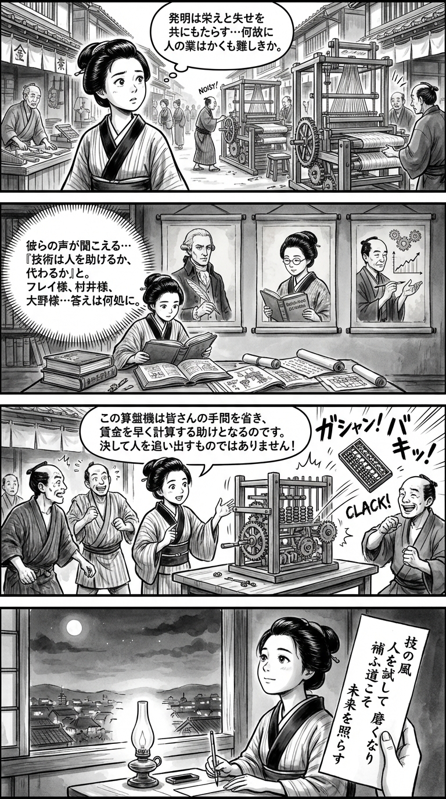

---
---
> **Language**: [日本語](../ja/テクノロジーの世界経済史　ビル・ゲイツのパラドックス_review.html) | [English](../en/テクノロジーの世界経済史　ビル・ゲイツのパラドックス_review.html) | [繁體中文](../zh-tw/テクノロジーの世界経済史　ビル・ゲイツのパラドックス_review.html)
>
> [← Top / トップページ](../../)

## 📖 書籍情報
- **タイトル**: テクノロジーの世界経済史　ビル・ゲイツのパラドックス  
- **著者**: カール・B・フレイ, 村井 章子, and 大野 一  
- **ASIN**: B08JCGNK7J  
- **URL**: [https://www.amazon.co.jp/dp/B08JCGNK7J](https://www.amazon.co.jp/dp/B08JCGNK7J)  

---

## 🎯 この本の核心
本書は、技術革新が経済成長をもたらす一方で、雇用を破壊し不平等を拡大させるという「ビル・ゲイツのパラドックス」を、古代から現代に至る長期的な歴史の中で検証する壮大な試みである。著者カール・B・フレイは、技術を「労働を補うもの」と「労働を置き換えるもの」に分類し、その違いが社会の安定と繁栄を左右してきたと論じる。  

産業革命期の機械化からAI時代の自動化まで、技術進歩がもたらす恩恵と犠牲の分配構造を丁寧に追い、政治権力・制度・文化が技術の採用を決める要因であることを明らかにする。未来を予言するのではなく、過去のパターンから学び、AI時代の社会設計に生かすための知的手引きとして構成されている。

---

## 💡 キーインサイト
- **技術の性質が社会の命運を決める**  
  技術進歩そのものは中立だが、それが「労働を補完する」のか「置き換える」のかによって、社会の安定度は大きく変わる。AIのように中間層の仕事を直接奪う技術は、社会的分断を拡大させる危険を孕む。  

- **政治権力が技術革新を可能にする**  
  技術の採用は発明の有無ではなく、政治的決断と権力構造に依存する。産業革命期のイギリスが工業化に成功したのは、政府が抵抗運動を抑え、技術導入を制度的に支えたためである。  

- **進歩の恩恵は時間差で訪れる**  
  技術革新の初期段階では多くの人々が犠牲を強いられるが、長期的には生活水準を押し上げる。この「短期の痛みと長期の利益」の非対称性を理解することが、AI時代の政策設計に不可欠である。  

- **新しい仕事は必ずしも失業者を救わない**  
  技術進歩が新しい職を生み出しても、それはしばしば異なるスキルを持つ「別の誰か」のための仕事である。再教育やスキル転換の仕組みがなければ、社会的分断は深まる。  

- **歴史は繰り返すが、同じではない**  
  産業革命とAI革命は構造的に似ているが、現代社会はより政治的に成熟しており、選択の余地を持つ。過去の教訓を活かすことで、技術進歩を社会的包摂の力に変えることができる。  

---

## 🔍 現代的文脈との関連
2024年以降、生成AIの急速な普及により、ホワイトカラー職を中心に自動化が進み、世界各地で「AI失業不安」が高まっている。米国や日本ではAI導入に対する抗議運動や政策論争が起き、まさに本書が描く「技術進歩への社会的抵抗」が再現されつつある。  

IMFやOECDの報告が示すように、AIはGDPを押し上げる一方で、所得格差を拡大させている。著者の指摘する「技術の恩恵と犠牲の不均衡」は、現代のAI経済にそのまま当てはまる。再教育・再分配・地域支援といった政策的介入がなければ、技術の進歩は社会的亀裂を深めるという警鐘が、いま現実味を帯びて響く。  

---

## 🚀 実践への提案
- **人間中心の技術導入を志向する**  
  AIや自動化の設計段階から、人間の判断力や創造性を補完する方向を重視すべきである。これにより、技術が「敵」ではなく「相棒」として機能する社会を築ける。  

- **再教育とスキル転換への投資**  
  技術変化に適応するためには、労働者が新しい職に移行できる仕組みが不可欠だ。企業や政府は、リスキリング（再教育）を単なる支援策ではなく、経済基盤の一部として位置づける必要がある。  

- **地域格差を抑える政策的介入**  
  自動化の影響は地域的に偏るため、地方経済への投資やインフラ整備を通じて、技術進歩の恩恵を均等化することが重要だ。これが社会的安定の鍵となる。  

- **過去から学ぶ政策形成**  
  技術導入をめぐる過去の成功と失敗を参照し、短期的な痛みをどう緩和するかという視点を政策に組み込むこと。歴史的洞察が、未来の混乱を防ぐ羅針盤となる。  

---

## ⭐ 総合評価
『テクノロジーの世界経済史』は、AI時代の不安を単なる未来予測ではなく、数千年にわたる人類の経験の延長線上で捉え直す知的冒険である。歴史・経済・政治を横断する分析により、技術進歩の「光」と「影」を冷静に見つめるための視座を提供している。  

経営者、政策立案者、そしてAI時代の働き方を模索するすべての読者にとって、本書は「過去を知ることで未来を設計する」ための必読書である。読後には、技術への恐れよりも、どう共存していくかという前向きな問いが残るだろう。

---

&copy; shioki | [CC BY-NC-SA 4.0](https://creativecommons.org/licenses/by-nc-sa/4.0/)
