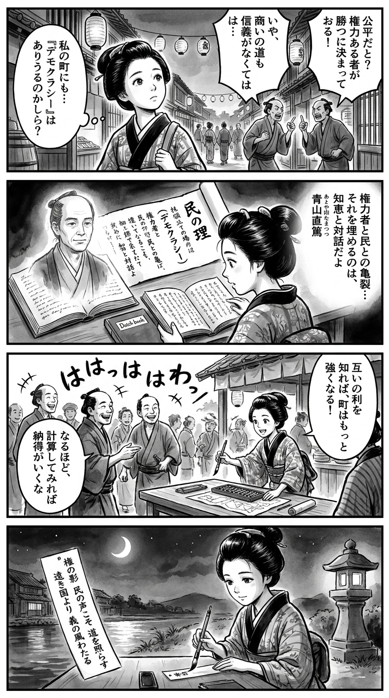

> **Language**: [日本語](../ja/デモクラシーの現在地――アメリカの断層から_review.html) | [English](../en/デモクラシーの現在地――アメリカの断層から_review.html) | [繁體中文](../zh-tw/デモクラシーの現在地――アメリカの断層から_review.html)
>
> [← Top / トップページ](../../)

## 📖 書籍情報
- **タイトル**: デモクラシーの現在地――アメリカの断層から  
- **著者**: 青山直篤  
- **ASIN**: B0BKGYRNMD  
- **URL**: [https://www.amazon.co.jp/dp/B0BKGYRNMD](https://www.amazon.co.jp/dp/B0BKGYRNMD)

---

<picture>
  <source srcset="../../images/reviews/デモクラシーの現在地――アメリカの断層から_4panel.webp" type="image/webp">
  
</picture>
## 🎯 この本の核心
本書は、アメリカ民主主義の危機を通して、グローバル化とエリート支配がもたらした社会的分断の構造を鋭く描き出す試みである。著者・青山直篤は、トランプ現象を単なる政治的逸脱ではなく、エリート層の偽善と地方社会の疎外が交錯する「時代の症状」として読み解く。

さらに、アメリカの断層は日本社会の従属構造とも地続きであると指摘し、戦後から続く日米関係の非対称性を民主主義の観点から再考する。最終的に著者は、「在所の義気」に象徴される地域的連帯の再生こそが、民主主義を立て直す唯一の道であると結論づけている。

---

## 💡 キーインサイト
- **エリートの想像力の欠如が分断を深める**  
  能力主義とグローバル化の名のもとに、エリート層は自らの外の世界を理解する力を失った。結果として、地方や労働者階層は政治的に取り残され、民主主義の基盤が浸食されていく。

- **トランプ支持は「怒りの政治」**  
  トランプ支持者の行動は経済合理性ではなく、都市への反感や文化的疎外感に根ざしている。政治的選択が感情とアイデンティティに支配される現象として、現代民主主義の脆弱さを示している。

- **グローバル化の「相互依存」は平和を保証しない**  
  経済的結びつきが対立を緩和するという幻想は崩れ、むしろ相互依存が武器化される時代に入った。市場の自由が倫理的枠組みを欠くとき、民主主義はその正統性を失う。

- **地域社会の崩壊が民主主義の劣化を招く**  
  地域共同体は公共性と責任感を育む場であり、その崩壊は民主主義の根を枯らす。著者は、地域の再生を通じて政治的信頼を取り戻す必要を説く。

- **日本の民主主義も同じ病を抱える**  
  アメリカの分断は日本の従属構造を映す鏡であり、民主主義の形骸化は他人事ではない。国家間の非対称性を見直すことが、民主主義の成熟に不可欠である。

---

## 🔍 現代的文脈との関連
アメリカでは、党派対立が生活様式や価値観の分断にまで及び、民主主義の制度的信頼が急速に低下している。選挙制度や司法の正統性をめぐる論争、SNSによる情報の断片化が、社会の共通基盤を揺るがしている。

本書が描く「エリートの偽善」と「地方の怒り」は、まさにこの現代的文脈の中で再現されている。青山は、制度改革だけでなく、地域的・人間的な信頼の再構築こそが民主主義再生の鍵であると示唆する。アメリカの危機を他山の石として、日本社会もまた「公共性の倫理」を問い直す必要がある。

---

## 🚀 実践への提案
1. **地域社会とのつながりを再構築する**
   近隣や地域での対話や協働を通じて、公共性と相互理解を育むことが、分断を癒やす第一歩となる。

2. **経済政策を倫理の視点で評価する**
   経済効率だけでなく、「誰のための富か」「どのような社会を支えるのか」という観点から政策を判断する姿勢が求められる。

3. **国家の役割を再定義する**
   国家は市場の後見人ではなく、人権・環境・安全保障を守る規範的主体として行動すべきである。市場への無制限な自由放任はもはや許されない。

4. **エリートと市民の対話を再生させる**
   政治を上からの指導ではなく、下からの参加と対話によって支える文化を育てることが、民主主義の回復に不可欠である。

5. **国際関係を「対等性」で再構築する**
   日米関係をはじめとする国際関係を、従属ではなく相互尊重の原理に基づいて再設計することが、民主主義の成熟を支える。

---

## ⭐ 総合評価
『デモクラシーの現在地――アメリカの断層から』は、アメリカの政治危機を通して、現代民主主義の根本的な病理を照らし出す。単なる政治評論ではなく、倫理・経済・地域社会を貫く総合的な文明論として読むべき書である。

読者は、アメリカの分断を「遠い国の出来事」としてではなく、自らの社会の鏡像として受け止めることになるだろう。民主主義を支えるのは制度ではなく、人間同士の信頼と共感であるという著者の主張は、今日の世界においてきわめて切実な警鐘である。

---

&copy; shioki | [CC BY-NC-SA 4.0](https://creativecommons.org/licenses/by-nc-sa/4.0/)
