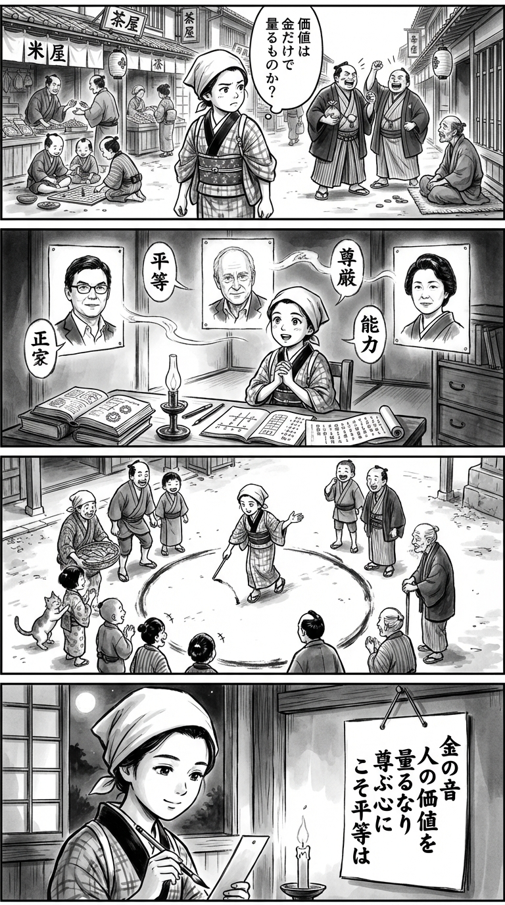

---
---
> **Language**: [日本語](../ja/トマ ピケティ-麻左子-平等について、いま話したいこと_review.html) | [English](../en/トマ ピケティ-麻左子-平等について、いま話したいこと_review.html) | [繁體中文](../zh-tw/トマ ピケティ-麻左子-平等について、いま話したいこと_review.html)
>
> [← Top / トップページ](../../)

## 📖 書籍情報
- **タイトル**: 平等について、いま話したいこと  
- **著者**: トマ ピケティ, マイケル サンデル, and 岡本 麻左子  
- **ASIN**: B0DRCHRGW9  
- **URL**: [https://www.amazon.co.jp/dp/B0DRCHRGW9](https://www.amazon.co.jp/dp/B0DRCHRGW9)

---

## 🎯 この本の核心
『平等について、いま話したいこと』は、経済学者トマ・ピケティと哲学者マイケル・サンデルが、現代社会の「不平等」と「尊厳」の問題を多角的に掘り下げた対話集である。ピケティは歴史的・制度的な観点から再分配と脱商品化を結びつけ、社会民主主義の再構築を提案する。一方、サンデルは能力主義や学歴偏重主義がもたらす倫理的分断を批判し、尊厳と承認を回復する政治の必要を説く。  

両者の議論は、単なる経済格差の是正にとどまらず、「人間が人間として扱われる社会とは何か」という根源的な問いに向かう。市場の論理を超えた民主的熟議、そして共同体の再生を通じて、平等を「人間関係の再構築」として再定義する試みが本書の核をなしている。

---

## 💡 キーインサイト
- **脱商品化が不平等を無意味化する**  
　教育や医療、文化を市場原理から切り離すことで、金銭的不平等の影響力を削ぐというピケティの洞察は、平等を「所得の再分配」から「生活領域の公共化」へと拡張する視点を与える。これにより、社会の基盤がより人間的な価値に支えられる可能性が開かれる。  

- **能力主義は新しい差別を生む**  
　サンデルが指摘するように、努力や才能を絶対視する社会では、成功者の傲慢と敗者の屈辱が生まれる。これは社会的尊厳を損ない、連帯を破壊する構造であり、現代の meritocracy（能力主義）批判の核心を突いている。  

- **民主主義は「怖れ」を超える熟議で成り立つ**  
　市場や専門家に判断を委ねるのではなく、市民自身が価値を決める熟議の場を取り戻すことが民主主義の本質だと両者は説く。政治的自治の回復は、平等を制度ではなく文化として根づかせる鍵となる。  

- **尊厳の欠如がポピュリズムを生む**  
　経済的困窮だけでなく、「自分が尊重されていない」という感覚が社会の分断を深める。尊厳と承認の政治を再構築することが、民主主義の再生に不可欠である。  

- **国際的な「普遍主義的主権主義」への展望**  
　ピケティが提案するこの概念は、国家主権を保ちながらも国際的な連帯を実現する新しい政治哲学である。地球規模の不平等や環境問題に対して、共通の倫理的基盤を築く方向性を示している。

---

## 🔍 現代的文脈との関連
2025年の社会では、格差の拡大と人間関係の希薄化が深刻化している。サンデルが指摘する「富者と貧者を対等に見る視線の喪失」は、日本を含む先進国で顕著な現象だ。本書の議論は、この「見えない差別」の構造を可視化し、倫理的平等を再考する契機を与える。  

また、フェミニスト経済学の台頭により、「必要」と「ケア」を中心に据えた経済の再設計が注目されている。ピケティの再分配論とサンデルの倫理的平等論は、こうした潮流と響き合い、ジェンダーやケアの視点を含む新しい社会民主主義への道を示唆する。  

さらに、ロールズ以降の「絶対水準 vs. 相対水準」論争を踏まえ、本書は平等を単なる所得差ではなく「相互承認の関係」として再定義する。これは、経済政策と倫理哲学を架橋する試みとして、現代の政策議論に深い示唆を与えている。

---

## 🚀 実践への提案
1. **教育・医療・文化といった領域を市場原理から切り離し、公共的熟議によって価値を決める制度設計を進めることが重要である**
   これは、社会的連帯の基盤を強化し、金銭的不平等の影響を減じる実践的な一歩となる。

2. **累進課税や最高賃金制度の導入を通じて、極端な所得格差を是正する仕組みを整えることが求められる**
   これは単なる再分配ではなく、社会関係の健全化を目的とした倫理的選択である。

3. **仕事の尊厳を再評価する文化運動を育むべきだ**
   学歴や職種に関係なく、社会への貢献を尊重する価値観が広がれば、能力主義の呪縛から脱し、より包摂的な社会が形成されるだろう。

4. **市民が直接参加できる熟議の場を制度化することが不可欠である**
   くじ引きによる市民議会や地域協議会の拡充は、民主主義を「観客の政治」から「参加の政治」へと転換する有効な手段となる。

---

## ⭐ 総合評価
本書は、経済学と倫理哲学の交差点に立ち、平等という概念を根底から問い直す知的対話である。ピケティの制度的分析とサンデルの倫理的洞察が交わることで、平等を「再分配の問題」から「人間関係の問題」へと拡張している。  

現代社会の分断や孤立に違和感を覚える人、民主主義の再生を真剣に考える人にとって、本書は思考の羅針盤となるだろう。読後には、「平等」とは単に富を分け合うことではなく、互いを人間として尊重し合う文化を築くことだという確信が残る。

---

&copy; shioki | [CC BY-NC-SA 4.0](https://creativecommons.org/licenses/by-nc-sa/4.0/)
