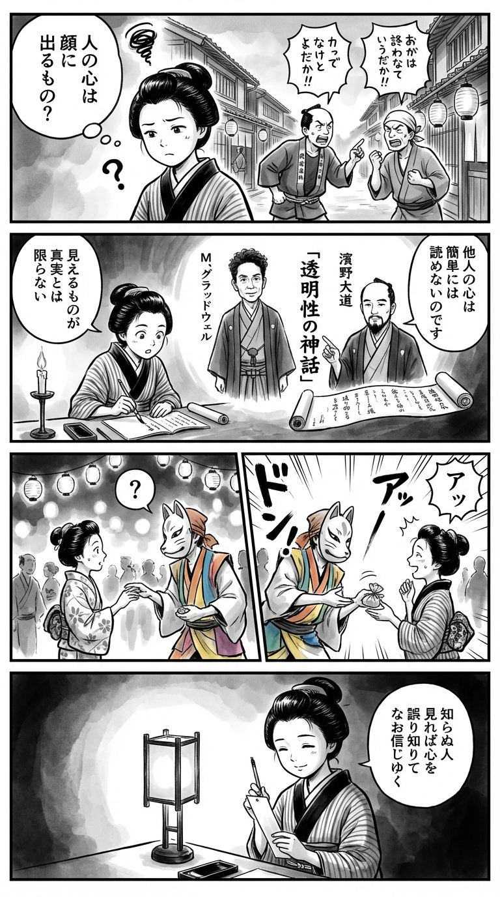

> **Language**: [日本語](../ja/トーキング・トゥ・ストレンジャーズ～「よく知らない人」について私たちが知っておくべきこと～_review.html) | [English](../en/トーキング・トゥ・ストレンジャーズ～「よく知らない人」について私たちが知っておくべきこと～_review.html) | [繁體中文](../zh-tw/トーキング・トゥ・ストレンジャーズ～「よく知らない人」について私たちが知っておくべきこと～_review.html)
>
> [← Top / トップページ](../../)

## 📖 書籍情報
- **タイトル**: トーキング・トゥ・ストレンジャーズ～「よく知らない人」について私たちが知っておくべきこと～  
- **著者**: M・グラッドウェル and 濱野 大道  
- **ASIN**: B08BWWQ6VJ  
- **URL**: [https://www.amazon.co.jp/dp/B08BWWQ6VJ](https://www.amazon.co.jp/dp/B08BWWQ6VJ)

---

## 🎯 この本の核心
マルコム・グラッドウェルは本書で、「見知らぬ他人を理解することの難しさ」という普遍的なテーマに挑む。人間は本能的に他者を信じ、表情や態度から真実を読み取れると錯覚するが、そこには構造的な誤解が潜んでいる。著者はこの「透明性の神話」を暴き、信頼と懐疑のバランスを再考させる。

本書は、心理学・社会学・歴史的事例を縦横に結び、他者理解の限界を科学的に検証する。裁判官の判断ミスからアルコールによる誤認、文化的衝突まで、私たちが「知らない人」と向き合う際の錯覚を多面的に描き出す。グラッドウェルは、完全な理解を求める傲慢さを戒め、「不完全な理解を受け入れる成熟」を提唱している。

---

## 💡 キーインサイト
- **「信じる」ことは人間の初期設定である**  
　人はまず他者を信じるようにできており、疑いは例外的な反応である。欺かれることは欠陥ではなく、社会的協力を支える進化的戦略であると著者は説く。

- **「透明性」は神話にすぎない**  
　表情や態度から真実を読み取れるという考えは誤りであり、フィクションが作り上げた幻想である。これを信じることで、冤罪や誤解といった悲劇が生まれる。

- **AIは人間の判断を凌駕しうる**  
　感情や先入観に左右される人間よりも、データに基づくAIの方が公平な判断を下す場合がある。これは「人間らしさ」が必ずしも倫理的優位を意味しないことを示す。

- **「疑い」は信頼を壊すものではない**  
　疑念を持つことは信頼の否定ではなく、健全な関係を保つための要素である。信じることと疑うことを両立させる視点が、成熟した社会を支える。

- **完全な理解を求めることの危険**  
　他者を完全に理解しようとする欲望こそが、誤解と対立を生む。理解の限界を受け入れる謙虚さが、人間関係の持続可能性を高める。

---

## 🔍 現代的文脈との関連
SNSやリモートワークが普及した現代では、「知っている人」と「知らない人」の境界が曖昧になっている。オンライン上のなりすましやフェイク情報の増加は、他者の真正性を見極める難しさを浮き彫りにしている。グラッドウェルの指摘する「透明性の神話」は、まさにこのデジタル社会において再検証されるべき問題である。

また、社会的分断やハラスメント問題など、「誰を信じるか」「どこまで疑うか」という判断が個人の倫理を試す局面が増えている。AIやデータ分析が判断補助として台頭する一方で、人間の直感や共感の限界が露呈している今、本書のメッセージはより切実な意味を帯びている。

---

## 🚀 実践への提案
1. **「他者を完全に理解できる」という幻想を手放す**
   表情や態度を真実の指標とみなすことをやめ、誤解が起こりうる前提で人と向き合う。これが偏見や誤判を減らす第一歩となる。

2. **「信頼」と「疑念」を両立させる**
   信じることを出発点にしつつ、矛盾や不整合を感じたときには立ち止まる。盲信でも不信でもない中庸の姿勢が、健全な関係を育む。

3. **判断において「印象」よりも「データ」を重視する**
   感情的な直感ではなく、客観的な情報を基に判断する習慣を持つ。これは職場や司法、日常の意思決定すべてに通じる実践である。

4. **酔った状態での重要な判断を避ける**
   アルコールが思考を短絡化させることを理解し、感情的な判断を控える。特に人間関係においては冷静さを保つことが不可欠である。

5. **「不完全な理解」を受け入れる謙虚さを持つ**
   誤解は避けられないという現実を受け入れ、他者との対話を柔軟に続ける。この姿勢が、異文化や異なる立場の人々との共存を可能にする。

---

## ⭐ 総合評価
『トーキング・トゥ・ストレンジャーズ』は、人間の「信頼」と「誤解」をめぐる構造を解体し、他者理解の限界を見つめ直す知的挑戦である。グラッドウェルは、科学的知見と物語的手法を融合させ、読者に深い思索を促す。

本書は、他人との関係に悩むすべての人、または社会的判断に関わる職業に携わる人にとって必読の一冊である。読後には、「理解できないことを受け入れる勇気」こそが、現代社会で最も必要な知性であると気づかされるだろう。

---

&copy; shioki | [CC BY-NC-SA 4.0](https://creativecommons.org/licenses/by-nc-sa/4.0/)
