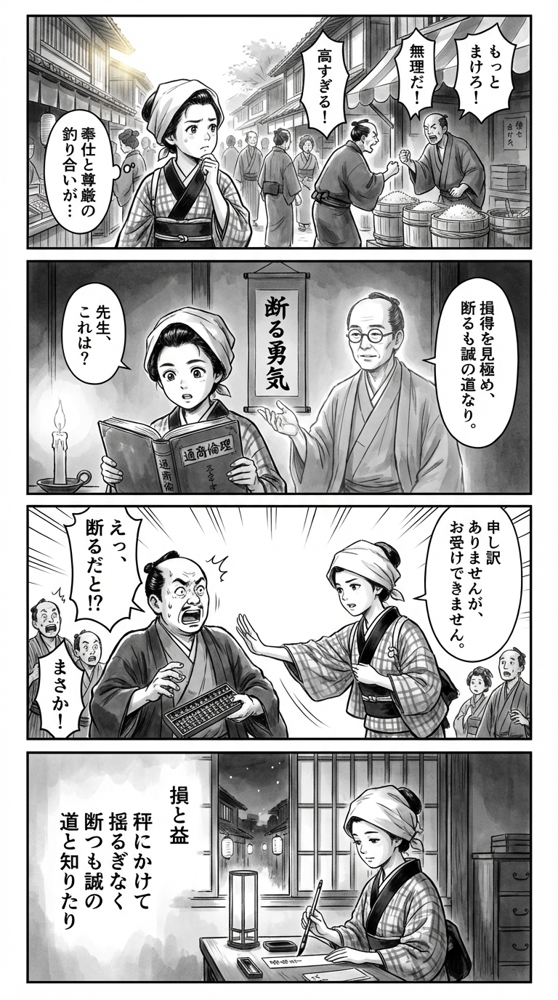

---
---
> **Language**: [日本語](../ja/フミコフミオ-【電子版限定特典付き】 給食営業マン サバイバル戦記　カスハラ地獄、失注連鎖、米の仕入れも赤信号_review.html) | [English](../en/フミコフミオ-【電子版限定特典付き】 給食営業マン サバイバル戦記　カスハラ地獄、失注連鎖、米の仕入れも赤信号_review.html) | [繁體中文](../zh-tw/フミコフミオ-【電子版限定特典付き】 給食営業マン サバイバル戦記　カスハラ地獄、失注連鎖、米の仕入れも赤信号_review.html)
>
> [← Top / トップページ](../../)

## 📖 書籍情報
- **タイトル**: 【電子版限定特典付き】 給食営業マン サバイバル戦記　カスハラ地獄、失注連鎖、米の仕入れも赤信号  
- **著者**: フミコフミオ  
- **ASIN**: B0FQV3YX96  
- **URL**: [https://www.amazon.co.jp/dp/B0FQV3YX96](https://www.amazon.co.jp/dp/B0FQV3YX96)

---

## 🎯 この本の核心
本書は、給食業界という一見地味な現場を舞台に、中小企業営業の過酷な現実を赤裸々に描いたノンフィクションである。著者フミコフミオは、日々の営業活動を通じて露わになる「構造的不利」「人材難」「カスハラ（カスタマーハラスメント）」といった現代日本の労働問題を、現場目線で活写している。  

その筆致は、単なる労働記録ではなく、営業という職業の本質を問う哲学的な深みを持つ。「取る」よりも「断る」勇気を重視し、損得勘定を超えたプロフェッショナリズムを提示する。中小企業の現場を通して、働くことの尊厳と現実主義の共存を描き出す一冊だ。

---

## 💡 キーインサイト
- **「下請け幻想」からの覚醒**  
  中小企業が「パートナー」と信じる関係は、実際には「下請け」にすぎないという冷厳な現実を突きつける。理想論ではなく、現実の力学を理解したうえで戦略を立てることの重要性を教える。  

- **「断る勇気」が真の営業力**  
  成果を追うだけでなく、リスクのある案件を見極めて断る判断力こそが、会社を守る営業の本質だと説く。数字よりも信頼を積み上げる姿勢が、長期的な成果を生む。  

- **「顧客ファースト」の欺瞞**  
  顧客の要求を無条件に受け入れることが、必ずしも企業の健全性につながらない。過剰な迎合は自社を疲弊させ、信頼関係を損なう危険を孕む。  

- **「魔法の営業術」は存在しない**  
  一攫千金のテクニックではなく、地道な関係構築と前倒しの努力が成果を生む。営業の本質は「日々の積み重ね」にあるという現実的な教訓が込められている。  

- **「嫌な経験」も血肉になる**  
  苦労や失敗を避けずに受け止めることで、人間の芯が鍛えられる。営業現場の試練を通じて、著者は「働くことの意味」を再定義している。

---

## 🔍 現代的文脈との関連
2024年以降、学校給食業界は人手不足とコスト上昇、食材調達難といった複合的な危機に直面している。地方自治体では地産地消を模索しつつも、供給農家の減少が「米の仕入れ赤信号」という現実を招いている。  

同時に、営業職を取り巻く「カスハラ」問題やメンタル不調は社会的関心を集めており、著者が描く「現場の疲弊」は決して過去の話ではない。むしろ、賃上げ圧力や人口減少が進む今こそ、本書の「断る勇気」「現場主義」のメッセージは、企業経営にも個人の働き方にも通じる普遍的な指針となっている。

---

## 🚀 実践への提案
1. **リスクを見極め、断る勇気を持つ**
   採算の合わない案件を避けることは、短期的な損失ではなく長期的な防衛策である。営業における「選択と集中」が、企業の持続性を支える。

2. **顧客との関係を「質」で育てる**
   数を追うよりも、信頼関係の深い顧客を大切にすることで、安定した成果を生む。見込み客の「量より質」への転換が、営業効率を高める鍵となる。

3. **前倒しの行動習慣を身につける**
   「明日やる」ではなく「今日やる」を徹底する。著者の実践のように、半年で年間ノルマを達成する意識が、結果を変える。

4. **「顧客ファースト」を再定義する**
   顧客の言いなりになるのではなく、双方にとって価値のある関係を築くことが真の顧客第一主義である。

5. **現場の声を経営に反映させる**
   現場を知らない意思決定は失敗を招く。現場の知見を「線」と「面」で捉え、経営判断に生かすことが組織の健全性を保つ。

---

## ⭐ 総合評価
『給食営業マン サバイバル戦記』は、現代日本の労働現場をリアルに描きながら、営業という職業の倫理と誇りを問い直す一冊である。著者の冷静な観察眼とユーモアが、読者に「働くとは何か」を深く考えさせる。  

営業職はもちろん、組織の中で現実と理想の狭間に立つすべてのビジネスパーソンにとって、本書は「生き延びるための仕事論」として読む価値がある。現場で汗を流す人々への共感と敬意を呼び起こす、静かな熱を持った作品だ。

---

&copy; shioki | [CC BY-NC-SA 4.0](https://creativecommons.org/licenses/by-nc-sa/4.0/)
