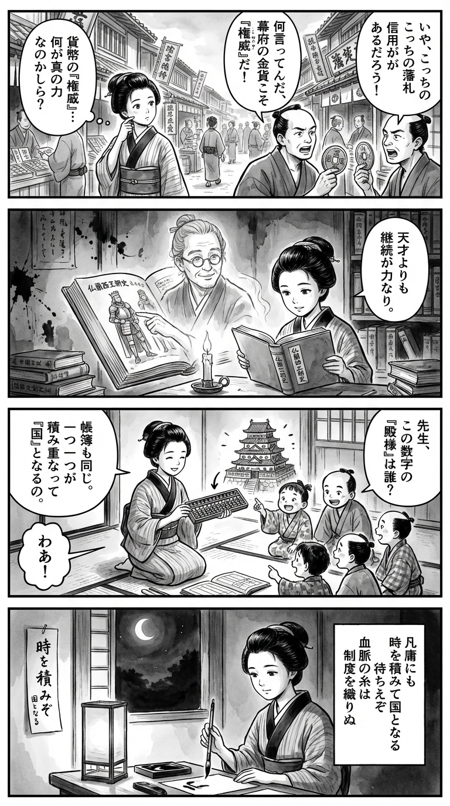

---
---
> **Language**: [日本語](../ja/フランス王朝史　全３冊合本版_review.html) | [English](../en/フランス王朝史　全３冊合本版_review.html) | [繁體中文](../zh-tw/フランス王朝史　全３冊合本版_review.html)
>
> [← Top / トップページ](../../)

## 📖 書籍情報
- **タイトル**: フランス王朝史　全３冊合本版  
- **著者**: 佐藤賢一  
- **ASIN**: B07VB2ZW4X  
- **URL**: [https://www.amazon.co.jp/dp/B07VB2ZW4X](https://www.amazon.co.jp/dp/B07VB2ZW4X)  

---

## 🎯 この本の核心
『フランス王朝史　全３冊合本版』は、ユーグ・カペーの即位からフィリップ4世まで、約400年にわたるカペー朝の歩みを通じて「国家とは何か」を問う壮大な叙事である。地方領主の連合体にすぎなかった中世フランスが、いかにして中央集権的な国家へと進化したのかを、政治・宗教・経済・制度の多層的な視点から描き出す。  

佐藤賢一は、英雄的な王ではなく「凡庸な継続」の力に焦点を当てる。カペー朝の真価は、個々の王の才覚ではなく、血統と制度の持続性にあったという視座が貫かれている。王権の正統性、宗教的道徳、制度改革、経済基盤の確立が、いかにして「フランス」という国家の骨格を形づくったかを、緻密な史実と文学的筆致で描き切る。  

---

## 💡 キーインサイト
- **正統性は時間によって築かれる**  
  フランス王家の権威は、一代の功績ではなく世代を超えた積み重ねによって確立された。ユーグ・カペーが名を、フィリップ2世が実を、ルイ9世が品格を得たという構造は、国家形成の「時間的正統性」を象徴している。  

- **制度改革が国家を生む**  
  ルイ6世の上訴制度やフィリップ4世の全国三部会の創設など、制度の整備こそが中央集権化の核心であった。名目上の改革がやがて実体を伴い、封建的連合から「国家」への転換を実現した。  

- **宗教的徳が政治を支える**  
  ルイ9世の敬虔な信仰は、武力による支配に道徳的正当性を与えた。宗教と政治の緊張関係の中で、信仰が国家の「良心」として機能する様子が描かれる。  

- **経済構造の変化が王権を試す**  
  貨幣経済の進展に伴い、王権は新たな財政基盤を模索した。フィリップ4世の貨幣改鋳や課税制度は、国家経営の近代化を先取りする試みであり、経済と政治の相互依存を浮き彫りにする。  

- **凡庸さの力**  
  派手な改革よりも、安定した継続が国家を成熟させる。フィリップ3世の穏健な治世が示すように、制度の定着期こそが文明の基盤を築く時期である。  

---

## 🔍 現代的文脈との関連
現代の歴史小説ブームの中で、佐藤賢一の作品は「史実に忠実なフィクション」として高く評価されている。著者自身が掲げる「ウソの周囲を真実で固める」という手法は、史実の再構築を通じて読者の歴史観を鍛える試みであり、本書もその代表例といえる。  

また、現代社会における組織運営や国家運営の課題—制度疲労、正統性の危機、倫理と実利の両立—に対し、カペー朝の経験は示唆に富む。短期的成果を追う現代にあって、「時間による正統性」「凡庸さの力」というテーマは、持続可能な社会の構築に通じる普遍的な教訓を与えている。  

---

## 🚀 実践への提案
1. **長期的視野で組織を育てる**  
   一代で成果を求めず、制度・文化・信頼を積み上げる姿勢が組織の持続力を生む。カペー朝のように「継続」を戦略とする視点が重要だ。  

2. **形式から変革を始める**  
   名目上の制度改革が意識変化を促す。まずは枠組みを設けることで、後に実体が追いつくという歴史的教訓を現代の組織改革にも応用できる。  

3. **倫理と現実のバランスを取る**  
   ルイ9世とフィリップ4世の対比が示すように、理想主義と現実主義の両立が信頼を生む。理念を掲げつつも、実行力を伴う判断が求められる。  

4. **制度の正統性を活用する**  
   危機時には、透明なプロセスと制度的承認を活用することで信頼を確保できる。正統性の担保は、組織の安定に直結する。  

5. **安定を価値として再評価する**  
   変革ばかりが称賛される現代にあっても、「凡庸な安定」が社会の成熟を支える。維持と整備の時期を恐れず、安定を戦略的に位置づけるべきだ。  

---

## ⭐ 総合評価
『フランス王朝史』は、歴史を通じて「国家の成熟とは何か」を問う知的探究の書である。英雄譚ではなく、制度と時間が織りなす国家形成のプロセスを描くことで、読者に「継続の哲学」を提示する。  

歴史ファンはもちろん、組織運営やリーダーシップに関心を持つ読者にも示唆に富む内容であり、制度・倫理・経済の交錯を通じて現代社会を照らす一冊となっている。読むほどに、歴史が「過去」ではなく「現在の鏡」であることを実感させる作品である。

---

&copy; shioki | [CC BY-NC-SA 4.0](https://creativecommons.org/licenses/by-nc-sa/4.0/)
