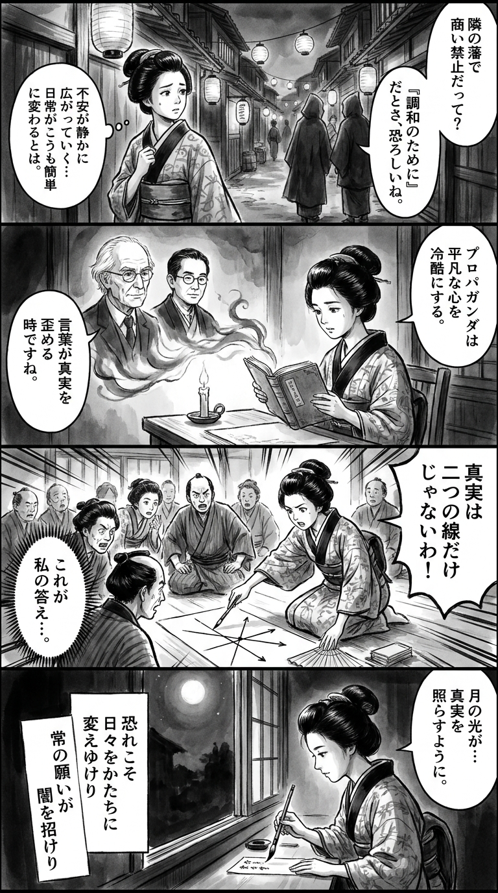

> **Language**: [日本語](../ja/プロット・アゲンスト・アメリカ_review.html) | [English](../en/プロット・アゲンスト・アメリカ_review.html) | [繁體中文](../zh-tw/プロット・アゲンスト・アメリカ_review.html)
>
> [← Top / トップページ](../../)

## 📖 書籍情報
- **タイトル**: プロット・アゲンスト・アメリカ  
- **著者**: フィリップ・ロス and 柴田元幸  
- **ASIN**: B0D5H6CGY1  
- **URL**: [https://www.amazon.co.jp/dp/B0D5H6CGY1](https://www.amazon.co.jp/dp/B0D5H6CGY1)

---

<picture>
  <source srcset="../../images/reviews/プロット・アゲンスト・アメリカ_4panel.webp" type="image/webp">
  
</picture>
## 🎯 この本の核心
『プロット・アゲンスト・アメリカ』は、もしもアメリカがナチス・ドイツと同盟を結び、反ユダヤ主義が国家レベルで容認されたら――という架空の歴史を通じて、民主主義の脆さと日常の崩壊を描く物語である。語り手は一人の少年であり、彼の目を通して「恐怖が日常に侵入する瞬間」が克明に記録される。  

物語の核心は、政治が個人と家庭にまで浸透し、信頼や愛情を分断していく過程にある。父の無力感、兄の変化、叔母の狂気など、家庭という最も身近な共同体が崩壊していく様は、社会全体の縮図として機能している。  

ロスは、歴史を「後から整えられた物語」としてではなく、「不測の事態の連続」として描く。読者は、恐怖と混乱のただ中で生きる人々の現実を、冷静な観察ではなく切実な体験として追体験することになる。

---

## 💡 キーインサイト
- **恐怖は社会構造を変質させる力である**  
　恐怖は単なる感情ではなく、記憶や判断、人格形成をも歪める。ロスは「絶えまない恐怖が記憶を覆う」という一文を通じて、恐怖が社会全体を再構築してしまう過程を描き出す。  

- **愛国心は容易に裏切られる幻想である**  
　「私たちの祖国はアメリカだった」という確信が、政治的決定ひとつで崩壊する。国家への信頼は絶対的なものではなく、権力構造の変化によって簡単に反転する脆弱な前提にすぎない。  

- **偏見は「普通の人々」から広がる**  
　極端な思想は狂信者の専売特許ではない。ロスは、隣人たちが徐々に変質していく様を通して、差別がいかに日常の中で正当化されていくかを示す。  

- **プロパガンダは単純化によって思考を奪う**  
　「リンドバーグに一票か、戦争に一票か」というスローガンが象徴するように、複雑な現実を二択に還元することで、人々は思考を停止し、支配に従順になる。  

- **「正常性」への欲望が危険を見えなくする**  
　人々は安定を求めるがゆえに、異常を見過ごす。ロスは「国民は正常性を何より望んだ」と描き、平穏への執着こそが社会の崩壊を招くことを警告する。

---

## 🔍 現代的文脈との関連
本作のテーマは、現代社会における「民主主義の脆弱性」と深く共鳴している。20世紀前半の極右運動や反ユダヤ主義の再現として描かれた架空のアメリカは、今日の世界で再び台頭する排外主義や陰謀論の構造と驚くほど似通っている。  

また、ロスが描く「静かに蝕まれていく日常」は、現代のSNS時代における情報操作や分断の進行を思わせる。極端な思想は突発的にではなく、日常の中で徐々に常識化していく。その緩慢な崩壊の描写は、現代社会に対する鋭い警鐘として読むことができる。  

さらに、実在の人物リンドバーグを大統領に据えるという設定は、「カリスマ的な個人が民主主義を歪める」危険を可視化する。ロスの想像力は、現実の政治的潮流を先取りする社会的シミュレーションとして、いまなお強い示唆力を持つ。

---

## 🚀 実践への提案
1. **単純なスローガンを疑う**
   政治的・社会的なメッセージが二択構造で提示されたときこそ、思考停止に陥らないよう注意すべきである。複雑さを受け入れることが、民主主義的思考の第一歩となる。

2. **少数者への言説の変化を観察する**
   差別は常に言葉から始まる。特定の集団が「問題視」される言説が増えたとき、それは社会の警報音である。早期に気づき、声を上げることが重要だ。

3. **「普通の人」の変化を見逃さない**
   過激な思想は、日常の人々の態度変化として現れる。周囲の空気の変化に敏感であることが、社会の異変を察知する最も確実な方法である。

4. **家庭やコミュニティでの対話を絶やさない**
   外部の政治的分断が家庭に侵入することを防ぐために、対話を維持する努力が必要である。意見の違いを恐れず、関係を断絶しないことが抵抗の形となる。

5. **「安心」を前提としない**
   平穏は与えられるものではなく、維持するための不断の努力が必要である。制度や社会の変化に対して批判的に考える姿勢を持つことが、自由を守る唯一の手段である。

---

## ⭐ 総合評価
『プロット・アゲンスト・アメリカ』は、歴史改変小説の枠を超えて、民主主義社会の根幹を問う文学的実験である。ロスの筆致は冷徹でありながら、少年の視点を通じて描かれる恐怖と喪失には深い人間的共感が宿る。  

この作品は、政治的極端化や分断が進む現代において、私たちが「正常性」という幻想にどれほど依存しているかを突きつける。読む者は、過去の寓話としてではなく、現在進行形の現実としてこの物語と向き合うことになるだろう。

---

&copy; shioki | [CC BY-NC-SA 4.0](https://creativecommons.org/licenses/by-nc-sa/4.0/)
