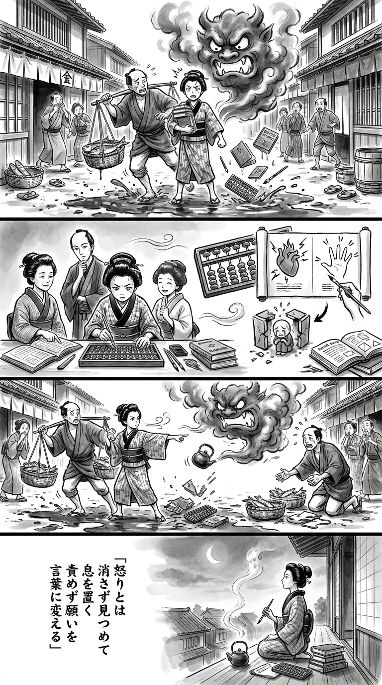

> **Language**: [日本語](../ja/マンガでやさしくわかるアンガーマネジメント_review.html) | [English](../en/マンガでやさしくわかるアンガーマネジメント_review.html) | [繁體中文](../zh-tw/マンガでやさしくわかるアンガーマネジメント_review.html)
>
> [← Top / トップページ](../../)

## 📖 書籍情報
- **タイトル**: マンガでやさしくわかるアンガーマネジメント
- **著者**: 戸田久美, 葛城かえで, and 柾朱鷺
- **ASIN**: B01H3JZGBI
- **URL**: [https://www.amazon.co.jp/dp/B01H3JZGBI](https://www.amazon.co.jp/dp/B01H3JZGBI)

---

<picture>
  <source srcset="../../images/reviews/マンガでやさしくわかるアンガーマネジメント_4panel.webp" type="image/webp">
  
</picture>
## 🎯 この本の核心
本書の核心は、怒りを悪として消し去るのではなく、自分を守るために必要な感情として受け入れる点にある。目標は「怒らない人」になることではなく、怒る必要のある場面を見極め、後悔しない方法で表現できるようになることだ。

そのために、衝動を鎮める短期的な技法と、怒りを生む「べき」や反応パターンを見直す長期的な訓練を組み合わせる。さらに怒りの奥にある不安や悲しさを言語化し、攻撃ではなく問題解決へ転換する視座を提示している。

---

## 💡 キーインサイト
- **感情と行動を切り分ける**  
  怒りを感じること自体は否定せず、その後の発言や行動を選び直す。感情の抑圧ではなく、表出方法の調整こそが本書の基本姿勢である。

- **短期対処と体質改善を併用する**  
  呼吸やカウントで爆発を防ぐ一方、記録と振り返りによって怒りやすい状況を把握する。即効性だけに頼らない点が実践的である。

- **自分の「べき」を疑う**  
  怒りの背景には、自分の常識と現実とのずれがある。相手にも異なる価値観があると理解すれば、譲れない要望と手放せる期待を区別できる。

- **怒りを要望へ翻訳する**  
  Iメッセージを用い、自分の感情と望む行動を具体的に伝える。相手を責めるのではなく、双方が解決に向かうための表現へ変える方法である。

---

## 🔍 現代的文脈との関連
パワーハラスメントやカスタマーハラスメント、家庭内の暴言などが社会問題となる現在、怒りの扱いは個人の性格だけでなく、組織や関係性の安全に関わる課題である。本書の「感情を否定せず、行動を選ぶ」という立場は、単なる我慢を求める研修とは明確に異なる。

また、怒りを不安や悲しさへ分解し、具体的な要望として伝える方法は、職場、子育て、介護など幅広い場面に応用できる。ただし、被害を受ける側だけに感情管理を要求せず、距離を取ることや組織的対応も必要だという視点と併せて読むべきである。

---

## 🚀 実践への提案
1. **怒りを0～10点で採点する**
   怒りが生じた直後に強度を数値化する。感情から一歩離れ、反射的な言動を防ぐ余白をつくれる。

2. **自分用の緊急対処法を決める**
   深呼吸、逆算、合言葉、一時退席などから一つ選ぶ。平静時に決めておけば、強い怒りの最中にも実行しやすい。

3. **21日間アンガーログをつける**
   日時、相手、出来事、強度をその都度記録し、書く最中は分析しない。後から見返すことで反応のパターンが浮かび上がる。

4. **「べき」の重要度を整理する**
   自分の期待を書き出し、譲れないものと許容できるものを分ける。怒りの原因を相手だけに帰さず、期待とのずれとして捉え直せる。

5. **Iメッセージで要望を伝える**
   「あなたは」ではなく「私は困った」「次はこうしてほしい」と表現する。論点を一つに絞ることで、非難ではなく改善につながる。

---

## ⭐ 総合評価
本書は、怒りを抑え込むための精神論ではなく、観察、記録、思考の点検、伝え方までを一続きの技術として示す実用書である。マンガ形式によって心理的な概念へ入りやすく、初めてアンガーマネジメントを学ぶ読者にも取り組みやすい。

怒った後で自己嫌悪に陥る人、必要な場面でも我慢してしまう人、部下や家族への叱り方に悩む人に特に有益である。怒りを人間関係の破壊力ではなく、自己理解と問題解決の手がかりへ変える読書体験が得られる。

---

&copy; shioki | [CC BY-NC-SA 4.0](https://creativecommons.org/licenses/by-nc-sa/4.0/)
