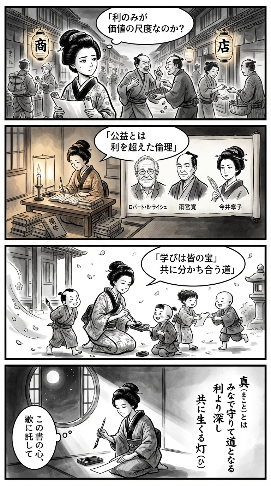

---
---
> **Language**: [日本語](../ja/ロバート・Ｂ・ライシュ-章子-コモングッド―暴走する資本主義社会で倫理を語る_review.html) | [English](../en/ロバート・Ｂ・ライシュ-章子-コモングッド―暴走する資本主義社会で倫理を語る_review.html) | [繁體中文](../zh-tw/ロバート・Ｂ・ライシュ-章子-コモングッド―暴走する資本主義社会で倫理を語る_review.html)
>
> [← Top / トップページ](../../)

## 📖 書籍情報
- **タイトル**: コモングッド―暴走する資本主義社会で倫理を語る  
- **著者**: ロバート・Ｂ・ライシュ, 雨宮 寛, and 今井 章子  
- **ASIN**: B0DFBSBBDJ  
- **URL**: [https://www.amazon.co.jp/dp/B0DFBSBBDJ](https://www.amazon.co.jp/dp/B0DFBSBBDJ)  

---

## 🎯 この本の核心
ロバート・B・ライシュの『コモングッド』は、現代資本主義が倫理を失い、社会的連帯を崩壊させつつある現状を鋭く告発する書である。著者は、民主主義の根幹には「共益（コモングッド）」という共有価値が不可欠であり、それが失われた社会はもはや共同体とは呼べないと警鐘を鳴らす。  

本書の中心には、「真実」「教育」「倫理的リーダーシップ」「市民的責任」といった柱が据えられている。ライシュは、勝利や利益を目的化した社会から、奉仕と信頼に基づく社会への転換を訴え、倫理的再生の道筋を描く。読者は、経済や政治の問題を超えて、「私たちは何のために社会をつくるのか」という根源的な問いに向き合うことになる。  

---

## 💡 キーインサイト
- **「コモングッド」は社会の存在条件である**  
  著者は「共益の概念のないところに社会は存在し得ない」と断言する。個人主義や市場原理が暴走する現代において、倫理的連帯の再構築がなければ社会は「ジャングル」と化すという警告である。  

- **真実の共有は民主主義の前提である**  
  情報操作や虚偽が蔓延する社会では、民主的な熟議が成り立たない。ライシュは「真実はそれ自体がコモングッドである」と述べ、メディアリテラシーと市民の責任を強調する。  

- **教育は公共財であり、民主主義の基盤である**  
  教育を「自己投資」としてではなく「公共善」として再定義することが、健全な社会を支える。知識を共有し、市民的判断力を育むことが、民主主義の再生に直結する。  

- **リーダーシップは勝利ではなく奉仕である**  
  「勝つためなら何でもあり」という風潮を批判し、リーダーの使命は「奉仕すること」にあると説く。倫理的リーダーシップの欠如こそが、社会的信頼の崩壊を招いている。  

- **名誉と恥の倫理を再構築する必要性**  
  富や権力を称賛する風潮を改め、「コモングッドに貢献する行為」こそが名誉であるという価値観を取り戻すことが求められている。  

---

## 🔍 現代的文脈との関連
2024〜2025年の世界では、ライシュが警告した「暴走資本主義」の兆候がますます顕著になっている。格差拡大、AIによる雇用不安、ESG投資の形骸化などが進み、倫理的基盤を失った市場の危うさが露呈している。こうした現実は、ライシュの「コモングッドの再生」論を一層切実なものにしている。  

また、民主主義の危機も深刻化している。フェイクニュースや政治的不信が蔓延する中で、「真実の共有」という本書のテーマは、単なる理想論ではなく、社会の存続条件としての重みを帯びている。教育・報道・リーダーシップの各領域で、倫理的再構築を求める声が高まる今、本書はその理論的支柱となる。  

---

## 🚀 実践への提案
1. **教育を「公共善」として支える**  
   教育を自己利益の手段ではなく、社会全体の知的基盤として捉え直す。地域や企業が教育支援に関与することで、民主主義の土台を強化できる。  

2. **真実を守る市民的行動を取る**  
   情報を鵜呑みにせず、信頼できる情報源を確認し共有する。虚偽や偏見を放置しない姿勢が、社会的信頼を再構築する第一歩となる。  

3. **倫理的リーダーを評価する文化を育てる**  
   成功や権力よりも「奉仕と誠実さ」を重視する価値観を広める。選挙や企業活動において、倫理的判断を基準に支持を行うことが重要だ。  

4. **「恥」と「名誉」の基準を見直す**  
   富の多寡ではなく、社会への貢献を名誉とする社会規範を再構築する。倫理的行動を称賛する文化が、信頼社会の再生を促す。  

---

## ⭐ 総合評価
『コモングッド』は、経済書でありながら倫理哲学の書でもある。ライシュは、資本主義の暴走を止めるために必要なのは制度改革よりも「倫理の再生」であると説き、読者に深い自己省察を促す。  

本書は、政治・経済・教育・メディアなど、あらゆる領域で「共益」を再考するための羅針盤となるだろう。分断と不信が広がる現代において、社会をもう一度「共に生きる場」として取り戻したい人にとって、必読の一冊である。

---

&copy; shioki | [CC BY-NC-SA 4.0](https://creativecommons.org/licenses/by-nc-sa/4.0/)
