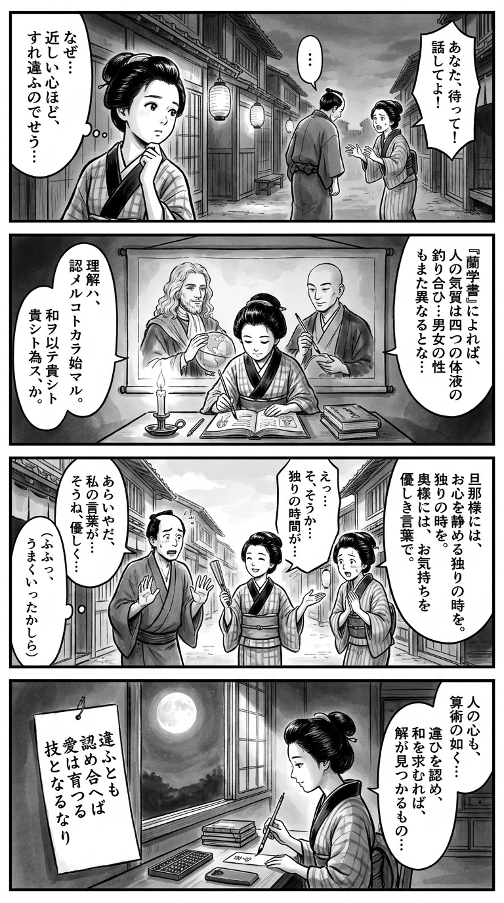

> **Language**: [日本語](../ja/一人になりたい男、話を聞いてほしい女_review.html) | [English](../en/一人になりたい男、話を聞いてほしい女_review.html) | [繁體中文](../zh-tw/一人になりたい男、話を聞いてほしい女_review.html)
>
> [← Top / トップページ](../../)

## 📖 書籍情報
- **タイトル**: 一人になりたい男、話を聞いてほしい女  
- **著者**: ジョン・グレイ and 児島 修  
- **ASIN**: B07FMSRZ8V  
- **URL**: [https://www.amazon.co.jp/dp/B07FMSRZ8V](https://www.amazon.co.jp/dp/B07FMSRZ8V)

---

<picture>
  <source srcset="../../images/reviews/一人になりたい男、話を聞いてほしい女_4panel.webp" type="image/webp">
  
</picture>
## 🎯 この本の核心
『一人になりたい男、話を聞いてほしい女』は、男女の心理的・生理的な違いを科学的視点から解き明かし、愛情関係をより良く保つための実践的知恵を提示する書である。著者ジョン・グレイは、従来の「ロールメイト」的関係から「ソウルメイト」的関係への進化を軸に、現代の男女が直面するすれ違いの本質を描く。  

本書は、単なる恋愛指南書ではなく、「愛情とは意識的に育てるスキルである」という哲学を提示する点に特徴がある。ホルモンバランスやストレスの仕組みを踏まえ、男女の違いを尊重しながら、互いの幸福を支え合うための具体的な方法を体系化している。

---

## 💡 キーインサイト
- **「ロールメイト」から「ソウルメイト」へ**  
  現代の関係性は、社会的役割の補完から心のつながりを重視する段階へと進化している。お互いを「支える存在」としてではなく、「理解し合う存在」として捉えることが、持続的な愛情の鍵である。  

- **男女の違いを尊重することが真の平等**  
  男性と女性の生物学的・心理的差異を否定せずに理解することが、関係の調和を生む。平等とは同一化ではなく、違いを前提とした相互理解の上に成り立つものである。  

- **ホルモンが感情と行動を左右する**  
  テストステロンやエストロゲンといったホルモンの働きを理解することで、ストレスや感情の波を客観的に捉えられる。科学的知見が、感情的対立を減らす実践的ツールとなる。  

- **「まず自分が変わる」姿勢の力**  
  相手を変えようとする前に、自分の行動や態度を変えることが関係改善の第一歩である。愛情は「与えること」から始まり、見返りを求めない姿勢が信頼と幸福を育む。  

- **愛情の循環を生む具体的行動**  
  男性には「信頼・受容・感謝」を、女性には「気遣い・理解・尊重」を与えることが、愛の循環を生む。本書はこの行動原則を明確に示し、実践的な愛情表現の指針を提供している。

---

## 🔍 現代的文脈との関連
現代社会では、パートナーシップにおいて「常に一緒にいること」よりも、適度な距離や個人の時間を尊重する傾向が強まっている。本書の「洞窟タイム」や「自分時間」の概念は、この新しい関係観に通じるものである。  

また、感情労働の偏りや会話の負担が一方に集中する問題が注目される中で、男女の違いを理解し合うという本書の主張は、単なる性差論を超えた「相互調整能力」の提案として読むことができる。固定的な性役割を再生産する危険を孕みつつも、互いの違いを尊重する視点は、現代の多様な関係性において依然として有効である。

---

## 🚀 実践への提案
1. **自分を変えることから始める**
   相手の態度を責める前に、自分の言動を見直す。主体的に変化する姿勢が、関係の再構築を促す。

2. **ホルモンバランスを意識する生活を送る**
   男性は運動や一人の時間でテストステロンを、女性は会話や共感でエストロゲンを高める。生理的理解が感情の安定をもたらす。

3. **命令ではなくリクエストで伝える**
   不満を「お願い」や「提案」として伝えることで、防衛的反応を避け、建設的な対話が生まれる。

4. **お互いの「回復時間」を尊重する**
   男性の「洞窟タイム」や女性の「自分時間」を理解し合うことで、ストレスを減らし、再び愛情を注ぐ余裕を取り戻せる。

5. **相手が必要とする愛を与える**
   相手の欲する愛情表現を意識的に選ぶことで、信頼と満足の循環が生まれる。愛は感情ではなく、行動で示すものだ。

---

## ⭐ 総合評価
本書は、男女の違いを科学と心理の両面から整理し、愛情を「意識的に育てるスキル」として提示した点で、恋愛・結婚・職場の人間関係にまで応用できる普遍的な洞察を持つ。  

現代の「平等」や「多様性」を重視する時代においても、相互理解と尊重の重要性は変わらない。本書は、愛情を感情論ではなく実践論として再定義し、読者に「愛する技術」を学ぶ機会を与えてくれる一冊である。

---

&copy; shioki | [CC BY-NC-SA 4.0](https://creativecommons.org/licenses/by-nc-sa/4.0/)
