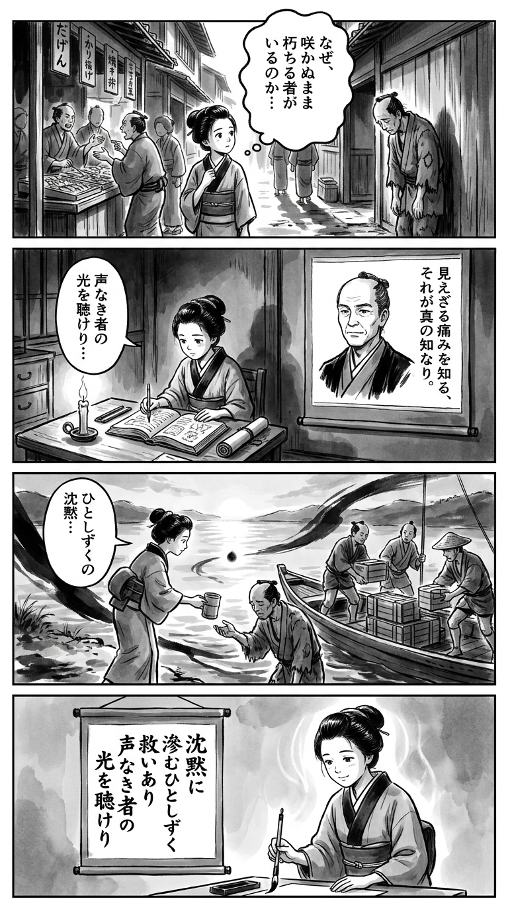

> **Language**: [日本語](../ja/一滴の沈黙_review.html) | [English](../en/一滴の沈黙_review.html) | [繁體中文](../zh-tw/一滴の沈黙_review.html)
>
> [← Top / トップページ](../../)

## 📖 書籍情報
- **タイトル**: 一滴の沈黙  
- **著者**: 相場 英雄  
- **ASIN**: B0H397G93X  
- **URL**: [https://www.amazon.co.jp/dp/B0H397G93X](https://www.amazon.co.jp/dp/B0H397G93X)

---

<picture>
  <source srcset="../../images/reviews/一滴の沈黙_4panel.webp" type="image/webp">
  
</picture>
## 🎯 この本の核心
『一滴の沈黙』は、格差と閉塞感に覆われた現代日本を背景に、若者たちの「報われない努力」と「失われた尊厳」を描く社会派ミステリである。舞台は多文化が交錯する高田馬場。そこでは中国人留学生と日本人学生が同じ空間で生きながら、異なる現実に直面している。  

物語は刑事・仲村の視点を通して展開し、職務の冷徹さと父親としての感情の狭間で揺れる人間の弱さを描き出す。事件の真相を追う過程で、他者への共感、贖罪、そして再生の可能性が静かに浮かび上がる。  

この作品は、犯罪小説の形式を借りながら、現代社会の「沈黙した痛み」を可視化する試みであり、読者に「正義とは何か」「人間らしさとは何か」を問いかける。

---

## 💡 キーインサイト
- **努力が報われない社会の現実**  
  麻奈の挫折は、個人の怠慢ではなく構造的な格差の象徴である。努力しても報われないという感情が、若者の希望を奪い、社会全体の停滞を生むことを示している。  

- **グローバル化がもたらすアイデンティティの揺らぎ**  
  日本人学生が中国人留学生に劣等感を抱く描写は、国際競争が個人の自尊心にまで影響を及ぼす現実を突きつける。グローバル社会における「自分の立ち位置」を再考させる要素である。  

- **共感が真実を導く力**  
  仲村が麻奈に寄り添い、娘と重ね合わせることで事件の核心に迫る姿は、共感が理屈を超えて真実を照らすことを示す。人間理解こそが正義の基盤であるというメッセージが響く。  

- **日本人の優越感の崩壊と再生**  
  経済的優位を失った日本の現実を直視する仲村の姿は、過去の幻想を脱し、現実を受け入れる成熟の物語でもある。国家的アイデンティティの変化が個人の成長と重ねられている。  

- **罪と赦しの物語**  
  麻奈の自首と智子の共感は、罪を超えて人間が再びつながる可能性を示す。社会の冷たさの中で、他者を理解しようとする行為そのものが救いとなる。

---

## 🔍 現代的文脈との関連
本作の背景には、都市部で進む「ガチ中華」文化の浸透や、中国人留学生の増加といった現実の社会変化がある。高田馬場の街並みは、グローバル化と格差が交錯する象徴的な舞台として機能している。  

また、経済停滞と貧困化が進む日本において、若者が感じる閉塞感はますます深刻化している。相場英雄はその現実を、事件という形で可視化し、読者に「社会の沈黙」に耳を傾けるよう促す。  

社会派ミステリとしての本作は、制度疲労や共生の難しさを描くと同時に、共感と理解を通じて未来を模索する文学的試みでもある。

---

## 🚀 実践への提案
1. **他者を「道具」として扱わない**
   麻奈の言葉が示すように、社会の冷淡さは日常の無関心から生まれる。感謝や思いやりを言葉にすることが、分断を和らげる第一歩となる。

2. **異文化への理解を深める**
   異なる背景を持つ人々と接する際、恐れや偏見ではなく学びの姿勢を持つことが重要である。共生社会は理解からしか始まらない。

3. **若者の困難を「個人の問題」とせず構造で見る**
   就職難や奨学金返済などの問題を、自己責任論で片づけず、社会的背景を共有することが必要である。共感が支援の出発点となる。

4. **職業倫理を「人間理解」として再定義する**
   仲村のように、誠実さと観察力を重視する姿勢はどんな仕事にも通じる。成果よりも過程における誠意が信頼を築く。

5. **現実を直視し、柔軟に変化を受け入れる**
   日本の衰退を認めることは敗北ではなく、新しい価値観を築くための出発点である。過去の成功体験に縛られない柔軟さが求められる。

---

## ⭐ 総合評価
『一滴の沈黙』は、社会の片隅に沈む声なき人々の痛みを、静かな筆致で描いた現代の鏡である。事件の背後に潜むのは、格差、孤立、そして共感の喪失という普遍的な問題だ。  

相場英雄は、社会派ミステリの枠を超え、人間の尊厳を問い直す文学的深みを与えている。現代日本の現実を直視しながらも、そこに再生の光を見出そうとする読者にこそ、この作品は強く響くだろう。

---

&copy; shioki | [CC BY-NC-SA 4.0](https://creativecommons.org/licenses/by-nc-sa/4.0/)
