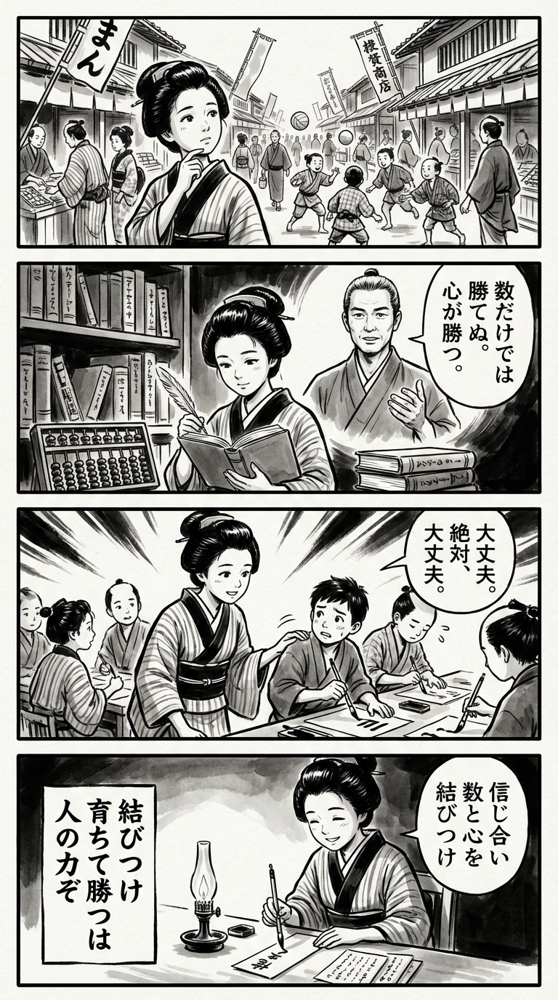

> **Language**: [日本語](../ja/一軍監督の仕事～育った彼らを勝たせたい～_review.html) | [English](../en/一軍監督の仕事～育った彼らを勝たせたい～_review.html) | [繁體中文](../zh-tw/一軍監督の仕事～育った彼らを勝たせたい～_review.html)
>
> [← Top / トップページ](../../)

## 📖 書籍情報
- **タイトル**: 一軍監督の仕事～育った彼らを勝たせたい～  
- **著者**: 高津 臣吾  
- **ASIN**: B09X5G7QLK  
- **URL**: [https://www.amazon.co.jp/dp/B09X5G7QLK](https://www.amazon.co.jp/dp/B09X5G7QLK)

---

<picture>
  <source srcset="../../images/reviews/一軍監督の仕事～育った彼らを勝たせたい～_4panel.webp" type="image/webp">
  
</picture>
## 🎯 この本の核心
本書は、東京ヤクルトスワローズを率いた高津臣吾監督が、自身の采配哲学とチーム運営の実際を語る一冊である。単なる勝利至上主義ではなく、「育成」と「勝利」という二兎を追う姿勢を貫く点に本書の独自性がある。  

著者は、野村克也監督から受け継いだ「野村野球」を現代的に再解釈し、データ分析と心理的洞察を融合させた「知恵の野球」を実践している。数字の背後にある人間の心を読み解く姿勢が、監督としての判断やリーダーシップに深みを与えている。  

また、「絶対大丈夫」という言葉に象徴されるように、言葉の力を重視し、選手の心理を支えるリーダーとしての在り方を提示する。野球を通して人を育て、チームを育てるという普遍的なテーマが全編を貫いている。

---

## 💡 キーインサイト
- **「絶対大丈夫」は信念の共有である**  
　もともと自己暗示の言葉を、あえてチーム全体に向けて発することで、選手の不安を希望に変えた。リーダーの言葉が組織の信念となる過程を示す象徴的なエピソードである。  

- **データは「知恵」と結びついて初めて意味を持つ**  
　著者はデータを単なる数値ではなく、現場の感覚や人間理解と結びつけて使う。これは、データドリブン時代における「人間中心の分析」の重要性を示唆している。  

- **「コーチ会議」がチームを強くする**  
　監督一人の判断ではなく、現場の知恵を集約し、組織的に課題を解決する仕組みを重視する。これは、現代のチームマネジメントにおける「集合知」の活用例といえる。  

- **「チャレンジ枠」で若手を育てる**  
　短期的な勝敗にこだわらず、若手に一軍の空気を経験させることで成長を促す。リスクを取ることで未来をつくるという、戦略的な育成哲学が貫かれている。  

- **「線」で見る野球の面白さ**  
　評論家が「点」で語る試合を、監督は「線」で捉える。長期的な成長と積み重ねの視点が、チームづくりの本質を浮かび上がらせている。

---

## 🔍 現代的文脈との関連
2020年代のプロ野球界では、監督の役割が戦術指揮からメンタルケアや育成支援へと広がっている。高津監督の「育った彼らを勝たせたい」という理念は、この流れの中で極めて現代的である。選手を単なる戦力ではなく、人として成長させることがチームの持続的成功につながるという思想が、コロナ禍以降の監督像を象徴している。  

また、SNS時代における監督の「人間味」や「言葉の力」が、ファンとの関係性を深める要素として注目されている。本書は、データと人間性の両立を図るリーダー像を提示し、AI時代のマネジメントにも通じる洞察を与えている。

---

## 🚀 実践への提案
1. **データを「考える材料」として使う**
   数値を鵜呑みにせず、そこから仮説を立てて現場で検証する姿勢を持つ。これにより、データが生きた知恵へと変わる。

2. **「提案が生まれる空気」を作る**
   上意下達ではなく、現場から意見が自然に出る文化を育てる。これが組織の創造性と持続的成長を支える。

3. **「チャレンジ枠」を設ける**
   若手や新しいアイデアに挑戦の機会を与える。短期的な成果よりも、長期的な人材育成とチームの活性化を優先する。

4. **「言葉の力」を意識して使う**
   リーダーの言葉は組織の空気を変える。状況に応じて、信頼と希望を生む言葉を選ぶことが重要である。

5. **「線」で物事を見る**
   短期的な結果に一喜一憂せず、長期的な成長の流れを意識して評価する。これは人材育成にもプロジェクト運営にも通じる視点である。

---

## ⭐ 総合評価
『一軍監督の仕事～育った彼らを勝たせたい～』は、野球という競技を超えて、リーダーシップと組織運営の本質を描いた実践書である。データと人間理解、厳しさと温かさ、育成と勝利――そのすべてを両立させようとする著者の姿勢が、現代のリーダーに深い示唆を与える。  

スポーツファンはもちろん、チームを率いる立場にあるすべての人にとって、組織を「勝たせる」ための哲学と実践を学べる一冊である。

---

&copy; shioki | [CC BY-NC-SA 4.0](https://creativecommons.org/licenses/by-nc-sa/4.0/)
