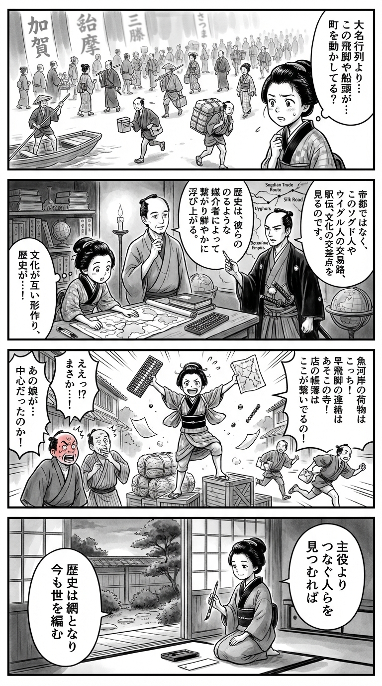

---
---
> **Language**: [日本語](../ja/世界史のミカタ_review.html) | [English](../en/世界史のミカタ_review.html) | [繁體中文](../zh-tw/世界史のミカタ_review.html)
>
> [← Top / トップページ](../../)

## 📖 書籍情報
- **タイトル**: 世界史のミカタ
- **著者**: 井上章一 and 佐藤賢一
- **ASIN**: [ハイライト分析の「書籍メタデータ抽出」セクションに記載されたASINをそのまま記載してください]
- **URL**: [ハイライト分析の「書籍メタデータ抽出」セクションに記載されたURLをそのまま記載してください]

## 🎯 この本の核心
『世界史のミカタ』の面白さは、世界史を「文明の中心」からではなく、「接点」や「周縁」から見直そうとするところにあります。ギリシア、ローマ、中国といった定番の主役だけでなく、ソグド人、ウイグル人、遊牧民、東ローマ帝国のような媒介者や周辺勢力に光を当てることで、歴史の輪郭がまったく違って見えてきます。

同時に本書は、異文化接触を単なる征服や同化の物語として描きません。支配する側もまた現地文化に変えられ、制度や宗教、言語、交通、通信の仕組みが複雑に絡み合いながら歴史が動くことを、対話形式の軽やかさで解きほぐしていきます。

さらに重要なのは、この本が過去の知識を増やすだけの教養書にとどまらない点です。帝国と民族主義、近代国家とインフラ、宗教と言語、そして日本の立ち位置を比較史のなかで考えさせることで、読者に「いまの世界をどう見るか」という視座そのものを手渡してくれます。

## 💡 キーインサイト
- **歴史は「中心」ではなく「つなぐ者」から見ると立体化する**  
  本書が繰り返し示すのは、文明の栄華そのものよりも、それらを結びつけた人々に注目する重要性です。交易民、遊牧民、周辺国家を視野に入れることで、従来の教科書的世界史では見えにくかった交通路、文化移転、権力の実態が浮かび上がります。

- **文化は一方向に伝播するのではなく、接触のなかで相互に変わる**  
  「征服した側が勝ち、された側が消える」という単純な図式を、本書は丁寧に崩します。言語は支配者のものになっても、衣服や習俗、統治感覚は被支配地域の影響を受けることがあり、歴史とは常に混成と交渉の産物なのだと気づかせます。

- **近代国家の実体は理念よりも、通信・交通・法のネットワークにある**  
  国家形成を精神論ではなく、インフラの問題として読む視点が本書の大きな魅力です。鉄道、郵便、電信、新聞といった情報伝達の回路が整って初めて、中央集権国家は現実の統治能力を持つという理解は、近代史を非常に具体的にしてくれます。

- **民族主義や民主主義も、理念だけで自動的に成立するわけではない**  
  本書は民族意識を自然で純粋な感情として扱わず、帝国の衰退や外部勢力の介入によって増幅されるものとして見ています。同様に民主主義も、制度名だけでは機能せず、血統、慣習、感情、演出といった現実の要素と折り合いながら動くものだと示しており、政治を見る目を現実的にしてくれます。

- **日本史は世界史の例外ではなく、比較のなかでこそ理解が深まる**  
  明治維新とフランス革命、封建制、養子相続などを横断的に見比べる本書の方法は、日本を特殊な島国史観から救い出します。日本をヨーロッパ諸国と並べて考えることで、日本の制度や政治文化の特徴がむしろ鮮明になり、世界史的な位置づけも見えやすくなります。

## 🔍 現代的文脈との関連
関連動向の情報はやや散漫ですが、本書の主題そのものは、現在の世界情勢と強く接続しています。とりわけ、国際政治を大国同士の競争だけでなく、中間国家、物流拠点、文化的媒介者の役割から見る視点は、サプライチェーンの再編、地域紛争、海洋戦略を考えるうえで有効です。

また、民族主義が内発的な感情だけでなく、外部からの刺激や情報環境によって強化されうるという見方は、今日のSNS時代の政治動員とも響き合います。誰が何を主張しているかだけでなく、その感情がどの媒体を通じ、どの勢力によって増幅されているのかを見抜く必要性を、本書は歴史の側から教えてくれます。

さらに、近代国家を「神経」としての通信網や制度で捉える発想は、デジタル行政、監視技術、情報戦が国家能力を左右する現代にも通じます。インフラは単なる技術ではなく、政治秩序そのものを形づくるという本書の視点は、今読んでも十分に新しいままです。

## 🚀 実践への提案
- **ニュースを読むときに「中心ではなく媒介者」に注目する**  
  大国の首脳や軍事力ばかりを見るのではなく、港湾都市、資源輸送路、中間国家、少数民族、ディアスポラの役割にも目を向けてみると、国際情勢の理解が一段深まります。本書の視点を応用すれば、表に出る主役の背後で、誰が世界をつないでいるのかを考える習慣が身につきます。

- **文化変化を「影響」ではなく「相互変容」として見る**  
  企業文化、移民社会、教育制度、流行の変化を観察するとき、一方が他方を塗り替えたと考えるだけでは不十分です。どちらが何を受け入れ、何を変え、どこで折衷が起きたのかを追うことで、現代社会の変化も歴史的に厚みをもって理解できるようになります。

- **国家や組織を評価するとき、理念より情報回路を点検する**  
  立派なビジョンや制度設計があっても、情報が現場まで届かず、現場の声が上に戻らなければ統治は機能しません。本書のいう「筋肉」と「神経」の比喩は、企業経営、行政改革、大学運営などにもそのまま使え、実務的な観察眼を与えてくれます。

- **政治メッセージは内容だけでなく、形式と媒体も一緒に読む**  
  わかりやすい標語、反復、映像演出、感情に訴える話法がどのように使われているかを意識するだけで、政治や世論の見え方は変わります。本書の歴史分析を踏まえると、説得力は中身の正しさだけでなく、伝達技術と演出の力学によって大きく左右されると理解できます。

- **日本を考えるとき、必ず比較対象を置く**  
  日本の制度や政治文化を論じる際に、フランス、イギリス、ドイツなどとの比較を試みると、「日本だけが特殊だ」という思い込みから離れられます。本書の比較史的な読み方は、現代日本の将来像を考える際にも、感情論ではなく相対化された判断を可能にしてくれます。

## ⭐ 総合評価
『世界史のミカタ』は、世界史の知識を詰め込む本というより、世界史をどう見るかという「目の使い方」を鍛える本です。周縁、媒介、比較、相互変容という視点を通じて、読者が無意識に抱いている中心史観や進歩史観を静かに揺さぶり、歴史理解をより柔軟で実践的なものに変えてくれます。

特に、世界史を学び直したい人、日本史を国際比較のなかで考えたい人、現代政治や国際情勢を歴史的な奥行きのなかで捉えたい人に向いています。対話形式ゆえに読み口は軽やかですが、中身はかなり骨太で、読後には「過去の見え方」だけでなく「現在の見え方」まで変わる一冊です。

---

&copy; shioki | [CC BY-NC-SA 4.0](https://creativecommons.org/licenses/by-nc-sa/4.0/)
