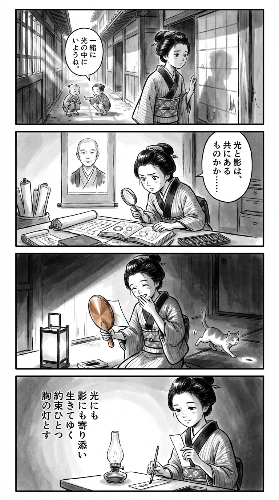

> **Language**: [日本語](../ja/光のとこにいてね_review.html) | [English](../en/光のとこにいてね_review.html) | [繁體中文](../zh-tw/光のとこにいてね_review.html)
>
> [← Top / トップページ](../../)

## 📖 書籍情報
- **タイトル**: 光のとこにいてね  
- **著者**: 一穂ミチ  
- **ASIN**: B0FXX4HLJH  
- **URL**: [https://www.amazon.co.jp/dp/B0FXX4HLJH](https://www.amazon.co.jp/dp/B0FXX4HLJH)

---

<picture>
  <source srcset="../../images/reviews/光のとこにいてね_4panel.webp" type="image/webp">
  
</picture>
## 🎯 この本の核心
『光のとこにいてね』は、幼少期に交わした約束を軸に、二人の少女・結珠と果遠の人生を描く物語である。友情と愛情の境界が曖昧な関係を通じて、人が他者と結びつくことの痛みと美しさを浮かび上がらせる。  

物語は「光」と「影」の象徴を繰り返し用いながら、母娘関係や「普通」への憧れといった社会的テーマを織り込み、女性たちの成長と自己受容を描き出す。過去と現在が交錯する構成の中で、登場人物たちは赦しと再生の道を歩み、光の中へと再び踏み出していく。

---

## 💡 キーインサイト
- **約束が人生を導く光となる**  
　幼い日の「光のとこにいてね」という言葉は、単なる約束ではなく、登場人物の人生を貫く信念の象徴である。再会のたびにその言葉が呼び起こされ、過去と現在をつなぐ光の糸となる。  

- **「普通」でない家庭が生む孤独と強さ**  
　果遠は「普通の家庭」から外れた環境で育ち、孤独と向き合うことで強さを身につける。その強さは痛みと表裏一体であり、彼女の人間性をより深く、現実的なものにしている。  

- **愛と依存の曖昧な境界**  
　結珠と果遠の関係には、憧れ、嫉妬、支配といった感情が複雑に絡み合う。愛することの純粋さと危うさを同時に描くことで、作者は「人を愛するとは何か」という根源的な問いを投げかける。  

- **母になることは過去と向き合うこと**  
　母となった果遠は、自分の母との関係を再解釈しながら、子どもを見守る強さを学ぶ。母性を血縁ではなく「見守る勇気」として描く点に、この作品の成熟した視点がある。  

- **光と影を共に受け入れる生き方**  
　光は希望でありながら影を生む。登場人物たちは互いの光と影を受け入れることで、ようやく自分の居場所を見つけていく。その姿は、痛みを抱えながらも前進する人間の普遍的な姿である。

---

## 🔍 現代的文脈との関連
本作が描く「普通」への渇望や母娘関係の葛藤は、現代社会におけるジェンダー観や家族像の変化と深く響き合う。多様な生き方が模索される時代にあっても、「普通でありたい」という欲望は根強く残り、それが人を縛る鎖にもなる。  

また、女性が「母になること」「ならないこと」を自ら選び取る視点は、現代文学における重要なテーマである。『光のとこにいてね』は、その選択の重さと自由を繊細に描き出し、読者に「自分の光をどう見つけるか」という問いを突きつける。

---

## 🚀 実践への提案
1. **小さな約束を心の灯として持ち続ける**
   約束は時間を超えて人をつなぐ。軽んじず、心に留めておくことで、人生の指針となる。

2. **「普通」という幻想を手放す**
   他者の基準に合わせるのではなく、自分の生をそのまま肯定する勇気を持つことが、真の自由への第一歩である。

3. **過去の痛みと共に生きる**
   忘却ではなく共存を選ぶこと。過去を抱えたままでも前に進めるという事実が、再生の力となる。

4. **他者の光を羨むより、自分の光を見つける**
   他人の人生を基準にせず、自分の中にある光を見出すことが、持続的な幸福につながる。

5. **赦しを通じて自分を解放する**
   赦しは相手のためではなく、自分の心を自由にするための行為である。そこにこそ再生の契機がある。

---

## ⭐ 総合評価
『光のとこにいてね』は、少女たちの繊細な心の軌跡を通じて、「愛」「記憶」「赦し」という普遍的なテーマを描き出した作品である。静かな筆致の中に、痛みと希望が共存する光景が広がり、読後には深い余韻が残る。  

母娘関係や女性の生き方に関心を持つ読者はもちろん、過去と向き合いながら生きるすべての人に響く一冊である。光と影のあわいに立ち尽くす人間の姿を、これほど誠実に描いた小説は稀である。

---

&copy; shioki | [CC BY-NC-SA 4.0](https://creativecommons.org/licenses/by-nc-sa/4.0/)
