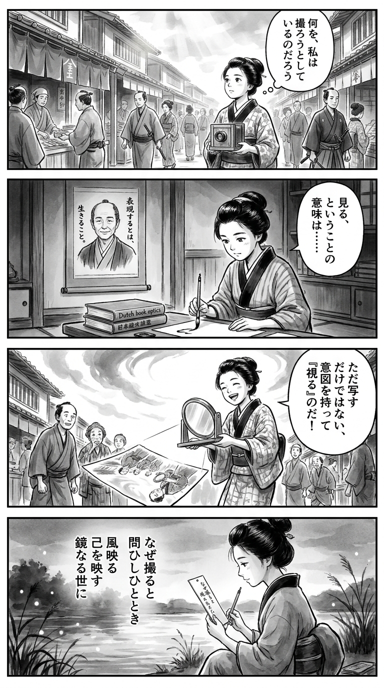

> **Language**: [日本語](../ja/写真力を上げるステップアップ思考法_review.html) | [English](../en/写真力を上げるステップアップ思考法_review.html) | [繁體中文](../zh-tw/写真力を上げるステップアップ思考法_review.html)
>
> [← Top / トップページ](../../)

## 📖 書籍情報
- **タイトル**: 写真力を上げるステップアップ思考法  
- **著者**: 丹野清志  
- **ASIN**: B0CKX6TG87  
- **URL**: [https://www.amazon.co.jp/dp/B0CKX6TG87](https://www.amazon.co.jp/dp/B0CKX6TG87)

---

<picture>
  <source srcset="../../images/reviews/写真力を上げるステップアップ思考法_4panel.webp" type="image/webp">
  
</picture>
## 🎯 この本の核心
本書は、写真を「技術」ではなく「思考と感性の表現」として捉えるための指南書である。丹野清志は、写真を撮る行為を「自分を表現する行為」と位置づけ、撮影技術よりも「なぜ撮るのか」という意識を重視する。  

著者は、既存の型やセオリーにとらわれず、自由な発想とアマチュア精神を持つことを提唱する。写真は社会や時代の鏡であり、個人の内面と社会的背景が交錯する場所として再定義される。  

その根底には、写真を通じて「人間性を育む」という思想がある。写真力とは、カメラ操作の巧拙ではなく、自分自身と世界をどう見つめるかという思考力の総体なのだ。

---

## 💡 キーインサイト
- **「なぜ撮るのか」を問うことが出発点**  
  撮影の目的を明確にすることが、単なる技術習得以上に重要である。自分の意図を意識化することで、写真が「記録」から「表現」へと変わる。  

- **センスは人間性から育まれる**  
  良いセンスは生まれつきではなく、豊かな人間関係や経験から生まれる。写真を磨くことは、同時に人間としての深みを養う行為である。  

- **アマチュア精神が創作の自由を守る**  
  商業的な評価や流行に縛られず、自分の感性を信じることが創造性の源泉となる。自由な姿勢が、写真表現の独自性を育てる。  

- **構図や技法は感性の延長線上にある**  
  「構図の正解」は存在せず、撮影者の感情や意図が最も重要である。形式的なルールよりも、自分の感じたままに撮る勇気が求められる。  

- **風景は社会と人間の関係を映す**  
  風景写真もまた、時代や社会の文脈を映し出すものとして再定義される。自然描写にとどまらず、「環境としての風景」を捉える視点が提示されている。

---

## 🔍 現代的文脈との関連
生成AIが写真や画像制作の領域を急速に変化させる中で、本書のメッセージは一層の重みを持つ。AIが「見たまま」を容易に再現できる時代だからこそ、「なぜ撮るのか」「何を感じ取るのか」という人間的な思考が差異化の鍵となる。  

また、SNS時代のコンテンツが短命化するなかで、写真家やクリエイターには「思想」や「価値観」を積み上げる姿勢が求められている。本書の提唱する「アマチュア精神」や「自由な表現」は、AI補完時代における人間の創造性の本質を照らし出す。  

写真を撮ることは、単なる視覚的行為ではなく、社会や時代をどう解釈するかという思考の訓練でもある。本書は、AI時代における「人間の眼」と「感性の再定義」を促す一冊である。

---

## 🚀 実践への提案
1. **撮る前に「なぜ撮るのか」を自問する**
   被写体を前にした瞬間、撮影意図を言葉にすることで、写真の方向性が明確になる。目的意識が作品の一貫性を生む。

2. **観察と想像力を鍛える**
   日常の中で「なぜこの光景に惹かれたのか」を考える習慣を持つ。観察力と想像力が、写真の深みを支える。

3. **異分野の芸術に触れる**
   絵画や文学に触れることで、構図や光の捉え方に新たな発想が生まれる。写真以外の表現が感性を拡張する。

4. **自分の写真を第三者の眼で見る**
   撮影時の感情を一度切り離し、客観的に作品を見直す。これにより、伝わる写真と自己満足の写真の違いが見えてくる。

5. **模倣から独自性へと進化する**
   尊敬する作家の作品を模倣することは、学びの第一歩である。模倣を通じて自分の感性を見つけ、やがて独自の表現へと昇華させる。

---

## ⭐ 総合評価
『写真力を上げるステップアップ思考法』は、写真を「考える行為」として再定義する思想書である。撮影技術の指南書ではなく、写真を通じて自分自身と世界をどう見つめるかを問う哲学的な一冊だ。  

写真を始めたばかりの人にも、長年撮り続けてきた人にも、新たな視点を与える。AIが画像を量産する時代において、人間の「見る力」「感じる力」を再び中心に据える本書は、創作の原点を思い出させてくれるだろう。

---

&copy; shioki | [CC BY-NC-SA 4.0](https://creativecommons.org/licenses/by-nc-sa/4.0/)
