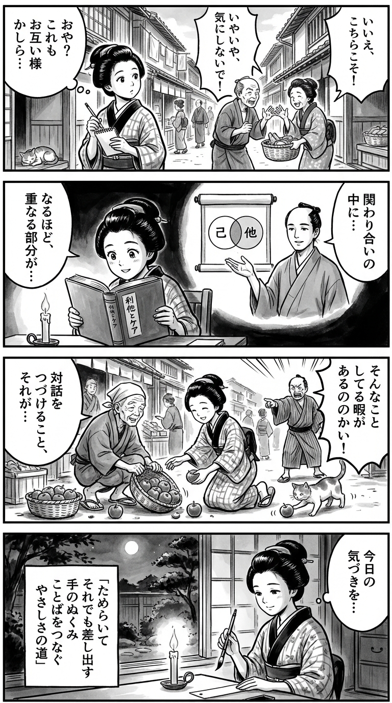

> **Language**: [日本語](../ja/利他・ケア・傷の倫理学_review.html) | [English](../en/利他・ケア・傷の倫理学_review.html) | [繁體中文](../zh-tw/利他・ケア・傷の倫理学_review.html)
>
> [← Top / トップページ](../../)

## 📖 書籍情報
- **タイトル**: 利他・ケア・傷の倫理学  
- **著者**: 近内悠太  
- **ASIN**: B0CY2GVPR7  
- **URL**: [https://www.amazon.co.jp/dp/B0CY2GVPR7](https://www.amazon.co.jp/dp/B0CY2GVPR7)

---

<picture>
  <source srcset="../../images/reviews/利他・ケア・傷の倫理学_4panel.webp" type="image/webp">
  
</picture>
## 🎯 この本の核心
『利他・ケア・傷の倫理学』は、「やさしさのすれ違い」が蔓延する現代社会において、他者とどう関わるべきかを根底から問い直す哲学的試みである。著者は「利他」と「ケア」を明確に区別しながらも、「大切にしているもの」という共通軸で両者を結びつける。  

利他とは「自分の大切なものより他者の大切なものを優先すること」、ケアとは「他者の大切なものを共に大切にする営為」である。この定義により、善意や共感といった曖昧な情緒を超えた、倫理的実践の構造が明らかにされる。  

さらに本書は、倫理と道徳の対立、言語ゲームによる他者理解、物語による癒しの力などを通じて、現代人が抱える「ケアの困難」を多層的に描き出す。利他とケアは単なる行為ではなく、文明そのものを癒やす倫理的契機として提示されている。

---

## 💡 キーインサイト
- **「大切にしているもの」を理解することがケアの出発点**  
  ケアや利他の失敗は、相手の価値観を誤解することから始まる。相手の「大切にしているもの」を見極める努力が、やさしさを実質化する鍵となる。

- **利他は「葛藤」を伴う倫理的決断である**  
  利他は単なる善意ではなく、自己の規範と他者の価値の間で揺れ動く行為である。ためらいや逡巡を含む「愚行」としての利他こそ、倫理の本質を映し出す。

- **ケアとは「言語ゲームを続けること」**  
  他者との関係は誤解や逸脱を避けられないが、対話を止めないことがケアの核心である。沈黙ではなく継続的な言葉のやり取りが、信頼を再構築する。

- **物語が傷を癒やす**  
  過去の失敗や喪失を語り直すことで、意味が再構成される。ケアとは、過去を変えるのではなく「過去の意味を変える」行為であり、癒しの物語を紡ぐことに他ならない。

- **利他はシステムを超える自由の瞬間**  
  利他は社会的合理性の外にある「バグ」として現れ、既存の制度や規範を揺さぶる。そこにこそ、人間が自由に他者と出会う可能性が宿る。

---

## 🔍 現代的文脈との関連
本書の思想は、資本主義社会の「正しさ」と「効率」に疲弊した現代人への応答として読むことができる。近年注目される「贈与の倫理」や「不寛容社会への抵抗」とも響き合い、他者との関係を再構築するための哲学的基盤を提供している。  

また、著者の前著『世界は贈与でできている』や、内田樹との対談に見られる「自在に生きる」思想とも連続しており、分断と孤立の時代における「ケアの政治学」を提示している。利他やケアを「社会のバグ」として捉える視点は、制度批判と倫理的希望を同時に内包する。  

現代の「失敗を許さない文化」や「共感疲労」に対して、本書は「愚行としてのやさしさ」を肯定する。合理性を超えた行為の価値を再評価することが、これからの共生社会の条件であると示唆している。

---

## 🚀 実践への提案
1. **他者の「大切にしているもの」を探る**
   相手の言葉や行動の背景にある価値を丁寧に聴き取ることが、真のケアの始まりである。理解の努力が、すれ違いを防ぐ最も確実な方法となる。

2. **会話を止めない勇気を持つ**
   誤解や衝突があっても、対話を続けることが関係の修復を可能にする。沈黙や断絶ではなく、継続的な言葉の交換こそがケアの実践である。

3. **「だったことになる」物語を紡ぐ**
   過去の失敗を語り直すことで、意味が変わり、自己や他者の癒しが生まれる。物語の再構成は、セルフケアの最も根源的な方法である。

4. **「にもかかわらず」行動する**
   完全な理解や正解を求めず、ためらいながらも行動することが利他の本質である。愚直な行為の中にこそ、信頼と自由の契機が宿る。

5. **文明や制度にもケアの視点を向ける**
   社会やテクノロジーの歪みを「傷」として見つめ、それを癒やす倫理を考えることが、個人のケアを超えた社会的実践へとつながる。

---

## ⭐ 総合評価
『利他・ケア・傷の倫理学』は、現代社会の「やさしさの機能不全」に対する哲学的処方箋である。利他とケアを単なる道徳的美徳ではなく、葛藤と逡巡を伴う倫理的実践として再定義し、読者に「他者と共に生きるとは何か」を根本から問い直させる。  

本書は、教育、医療、福祉、ビジネスなど、人と関わるすべての領域に示唆を与える。感情的共感ではなく、言語と物語を通じた関係の再構築を促すその思想は、分断の時代における希望の哲学である。読後には、「やさしさとは何か」をもう一度考えたくなるだろう。

---

&copy; shioki | [CC BY-NC-SA 4.0](https://creativecommons.org/licenses/by-nc-sa/4.0/)
