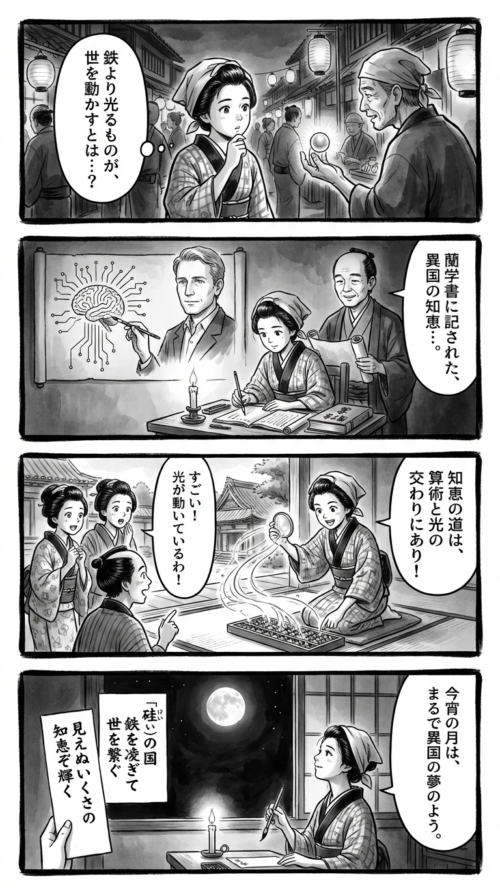

---
---
> **Language**: [日本語](../ja/半導体戦争――世界最重要テクノロジーをめぐる国家間の攻防_review.html) | [English](../en/半導体戦争――世界最重要テクノロジーをめぐる国家間の攻防_review.html) | [繁體中文](../zh-tw/半導体戦争――世界最重要テクノロジーをめぐる国家間の攻防_review.html)
>
> [← Top / トップページ](../../)

## 📖 書籍情報
- **タイトル**: 半導体戦争――世界最重要テクノロジーをめぐる国家間の攻防  
- **著者**: クリス・ミラー and 千葉 敏生  
- **ASIN**: B0BP6HDZV2  
- **URL**: [https://www.amazon.co.jp/dp/B0BP6HDZV2](https://www.amazon.co.jp/dp/B0BP6HDZV2)  

---

## 🎯 この本の核心
クリス・ミラー『半導体戦争』は、半導体という目に見えないテクノロジーがいかにして現代文明の中枢を形成し、国家の命運を左右してきたかを描き出す壮大な地政学的叙事詩である。  
著者は、アメリカ、ソ連、日本、台湾、韓国といった国家がチップをめぐって繰り広げた覇権争いを、経済・軍事・政治の交差点として描写する。  

本書の核心は、「シリコンが鉄に勝った」時代の到来を通じて、技術がもはや単なる産業ではなく、文明そのものの神経系であることを示す点にある。半導体を「新しい石油」と位置づけ、供給網の脆弱性と国家戦略の再定義を迫る問題提起は、現代の読者に強い現実感をもって迫ってくる。  

---

## 💡 キーインサイト
- **半導体は「新しい石油」である**  
  現代社会のあらゆる機能はチップに依存しており、供給遮断は国家の機能停止を意味する。エネルギー資源のように地政学的な「急所」としての性格を帯びている点が重要である。  

- **技術革新は科学だけでなく経営とサプライチェーンの成果**  
  ムーアの法則の進化は、物理学者だけでなく、製造・物流・マーケティングの専門家たちの協働の結果である。技術とは「組織的知性」の産物であるという視点が、単なる技術史を超えた洞察を与える。  

- **模倣ではなく統合が成功の鍵**  
  ソ連の「コピー」戦略が失敗し、日本や台湾が国際的ネットワークに統合されて成功したように、孤立した技術開発では限界がある。オープンな協働こそが技術覇権を生む。  

- **国家戦略としての産業政策の重要性**  
  台湾や韓国の成功は、政府の長期的支援と教育投資の成果である。国家が産業の方向性を見据えて戦略的に関与することが、地政学的優位をもたらす。  

- **軍民融合が技術進化を加速させた**  
  ペイブウェイ誘導爆弾などの事例が示すように、軍需と民需の相互作用がイノベーションを推進した。技術の進化は戦争と平和の両側面を持つという二重性を本書は鋭く描く。  

---

## 🔍 現代的文脈との関連
本書のテーマは、2020年代の米中対立とサプライチェーン再編の現実と深く響き合う。米国のCHIPS法による国内回帰、台湾有事の懸念、そして日本の「半導体復権」への動きは、まさに本書が描く歴史の延長線上にある。  

半導体をめぐる「技術ナショナリズム」は、TikTok規制やAIチップ輸出制限など、日常生活にも影響を及ぼしている。著者が示す「半導体＝戦略資源」という構図は、現代のフレンドショアリング政策やAI産業の地政学的競争を読み解く鍵となる。  

この意味で本書は、過去の物語であると同時に、未来の予言でもある。半導体を軸にした新しい冷戦構造の理解に不可欠な一冊である。  

---

## 🚀 実践への提案
- **サプライチェーンの可視化と多元化を進める**  
  半導体供給の集中は国家的リスクである。企業や政府は、調達経路の多様化と透明化を戦略的に推進すべきだ。これは経済安全保障の基盤となる。  

- **教育・研究・製造の連携を強化する**  
  MITやスタンフォードが果たした役割に学び、理工系教育と産学連携を強化することが次世代の技術覇権を左右する。人材育成は最も長期的かつ確実な投資である。  

- **国際的共創を志向する**  
  模倣ではなく共創へ。ソ連の失敗と日本の成功が示すように、国際的ネットワークへの統合が成長の鍵となる。オープンイノベーションの推進が、孤立を防ぎ、技術の持続的発展を支える。  

- **軍民両用技術の倫理的管理を確立する**  
  「シリコンが鉄に勝った」時代において、技術は軍事力の中核でもある。その転用リスクを踏まえた国際ルールづくりと倫理的ガバナンスが求められる。  

---

## ⭐ 総合評価
『半導体戦争』は、単なるテクノロジー史ではなく、文明の構造を読み解くための「現代の必読書」である。国家、企業、研究者がどのように技術を戦略資源として扱うべきかを、歴史と地政学の両面から問い直す。  

読者は、半導体を通じて「見えない戦争」の実相を理解し、自国の未来を考える視座を得るだろう。経営者、政策立案者、技術者、そして一般読者にとっても、現代世界を読み解く羅針盤となる一冊である。

---

&copy; shioki | [CC BY-NC-SA 4.0](https://creativecommons.org/licenses/by-nc-sa/4.0/)
