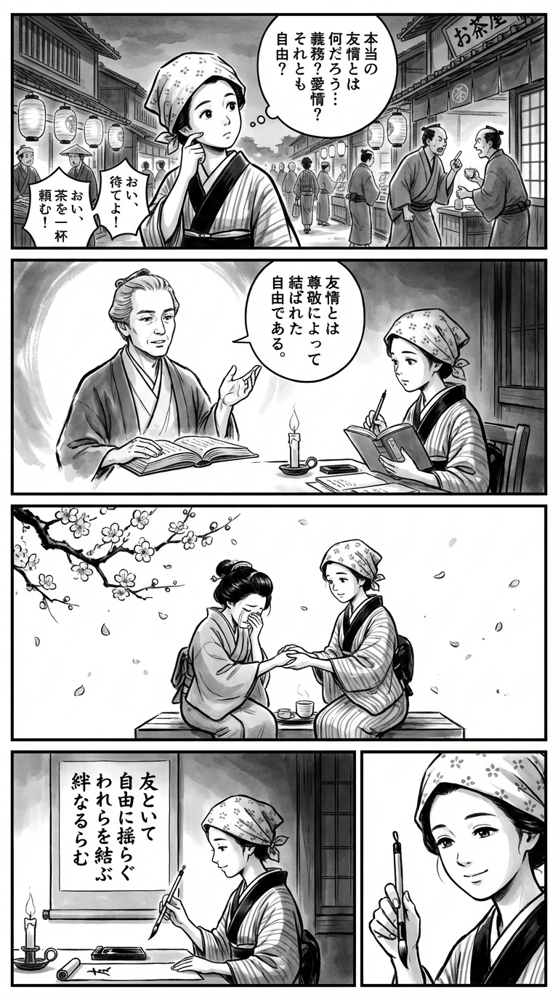

> **Language**: [日本語](../ja/友情を哲学する～七人の哲学者たちの友情観～_review.html) | [English](../en/友情を哲学する～七人の哲学者たちの友情観～_review.html) | [繁體中文](../zh-tw/友情を哲学する～七人の哲学者たちの友情観～_review.html)
>
> [← Top / トップページ](../../)

## 📖 書籍情報
- **タイトル**: 友情を哲学する～七人の哲学者たちの友情観～
- **著者**: 戸谷 洋志  
- **ASIN**: B0BV22VGZX  
- **URL**: [https://www.amazon.co.jp/dp/B0BV22VGZX](https://www.amazon.co.jp/dp/B0BV22VGZX)

---

<picture>
  <source srcset="../../images/reviews/友情を哲学する～七人の哲学者たちの友情観～_4panel.webp" type="image/webp">
  
</picture>
## 🎯 この本の核心
本書は、アリストテレスからフーコーに至る七人の哲学者の思想を通じて、「友情とは何か」という根源的な問いを多角的に探求する試みである。著者・戸谷洋志は、友情を単一の理想像に還元するのではなく、その多様性そのものを肯定する立場をとる。  

友情は「自律」と「依存」、「愛」と「尊敬」、「個」と「社会」といった対立概念のあいだで揺れ動く関係として描かれる。著者は、友情を制度や義務に縛られない自由な関係と捉え、その不安定さを人間的成熟の証として評価する。  

最終的に本書は、友情を「他者とともに生きることの芸術」として再定義し、哲学的思索を通じて現代社会における人間関係の再構築を促すものである。

---

## 💡 キーインサイト
- **友情は自由で不安定な関係である**  
　友情は契約や制度に基づかず、いつでも解消可能な関係である。その不安定さこそが、他者と向き合う自由の証であり、純粋な関係性の基盤となる。  

- **愛と尊敬の両立が友情を支える（カント）**  
　友情は単なる感情的な愛ではなく、相手の自律性を尊重する「尊敬」を伴う道徳的関係である。欲求に支配されない理性的な関係こそ、長続きする友情の条件である。  

- **同質性を超える友情（ニーチェ）**  
　友情は「似た者同士」の関係ではなく、異なる者同士が理想を共有し、互いを高め合う関係である。対立や緊張を恐れず、成長の契機として受け入れる姿勢が求められる。  

- **依存を肯定する新しい友情観（マッキンタイア）**  
　他者への依存は弱さではなく、人間の善を開花させる条件である。相互のケアを通じてこそ、友情は倫理的実践として成立する。  

- **友情は権力に管理されない自由の空間（フーコー）**  
　社会規範や性愛の枠組みを超えた友情は、権力に支配されない自由な関係として再評価される。友情は、他者とともに新しい生の可能性を切り開く実験場である。

---

## 🔍 現代的文脈との関連
デジタル化が進む現代社会では、SNSを通じた「つながり」が友情の代替物となり、関係の希薄化や承認欲求の肥大化が問題視されている。本書の「制度や契約に縛られない友情」という視点は、こうしたバーチャルな関係の脆弱さを照らし出す。  

また、ボーヴォワールやヴェイユの議論は、ジェンダーや社会的抑圧の中で形成される友情の意義を再考させる。現代の多文化社会において、友情は差異を受け入れ、共存を可能にする倫理的実践としての意味を持つ。  

さらに、国際関係や教育現場で「友情」をキーワードにした協働や対話が重視される今、本書は哲学的な基盤を提供し、友情を「共に生きる力」として再定義する契機を与えている。

---

## 🚀 実践への提案
1. **友を「理解しよう」としすぎない**
   他者を自分の想像で再構成せず、そのままの存在として受け入れることが真の友情の出発点である。ヴェイユの思想が示すように、想像の介入を抑えることが純粋な関係を保つ鍵となる。

2. **尊敬をもって本音を語る**
   カントの「愛と尊敬の両立」に倣い、率直さと配慮を両立させることが重要である。相手の自律性を尊重しながら対話することで、友情はより深く持続する。

3. **対話を絶やさない**
   マッキンタイアの議論に基づき、長期的な対話の継続が友情の基盤を築く。沈黙や誤解を恐れず、相手の善を理解しようとする姿勢が信頼を育む。

4. **依存を恐れず支え合う**
   友情は完全な自立ではなく、相互依存の中で成熟する。支え合いを通じてこそ、人は自らの善を開花させ、他者との関係を深めることができる。

5. **友情の多様性を受け入れる**
   友情の形は一つではない。社会的背景や価値観の違いを超えて、それぞれの関係性を尊重することが、現代における友情の倫理である。

---

## ⭐ 総合評価
『友情を哲学する』は、友情という身近なテーマを通じて、哲学がいかに私たちの生を支える実践であるかを示す稀有な書である。アリストテレスの倫理からフーコーの権力論までを横断しながら、友情の本質を「自由と依存」「愛と尊敬」「個と社会」のあいだに見出す構成は圧巻である。  

本書は、SNS時代における「つながり疲れ」や「孤独の増大」に悩む読者にとって、他者とどう関わるべきかを再考する哲学的手引きとなるだろう。友情を「生き方の芸術」として捉え直すことを促す、深く静かな思索の書である。

---

&copy; shioki | [CC BY-NC-SA 4.0](https://creativecommons.org/licenses/by-nc-sa/4.0/)
