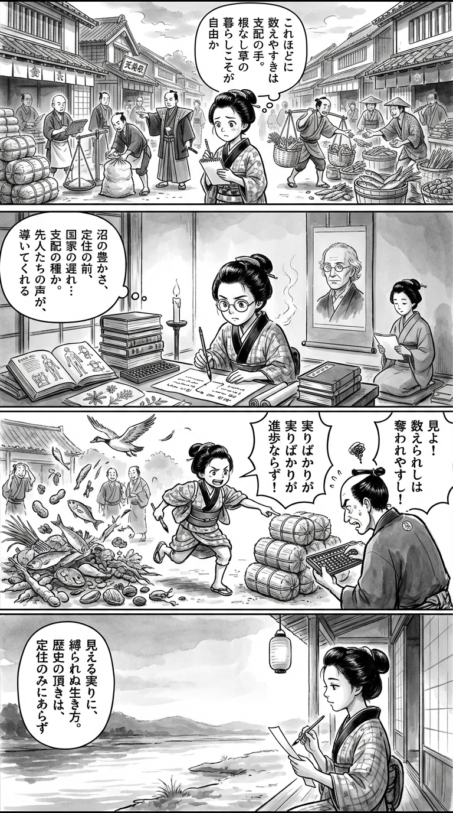

---
---
> **Language**: [日本語](../ja/反穀物の人類史――国家誕生のディープヒストリー_review.html) | [English](../en/反穀物の人類史――国家誕生のディープヒストリー_review.html) | [繁體中文](../zh-tw/反穀物の人類史――国家誕生のディープヒストリー_review.html)
>
> [← Top / トップページ](../../)

## 📖 書籍情報
- **タイトル**: 反穀物の人類史――国家誕生のディープヒストリー
- **著者**: ジェームズ・C・スコット and 立木勝
- **ASIN**: B082NXLMJH
- **URL**: [https://www.amazon.co.jp/dp/B082NXLMJH](https://www.amazon.co.jp/dp/B082NXLMJH)

---

## 🎯 この本の核心
本書の核心は、定住・農耕・国家を一直線の進歩として並べる人類史の常識を、深い時間軸から根本的に疑い直すところにあります。定住は農耕よりも早く成立しえたし、国家は農耕の当然の帰結ではなく、かなり遅れて現れた特殊な制度にすぎない――この視点の転換が全編を貫いています。

さらに著者は、初期国家を栄光ある文明の出発点としてではなく、穀物・人口・労働を可視化し、把握し、徴収する装置として描きます。そこで重視されるのは、食べ物としての穀物の価値だけではなく、課税しやすく、貯蔵しやすく、統治しやすいという政治的性質です。

同時に本書は、農耕化や定住化が人間をより幸福で自由にしたという通念にも厳しく反論します。感染症、栄養の偏り、労働拘束、強制、逃亡、国家崩壊といった側面を前景化することで、人類史を国家の側からではなく、その外部や周縁から見直す知的挑戦になっています。

---

## 💡 キーインサイト
- **定住は農耕の結果ではなく、豊かな生態環境のなかで先に成立しうる**
  本書は、定住が畑作の開始によって初めて可能になったという通説を崩します。とりわけ湿地のような生態的に豊かな地域では、農耕以前でも十分に安定した暮らしが可能だったという指摘は、「文明化は欠乏から始まる」という物語を相対化します。

- **国家の誕生には長い時間差があり、それ自体が非必然性を示している**
  農耕と定住の開始から国家成立までに数千年規模の隔たりがあるという点は、本書でもっとも説得力のある論点の一つです。国家は自然発生的な完成形ではなく、特定条件のもとでようやく成立した、歴史的にかなり不安定な制度だったと見えてきます。

- **穀物は栄養源である以上に、統治に向いた作物だった**
  著者が鋭いのは、穀物の重要性を生産性や文明の象徴としてではなく、徴税・記録・再分配の容易さから説明する点です。見える、数えられる、分けられる、運べるという性質が、国家権力の形成に深く結びついていたという見方は、食料と政治の関係を一段深く理解させます。

- **農耕化は解放ではなく、人間の“家畜化”でもあった**
  人間が自然を支配したのではなく、火や穀物や家畜を中心とする生活サイクルに人間の方が組み込まれていった、という逆転の発想が印象的です。これにより、効率化や定住化を自動的に進歩とみなす近代的感覚そのものが問い直されます。

- **国家の外部にいた人びとは、未開ではなく別の自由の担い手だった**
  “野蛮人”とは文化的に劣った存在ではなく、国家に包摂されていない政治的存在だという本書の整理は重要です。国家の外にいることは遅れではなく、場合によっては課税、徴兵、疫病、強制労働から距離を取る合理的な選択だったという視座が、歴史理解を大きく変えます。

---

## 🔍 現代的文脈との関連
本書の問題提起は、現代の集中管理社会を考えるうえでも示唆的です。可視化、標準化、記録、人口把握といった国家の基本技術は、今日では行政データ、監視技術、プラットフォーム管理、サプライチェーンの最適化といった形でより精密になっています。そのため本書は、何が「見える化」され、誰がその利益を得るのかを問い返す読書としても機能します。

また、気候変動、感染症、食料安全保障の不安が続く時代において、単一作物への依存や過度な集中の脆さを考える材料としても本書は読めます。もちろん本書は現代政策論そのものではありませんが、多様な生業、分散性、移動可能性、周縁の知恵といった論点は、持続可能性を考える際の想像力を豊かにしてくれます。

さらに、主流制度の外にある暮らしや共同体を、ただ「遅れている」と見なさない視点も現代的です。地方、先住民社会、非標準的な働き方や生活様式を評価する際に、包摂だけを善としない姿勢は、同質化圧力の強い現代社会に対する静かな批評になります。

---

## 🚀 実践への提案
1. **「進歩」の語りを見たら、その背後の時間差を確かめる**
   何かが便利になった、制度化された、大規模化したという事実を、そのまま進歩と受け取らないことが第一歩です。何が先に存在し、何が後から管理可能な形に整えられたのかを意識すると、歴史だけでなく現代社会の制度設計も批判的に見られるようになります。

2. **可視化や数値化に出会ったとき、“誰のための整理か”を問う**
   本書が示すように、記録や標準化は中立的な知ではなく、統治と結びつく力でもあります。仕事、教育、行政、健康管理の場で数値や一覧表に接したとき、それが誰を助け、誰を従わせやすくするのかを考える習慣は、現代的なリテラシーとして有効です。

3. **効率よりも、多様性と分散を生活設計の基準に加える**
   単一の収入源、単一の食習慣、単一のコミュニティへの依存は、平時には効率的でも、危機には脆くなります。本書の視点を借りれば、複数の選択肢を持つこと、生活の足場を分散させることは、自由や回復力を高める現実的な工夫だと理解できます。

4. **主流から外れた生き方を、劣位ではなく別様の合理性として見る**
   国家や市場の中心から距離を取る暮らし方に触れたとき、すぐに時代遅れと決めつけないことが大切です。本書は、周縁には非効率ではなく、別の適応力や自由があることを教えます。読後は、自分の価値判断のものさし自体を見直すことができるでしょう。

---

## ⭐ 総合評価
『反穀物の人類史』は、文明史の教科書的常識に深い亀裂を入れる、刺激的で挑発的な一冊です。国家、農耕、定住を疑うというテーマだけを見ると極端に感じられるかもしれませんが、本書の価値は単なる逆張りではなく、見慣れた歴史叙述の前提を丹念に崩し、別の見え方を与えてくれる点にあります。

とくに、国家の外部や周縁に光を当てたい読者、進歩史観に違和感を持つ読者、統治と可視化の関係に関心のある読者には強く響くはずです。読後には、人類史についての理解が変わるだけでなく、現代の制度や便利さに対する感覚まで少しずれる。その知的な“ずれ”こそが、この本の最良の読書体験です。

---

&copy; shioki | [CC BY-NC-SA 4.0](https://creativecommons.org/licenses/by-nc-sa/4.0/)
