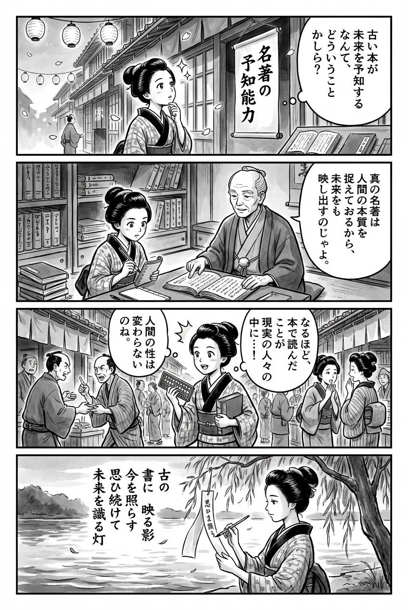

> **Language**: [日本語](../ja/名著の予知能力_review.html) | [English](../en/名著の予知能力_review.html) | [繁體中文](../zh-tw/名著の予知能力_review.html)
>
> [← Top / トップページ](../../)

## 📖 書籍情報
- **タイトル**: 名著の予知能力  
- **著者**: 秋満吉彦  
- **ASIN**: B0C581FVB5  
- **URL**: [https://www.amazon.co.jp/dp/B0C581FVB5](https://www.amazon.co.jp/dp/B0C581FVB5)

---

<picture>
  <source srcset="../../images/reviews/名著の予知能力_4panel.webp" type="image/webp">
  
</picture>
## 🎯 この本の核心
『名著の予知能力』は、NHK「100分 de 名著」のプロデューサーである秋満吉彦が、古典文学の中に潜む「未来を読む力」を探る知的冒険である。著者は、名著が未来を「予知」しているように見えるのは、そこに描かれた人間や社会の本質が時代を超えて普遍的だからだと説く。  

本書は、番組制作の舞台裏を通じて、古典を単なる知識ではなく「現代を読み解く教科書」として再生させる試みを描く。科学技術の倫理、資本主義の暴走、戦争や差別といった現代的課題に、名著がどのように光を当てるかを具体的に示している。  

さらに、著者は「概念の力」をレンズにたとえ、名著を読むことが思考の解像度を高め、民主主義や共感を支える教養の再生につながると論じる。名著とは、過去の遺産ではなく、未来を生き抜くための知的武器なのだ。

---

## 💡 キーインサイト
- **名著の予知力は「普遍性」から生まれる**  
　名著が未来を当てるように見えるのは、著者たちが人間の本質を徹底的に掘り下げた結果である。普遍性を獲得した思想は、どの時代にも再解釈され、現代の問題を照らす。

- **「わかりやすさ」は思考停止を招く**  
　メディアや教育が「わかりやすさ」を優先することで、複雑な問題を単純化し、議論を閉ざしてしまう危険がある。思考を続けることこそ、全体主義への抵抗であると著者は警鐘を鳴らす。

- **教養は民主主義を守る防波堤である**  
　教養とは知識の量ではなく、異なる意見を尊重し、熟議を重ねる態度である。戦争や分断を防ぐために必要なのは、この「思考する教養」だと本書は強調する。

- **他者の声を「我が事」として引き受ける倫理**  
　アレクシエーヴィチや河合隼雄の章を通じて、他者の痛みに耳を傾け、共感する姿勢の重要性が語られる。共感は感情ではなく、倫理的な実践として提示される。

- **「本棚の編集」が創造性を生む**  
　異なるジャンルの本を並べ替えることで、偶発的な知の出会いが新たな発想を生む。知の創造は、異質なものを接続する編集的思考から生まれると説かれる。

---

## 🔍 現代的文脈との関連
AIや監視社会の進展が加速する2020年代、オーウェル『1984年』やハクスリー『すばらしい新世界』といったディストピア文学が再評価されている。秋満の論は、こうした再注目の背景を的確に説明する。名著の「予知能力」は、データではなく人間の洞察が未来を見通す力を持つことを示している。  

また、生成AIが創造性を模倣する時代にあって、「考え続ける」ことの価値は一層重みを増している。本書が提示する「教養による民主主義の防衛」は、情報過多と分断の時代における知的な抵抗の指針となる。文学の力を再発見することは、AI時代の人間らしさを取り戻す行為でもある。

---

## 🚀 実践への提案
1. **名著を現代の課題と接続して読む**
   古典を「過去の知識」としてではなく、現代社会の問題を読み解くための鏡として読む。これにより、読書が思考と行動を結ぶ実践となる。

2. **「わかりやすさ」に抗して問いを立てる**
   単純な答えに満足せず、「なぜそうなのか」「他の見方はあるか」と問い続ける。思考の継続が、自由を守る最も確かな手段である。

3. **「他者の声」を自分の問題として受け止める**
   ニュースや文学に触れる際、他人の痛みを切り離さず、自分の生活や判断に引き寄せて考える。共感は社会の分断を乗り越える第一歩となる。

4. **「教養」を日常の判断軸に据える**
   教養を知識の蓄積ではなく、熟議と多様性を支える思考態度として育てる。急がず、異なる意見を尊重する姿勢が、健全な社会を支える。

5. **「本棚の編集」を実践する**
   異なる分野の本を意識的に並べ替え、偶発的な出会いを生み出す。知の編集が、新しい発想と創造的思考を促す。

---

## ⭐ 総合評価
『名著の予知能力』は、古典を「未来を読む装置」として再定義する知的挑戦である。秋満吉彦は、名著を現代社会の鏡として読み替えることで、教養の再生と民主主義の再構築を提案する。  

本書は、思考を止めず、他者に耳を傾け、複雑な現実を受け止めるための「知の倫理書」として読むべき一冊である。AIと情報の洪水に揺れる時代にあって、名著が持つ「予知能力」は、未来を生き抜くための最も確かな羅針盤となるだろう。

---

&copy; shioki | [CC BY-NC-SA 4.0](https://creativecommons.org/licenses/by-nc-sa/4.0/)
