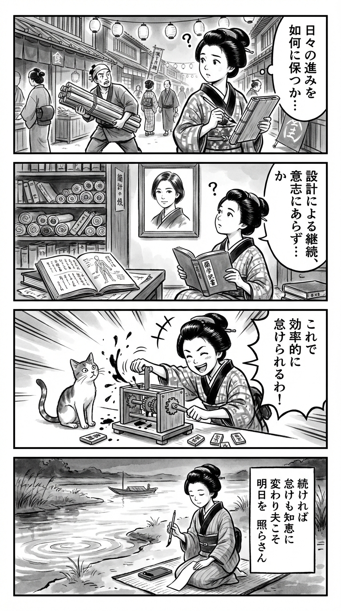

> **Language**: [日本語](../ja/大塚あみ-＃100日チャレンジ 毎日連続100本アプリを作ったら人生が変わった_review.md) | [English](../en/大塚あみ-＃100日チャレンジ 毎日連続100本アプリを作ったら人生が変わった_review.md) | [繁體中文](../zh-tw/大塚あみ-＃100日チャレンジ 毎日連続100本アプリを作ったら人生が変わった_review.md)
>
> [← Top / トップページ](../../index.html)

## 📖 書籍情報
- **タイトル**: ＃100日チャレンジ 毎日連続100本アプリを作ったら人生が変わった  
- **著者**: 大塚あみ  
- **ASIN**: B0DQ81M5TF  
- **URL**: [https://www.amazon.co.jp/dp/B0DQ81M5TF](https://www.amazon.co.jp/dp/B0DQ81M5TF)  

---

## 🎯 この本の核心
本書は、AI時代における「継続」と「自己成長」をテーマにした実践的な記録である。著者・大塚あみは、ChatGPTを活用しながら100日間で100本のアプリを作るという挑戦を通じて、創作と学びの関係を再定義していく。  

単なる努力や根性論ではなく、「怠けるための努力」や「仕組み化による継続」といった、Z世代らしい合理的かつ柔軟な発想が貫かれている点が特徴的だ。AIを使いこなすには人間の理解力が不可欠であるという洞察を軸に、著者は自分の特性を受け入れ、理性と感情のバランスを探るプロセスを描く。  

最終的に本書は、「自分のやり方で生きる」ことの価値を肯定し、AI時代における創造と自己理解の新しい形を提示している。

---

## 💡 キーインサイト
- **継続の中にしか成長はない**  
  勢いで始めた挑戦も、毎日続けるうちに「継続そのもの」が目的へと変化する。続けることでしか見えない成長の実感が、著者の行動を支えた。  

- **AIは使い手の知性を映す鏡である**  
  ChatGPTの限界を知ることで、AIを使いこなすには課題理解と批判的思考が不可欠だと気づく。AIを「答えを出す機械」ではなく「思考を深める相棒」として扱う姿勢が重要である。  

- **怠ける工夫が創造性を高める**  
  「サボるために全力を尽くす」という逆説的な哲学は、効率化と創造性の両立を示す。嫌なことを自動化することで、本当にやりたいことに集中できる環境を作る発想だ。  

- **習慣化は意志よりも強い**  
  ルーティンを固定し、考える前に動く仕組みを作ることで、モチベーションの波を超えて継続が可能になる。意志に頼らない仕組みづくりが、長期的な成果を支える。  

- **自己理解が創造の出発点である**  
  「嫌なことはしない」「興味のあることに没頭する」という性質を欠点ではなく才能と再定義する。自分を理解し、受け入れることが創造的エネルギーの源泉となる。  

---

## 🔍 現代的文脈との関連
本書のテーマは、2024〜2025年にかけて広がる「AI駆動型習慣形成」というトレンドと深く結びついている。ChatGPTを活用して毎日アプリを制作・公開するという行動は、Z世代が重視する「努力を仕組み化し、楽しみながら継続する」価値観を象徴している。  

SNS上では著者の挑戦に触発され、同様の「100日チャレンジ」投稿が増加した。これは、AIを単なる効率化ツールとしてではなく、自己変革の触媒として用いる新しい文化の萌芽を示す。  

また、昭和世代の「苦行的努力」から脱却し、「楽しみながら成果を出す」姿勢への転換が見られる点でも、本書は時代の転換点を記録した一冊といえる。生成AI黎明期の行動記録として、後年振り返られる価値を持つだろう。

---

## 🚀 実践への提案
1. **小さな改善を積み重ねる**  
   毎日完璧を目指すのではなく、「昨日より1％良くする」意識を持つ。微小な進歩の積み重ねが、長期的な変化を生む。  

2. **AIを補助輪として使う**  
   ChatGPTの回答をそのまま採用せず、吟味・修正することで思考力を鍛える。AIは効率化の道具であると同時に、思考の鏡でもある。  

3. **サボる仕組みを設計する**  
   面倒な作業を自動化し、創造的な時間を確保する。「怠けるための努力」は、結果的に生産性を高める戦略的発想である。  

4. **ルーティンを固定して意志に頼らない**  
   決まった時間に作業を行うことで、モチベーションの波に左右されない。継続を支えるのは意志ではなく仕組みである。  

5. **自分の特性を肯定的に再定義する**  
   自分の「偏り」や「癖」を否定せず、それを強みに変える視点を持つ。自己理解が、創造的行動の持続力を生む。  

---

## ⭐ 総合評価
『＃100日チャレンジ』は、AI時代の自己成長と創造のリアルを描いた等身大の記録である。努力を「仕組み化」し、AIと共に成長する姿勢は、現代の働き方・学び方に通じる普遍的な示唆を含む。  

特に、完璧主義に悩む人や継続が苦手な人にとって、本書は「自分のやり方で続ける」ための実践書となるだろう。AIを使いこなす技術書であると同時に、自己理解と行動変容の物語としても深く響く一冊である。

---

&copy; shioki | [CC BY-NC-SA 4.0](https://creativecommons.org/licenses/by-nc-sa/4.0/)
