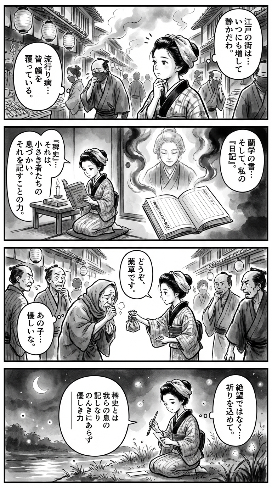

> **Language**: [日本語](../ja/東京ディストピア日記_review.html) | [English](../en/東京ディストピア日記_review.html) | [繁體中文](../zh-tw/東京ディストピア日記_review.html)
>
> [← Top / トップページ](../../)

## 📖 書籍情報
- **タイトル**: 東京ディストピア日記  
- **著者**: 桜庭一樹  
- **ASIN**: B0936XWP35  
- **URL**: [https://www.amazon.co.jp/dp/B0936XWP35](https://www.amazon.co.jp/dp/B0936XWP35)

---

<picture>
  <source srcset="../../images/reviews/東京ディストピア日記_4panel.webp" type="image/webp">
  
</picture>
## 🎯 この本の核心
『東京ディストピア日記』は、コロナ禍の東京を生きる著者が、日々の経験を「稗史」として記録した作品である。国家が描く「正史」に対し、個人の生活と感情を通して時代を捉え直す姿勢が貫かれている。  

社会の分断、倫理の揺らぎ、そして芸術の救済力が交錯する中で、著者は「他者への想像力」を人間の根源的な力として提示する。混乱の時代においても、優しさと想像力を失わずに生きることの意味を問い直す作品である。

---

## 💡 キーインサイト
- **「稗史」としての自己記録の意義**  
  個人の体験を歴史の一部として記すことは、国家的な物語に埋もれた「庶民の真実」を浮かび上がらせる行為である。著者は日常の記録を通じて、歴史の主体を再定義している。  

- **倫理的選択としての行動**  
  マスク着用をめぐる記述は、単なる衛生行為ではなく、他者への想像力と倫理を象徴する。個人の自由と公共の善のあいだで揺れる現代人の葛藤を、著者は鋭く描き出す。  

- **「のんきさ」がもたらす危機**  
  危機に対して鈍感な社会の「のんきさ」は、現実逃避と無責任の表れである。著者はこの無自覚を通じて、思考停止がいかに社会を脆弱にするかを警告する。  

- **芸術の救済力**  
  芸術は混乱の時代において人間の尊厳を支える力である。著者は「本物の芸は有事に人を救う」と語り、芸術が希望の回復装置であることを示す。  

- **他者への想像力と優しさの回復**  
  終盤の「寄り添え、議論しろ、そして優しくなれ」という呼びかけは、分断を超えるための倫理的宣言である。想像力を通じて他者とつながることが、未来への唯一の道だと説く。

---

## 🔍 現代的文脈との関連
本書の「ディストピア」は、監視社会や全体主義を描く古典的ディストピアとは異なり、現実の東京に潜む倫理的・感情的な荒廃を照射する。パンデミック下の不安、分断、そして無関心は、AI監視や情報過多の現代社会にも通じる課題である。  

また、芸術を「人を救う力」として再評価する視点は、近年のアートとケア、社会包摂の議論とも響き合う。桜庭が描く「稗史」は、巨大な歴史の陰で見過ごされがちな生活者の声をすくい上げ、現代都市における人間性の再生を促している。

---

## 🚀 実践への提案
1. **日常を「稗史」として記録する**
   どんなに些細な体験も、時代の断片である。自分の感情や出来事を記録することで、歴史の中に自分の位置を見出せる。

2. **他者への想像力を行動に変える**
   他者を思いやる小さな選択——たとえば公共の場での配慮——が、社会の分断を和らげる第一歩となる。

3. **芸術に触れる時間を持つ**
   混乱の時代にこそ、芸術は心の免疫力を高める。読書、映画、音楽などを通じて、自分の感情を再生させることができる。

4. **「のんきさ」に気づき、思考を止めない**
   社会の空気に流されず、現実を見つめ続けることが重要である。危機感を保つことが、倫理的な行動の出発点となる。

5. **優しさと議論を両立させる**
   異なる意見を持つ他者と対話しながらも、思いやりを失わない姿勢を持つこと。これが、分断を超えるための最も現実的な方法である。

---

## ⭐ 総合評価
『東京ディストピア日記』は、パンデミックという現実の中で人間の倫理と想像力を問い直す、静かで深い記録文学である。桜庭一樹は、社会の亀裂や無関心を見つめながらも、芸術と優しさの力を信じる姿勢を貫く。  

この作品は、単なる日記ではなく、現代人が「どう生きるか」を問う思想書でもある。分断の時代においても他者を思い、日常を記録し続けることの尊さを再確認させてくれる一冊である。

---

&copy; shioki | [CC BY-NC-SA 4.0](https://creativecommons.org/licenses/by-nc-sa/4.0/)
