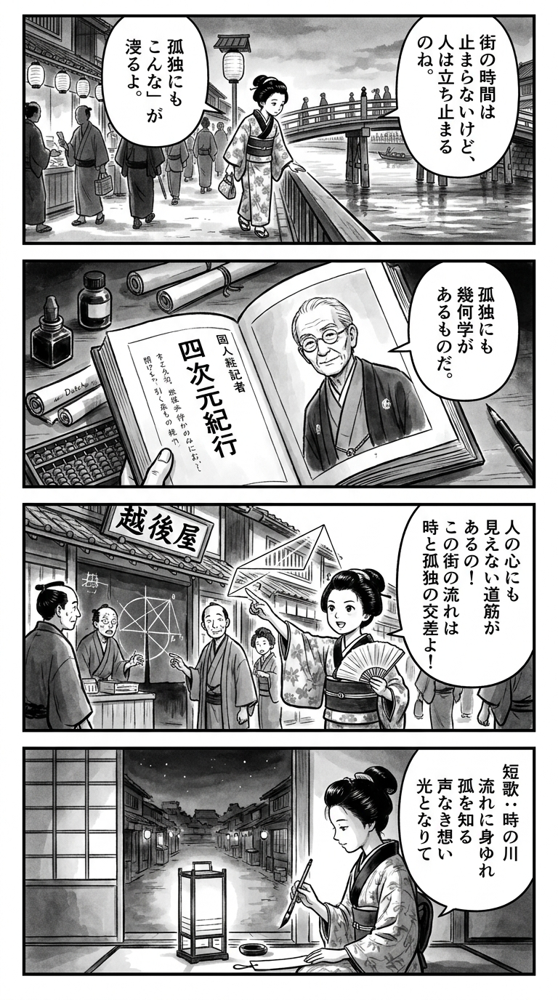

> **Language**: [日本語](../ja/東京四次元紀行_review.html) | [English](../en/東京四次元紀行_review.html) | [繁體中文](../zh-tw/東京四次元紀行_review.html)
>
> [← Top / トップページ](../../)

## 📖 書籍情報
- **タイトル**: 東京四次元紀行  
- **著者**: 小田嶋隆  
- **ASIN**: B0B1TY4RGC  
- **URL**: [https://www.amazon.co.jp/dp/B0B1TY4RGC](https://www.amazon.co.jp/dp/B0B1TY4RGC)

---

<picture>
  <source srcset="../../images/reviews/東京四次元紀行_4panel.webp" type="image/webp">
  
</picture>
## 🎯 この本の核心
『東京四次元紀行』は、東京という都市を舞台に、時間・孤独・崩壊・記憶といった人間存在の断片を描き出す都市文学である。小田嶋隆は、変化し続ける都市の速度と、人間の老い・停滞を対照的に描き、時間の不可逆性を鮮やかに浮かび上がらせる。  

同時に、孤独や依存、言葉の限界といった内面的なテーマを通じて、社会の「内側」と「外側」に生きる人々の姿を照射する。孤独を欠陥ではなく「天性」として肯定する視点は、現代社会における生存の倫理を問い直すものである。  

本書の核心は、変化と喪失を恐れず、流れ続けることそのものを「生」として肯定する姿勢にある。都市の時間と人間の時間が交錯する中で、読者は「生きるとは何か」という根源的な問いに向き合うことになる。

---

## 💡 キーインサイト
- **社会の秩序は「自己制御できる人間」によって構築されている**  
  社会は自制的で合理的な人々によって設計されており、その枠外にいる者は「局外者」としてしか生きられない。この構造を見抜くことで、現代社会の排除のメカニズムが浮かび上がる。  

- **孤独は欠陥ではなく、存在の一形態である**  
  孤独は治すべき病ではなく、むしろ社会の多様性を支える基盤である。孤独を肯定することで、他者との過剰な同調から自由になる視点が提示される。  

- **依存は崩壊であり、同時に慰めでもある**  
  アルコールや破滅への欲望は、自己崩壊を望む心理と結びつく。著者はその甘美さを否定も肯定もせず、冷静に観察することで人間の弱さを照らし出す。  

- **言葉を持たない者は世界の外側に追いやられる**  
  言語化できない感情を抱える者は、社会から見えにくくなる。沈黙の中にある誠実さを描くことで、言葉の支配構造そのものが問われている。  

- **人間は「捨てられなかったもの」でできている**  
  過去の未練や記憶の残骸が人格を形成する。人は完璧に更新される存在ではなく、「廃棄しそこなった経験」の結晶体として生きるという洞察が深い。

---

## 🔍 現代的文脈との関連
近年の東京は、再開発や観光化の進展とともに、「誰のための都市か」という問いが再び浮上している。服装や振る舞いにおける規範意識、あるいは「ダサさ」をめぐる社会的圧力は、都市の同調圧力を象徴する現象である。  

小田嶋の筆致は、こうした「見えない規範」に抗う都市生活者の視点と響き合う。彼が描く孤独や局外者の感覚は、現代の都市文化における包摂と排除の問題を先取りしている。  

また、SNSやAIによって言葉が加速度的に流通する時代において、「言葉を持たない者」の沈黙を描いた本書は、情報社会の影に潜む人間の不安と誠実さを再考させる契機となる。

---

## 🚀 実践への提案
1. **孤独を否定せず、肯定的に受け止める**
   孤独は欠陥ではなく、自己を見つめ直す契機である。他者との比較をやめ、自らの孤独を「生の形」として受け入れることが、自由への第一歩となる。

2. **「捨てられなかったもの」を再評価する**
   手放せない記憶や未練は、人格の礎である。それらを無理に消去するのではなく、自分の物語の一部として抱きしめることが、成熟した自己理解につながる。

3. **変化を恐れず、歩き続ける**
   都市も人も絶えず変化する。停滞を恐れるより、変化の中で自分を更新し続ける姿勢こそが、生の実感を取り戻す鍵となる。

4. **沈黙の価値を認める**
   言葉にできない感情を抱く自分を責めず、沈黙を誠実な表現として受け入れる。情報過多の時代において、沈黙はむしろ抵抗の形である。

5. **社会の「内側」と「外側」を意識して生きる**
   自分がどの位置に立っているかを自覚することで、社会の構造的な不平等を見抜ける。局外者の視点を持つことは、批評的思考の出発点となる。

---

## ⭐ 総合評価
『東京四次元紀行』は、都市の速度と人間の脆さを重ね合わせながら、現代社会の孤独と変化を描く比類なき都市批評である。小田嶋隆の観察眼は、東京という街の風景を通じて、私たち自身の「生のあり方」を問う。  

この本は、都市に生きるすべての人に向けた静かな問いかけであり、社会の「内側」に適応できない者たちへの優しいまなざしでもある。変化を恐れず、孤独を抱きしめながら歩くための、現代人のための哲学的紀行である。

---

&copy; shioki | [CC BY-NC-SA 4.0](https://creativecommons.org/licenses/by-nc-sa/4.0/)
