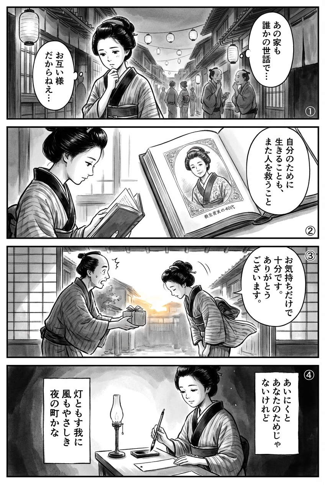

---
---
> **Language**: [日本語](../ja/柚木麻子-あいにくあんたのためじゃない_review.html) | [English](../en/柚木麻子-あいにくあんたのためじゃない_review.html) | [繁體中文](../zh-tw/柚木麻子-あいにくあんたのためじゃない_review.html)
>
> [← Top / トップページ](../../)

## 📖 書籍情報
- **タイトル**: あいにくあんたのためじゃない  
- **著者**: 柚木麻子  
- **ASIN**: B0CSYG5LJ3  
- **URL**: [https://www.amazon.co.jp/dp/B0CSYG5LJ3](https://www.amazon.co.jp/dp/B0CSYG5LJ3)

---

<picture>
  <source srcset="../../images/reviews/柚木麻子-あいにくあんたのためじゃない_4panel.webp" type="image/webp">
  
</picture>
## 🎯 この本の核心
『あいにくあんたのためじゃない』は、現代社会に生きる女性と男性たちの「誇り」と「みじめさ」を、仕事・家庭・友情といった生活の断面から描き出す群像劇である。母娘や友人、同僚といった人間関係の中で、他者との距離を測りながらも、自分の言葉と生き方を模索する姿が鮮やかに浮かび上がる。  

柚木麻子は、批評、贈与、労働、老い、そして地域の記憶といった多層的なテーマを通じて、「誰かのため」ではなく「自分のため」に生きることの尊厳を描く。その決意は、他者を拒絶するのではなく、むしろ他者を救う力として機能する。  
本作は、優しさと痛みが共存する現代のリアリズムを、生活の言葉で描いた作品である。

---

## 💡 キーインサイト
- **批評とは「嫌われる勇気」である**  
  登場人物の佐橋が示すように、真の批評は迎合ではなく、文化を守るための誠実な闘いである。好かれることよりも正直であることを選ぶ姿勢が、仕事にも人生にも通じる倫理を提示する。  

- **「ケチ」は自由の証である**  
  消費社会の中で「ときめきをお金で買わない」生き方を肯定する視点が新鮮だ。節約や倹約を「貧しさ」ではなく「自立」として描くことで、幸福の定義を再構築している。  

- **女性の連帯は誤解と贈与のあいだにある**  
  善意の贈り物が相手を傷つけることもあるという描写は、支援と支配の境界を問い直す。真の連帯とは、理解しきれない他者と共にいる勇気を持つことだと示唆する。  

- **「見えない仕事」が社会を支える**  
  商店街で店を続ける女性や、家庭と仕事を両立する母親たちの姿は、社会の基盤を支える「名もなき労働」を可視化する。彼女たちの「続けること」こそが、静かな抵抗であり希望である。  

- **老いと更新の共存**  
  過去を否定せず、古さを抱きしめながら新しい価値を見出す姿勢が描かれる。老いを衰退ではなく、再生の契機として肯定するまなざしが、作品全体に温かみを与えている。

---

## 🔍 現代的文脈との関連
本作が描く「SNSでの炎上」や「言葉の暴力」は、2024年以降の社会で顕在化する問題と深く響き合う。無意識の偏見やキャンセルカルチャーが横行する中で、柚木は「本物の言葉」とは何かを問い直す。  

また、「人のために生きること」への疲弊や、「期待される自分」からの解放を求める風潮とも共鳴する。SNS疲れや推し文化の過熱に倦んだ現代人にとって、この作品は「黙って同じ時間を過ごす」ことの意味を再発見させる。  

さらに、女性のキャリアや家庭内労働、地域コミュニティの再生といった社会課題を、説教ではなく物語として描く点が秀逸だ。現代のモヤモヤを言語化し、読者に静かな勇気を与える作品である。

---

## 🚀 実践への提案
1. **自分の感じたことを言葉にする勇気を持つ**
   「うまい」としか言えない感想を超え、感じたことを正直に表現する努力をする。迎合しない言葉が、誠実な関係と信頼を育てる。

2. **贈与の裏にある心理を見つめる**
   善意の行為が相手にどう受け取られるかを考える。支援やプレゼントが、相手の自尊心を損なわないよう、想像力を働かせることが大切だ。

3. **「続けること」を誇りにする**
   目立たない仕事や日々の積み重ねを軽視しない。続けることそのものが、社会を支える力であり、自分の尊厳を守る行為となる。

4. **生活から「本物の言葉」を紡ぐ**
   SNSの流行語や他人の意見に頼らず、自分の経験から言葉を生み出す。生活の中で感じたことを自分の言葉で語ることが、真の表現につながる。

5. **古さを受け入れ、更新を楽しむ**
   過去の自分や時代を恥じず、積み重ねとして受け入れる。変化を恐れず、古いものの中に新しい意味を見出す姿勢が、成熟した生き方を導く。

---

## ⭐ 総合評価
『あいにくあんたのためじゃない』は、現代の息苦しさを真正面から見つめ、そこに潜む優しさと誇りをすくい上げた作品である。柚木麻子の筆致は、痛みを伴いながらも読者を励ます温度を持つ。  

SNSや職場、家庭など、誰もが「他人の期待」と「自分の本音」の狭間で揺れる時代に、この本は「自分のために生きること」が他者への最大の誠実さであると教えてくれる。  
静かだが確かな希望を感じさせる、成熟した現代文学の到達点といえるだろう。

---

&copy; shioki | [CC BY-NC-SA 4.0](https://creativecommons.org/licenses/by-nc-sa/4.0/)
