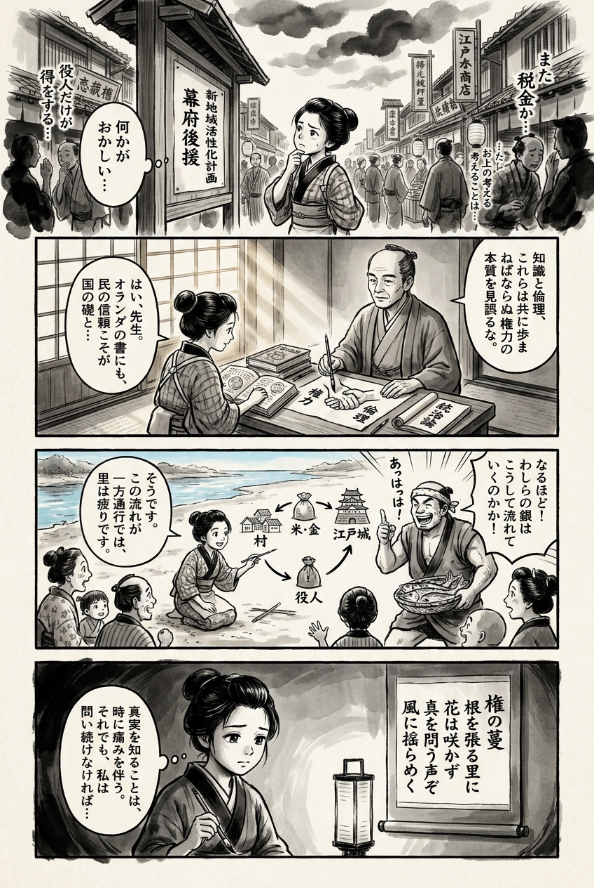

> **Language**: [日本語](../ja/楽園の瑕_review.html) | [English](../en/楽園の瑕_review.html) | [繁體中文](../zh-tw/楽園の瑕_review.html)
>
> [← Top / トップページ](../../)

## 📖 書籍情報
- **タイトル**: 楽園の瑕  
- **著者**: 相場英雄  
- **ASIN**: B0FDF13MHZ  
- **URL**: [https://www.amazon.co.jp/dp/B0FDF13MHZ](https://www.amazon.co.jp/dp/B0FDF13MHZ)

---

<picture>
  <source srcset="../../images/reviews/楽園の瑕_4panel.webp" type="image/webp">
  
</picture>
## 🎯 この本の核心
『楽園の瑕』は、「地方創生」という言葉の裏に潜む権力構造の腐敗を鋭く抉る社会派サスペンスである。相場英雄は、政治・官僚・企業の癒着がいかにして地域を疲弊させ、国民の生活を犠牲にしていくかを冷徹に描き出す。  

物語の中心には、正義を追う刑事・樫山と、贖罪を求める元官僚・古賀がいる。彼らの行動を通じて、個人の倫理と国家の腐敗、そして真実を暴く勇気の意味が問われる。  
また、環境破壊や情報監視といった現代的問題を背景に、人間の尊厳と再生の可能性を描く点に本作の深みがある。

---

## 💡 キーインサイト
- **「地方創生」は搾取の新たな装置である**  
　地方再生を謳う政策が、実際には中央の利益構造を維持するための仕組みとして機能している。相場はこの構造的搾取を暴き、地域の疲弊が制度的に再生産される現実を突きつける。  

- **倫理の欠如が国家を歪める**  
　登場人物の政治家や官僚たちは、国家を私物化し、外資や企業の利益を優先する。制度の問題よりも、個人の倫理の崩壊こそが社会の根幹を揺るがすと示している。  

- **情報は支配と抵抗の両刃の剣**  
　監視社会の現実を描きつつ、記者・池内が真実を暴く姿を通じて、情報が権力の武器にも、自由のための刃にもなり得ることを示す。  

- **正義にはリスクを取る覚悟が必要**  
　樫山や古賀の行動は、真実を追う者がいかに危険と隣り合わせであるかを物語る。安全圏に留まることでは正義は実現しないという、現実的な倫理の問いがある。  

- **環境と地域文化の喪失は不可逆である**  
　経済発展の名の下に破壊される自然や共同体の描写は、金銭では代替できない価値を訴える。人間の幸福とは何かを根底から問う視座がある。

---

## 🔍 現代的文脈との関連
現代日本では、地方の人口減少とコミュニティの崩壊が深刻化している。『楽園の瑕』が描く「地方創生の欺瞞」は、現実の政策課題と驚くほど重なる。補助金や再生事業が中央の利益に吸収される構造は、今日もなお続いている。  

また、SNSによる偏見の拡大や監視社会の進行は、情報の扱い方をめぐる倫理問題として現実味を増している。相場の描く「情報支配」と「真実の暴露」は、現代のメディア環境における報道の使命を再考させる。  
本作は、地方と中央、個人と国家、真実と虚偽という対立軸を通じて、現代社会の歪みを照射する鏡となっている。

---

## 🚀 実践への提案
1. **地方政策を自ら検証する視点を持つ**
   「地方創生」の名の下に行われる事業の実態を調べ、資金の流れや成果を確認することが、地域の自立を守る第一歩となる。

2. **情報リテラシーを高める**
   監視社会では、情報の出所と意図を見抜く力が不可欠である。報道やSNSを鵜呑みにせず、複数の視点から真実を見極める姿勢を持つべきだ。

3. **倫理に基づいた行動を優先する**
   短期的な利益よりも、社会全体の正義と誠実さを重視する判断が求められる。個人の倫理が社会の方向を決めるという本作の教訓を実践に移すことが重要である。

4. **環境と地域文化を守る選択をする**
   開発や投資の是非を考える際には、地域の自然や文化を守る視点を持つこと。経済合理性だけでなく、生活の質を重視する選択が未来を支える。

5. **真実を伝える報道を支援する**
   池内のような記者が真実を暴けるのは、市民の支持があるからこそである。独立した報道機関を支援し、社会の透明性を守る行動を取るべきだ。

---

## ⭐ 総合評価
『楽園の瑕』は、社会の構造的腐敗を暴くと同時に、個人の信念と倫理の力を描く重厚な社会派小説である。政治や経済の裏側を描きながらも、読後に残るのは「人間はどこまで正義を貫けるか」という普遍的な問いである。  

地方再生や環境問題、情報社会の倫理に関心を持つ読者にとって、本作は単なるフィクションではなく、現実を見つめ直すための鏡となるだろう。相場英雄の筆致は鋭く、同時に人間への希望を手放さない。社会の闇を描きながらも、そこに光を見出す一冊である。

---

&copy; shioki | [CC BY-NC-SA 4.0](https://creativecommons.org/licenses/by-nc-sa/4.0/)
