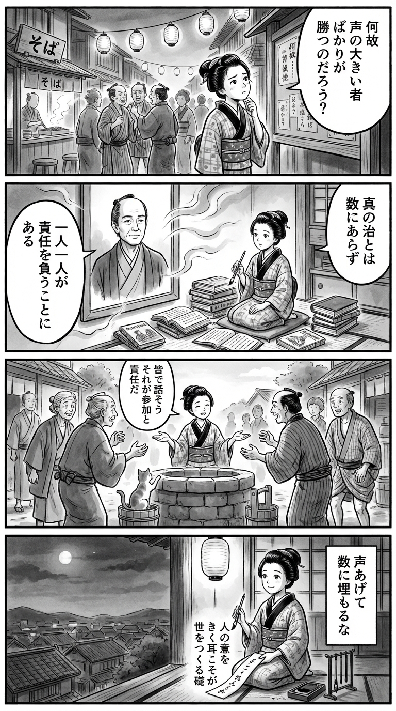

> **Language**: [日本語](../ja/民主主義とは何か_review.html) | [English](../en/民主主義とは何か_review.html) | [繁體中文](../zh-tw/民主主義とは何か_review.html)
>
> [← Top / トップページ](../../)

## 📖 書籍情報
- **タイトル**: 民主主義とは何か  
- **著者**: 宇野重規  
- **ASIN**: B08L3JY5B2  
- **URL**: [https://www.amazon.co.jp/dp/B08L3JY5B2](https://www.amazon.co.jp/dp/B08L3JY5B2)

---

## 🎯 この本の核心
『民主主義とは何か』は、民主主義を単なる政治制度ではなく、人間の自由・平等・責任に基づく「生き方」として再定義する試みである。宇野重規は、古代ギリシアから現代日本に至るまでの思想と制度の変遷を辿りながら、民主主義の理念と現実の乖離を浮き彫りにする。  

著者は、民主主義を「参加と責任のシステム」として捉え、市民一人ひとりの意識と行動が制度を支える根幹であると主張する。そのうえで、ポピュリズムやテクノロジーによる支配といった現代的危機を前に、民主主義を再構築するための思想的基盤を提示している。

---

## 💡 キーインサイト
- **民主主義は多数決ではなく、倫理的な制度である**  
　民主主義は単に数の論理で決まるものではなく、少数者の尊重を前提とする倫理的秩序である。著者は、多数決の背後にある「他者への配慮」という価値を再確認することで、民主主義の本質を取り戻そうとする。  

- **「政治」とは自由な人々の共同統治である**  
　古代ギリシアにおいて政治とは、支配ではなく、自由で平等な人々が公共の場で議論し決定する営みであった。この原点を思い出すことが、現代の政治的無関心を打破する鍵となる。  

- **民主主義の危機は「参加」と「責任」の喪失から生じる**  
　アルゴリズムやSNSによる情報の自動化が、人々の自律的判断を奪いつつある。民主主義を維持するには、思考と判断を他者と共有し、結果に責任を持つ文化を再構築する必要がある。  

- **自由主義との緊張を受け入れることが成熟の条件である**  
　民主主義と自由主義の間には常に緊張が存在する。著者はその矛盾を否定するのではなく、両立の努力こそが政治的成熟をもたらすと説く。  

- **AI時代における「人間性」の再確認**  
　テクノロジーが人間の判断を代替する時代において、民主主義の未来は共感と対話に基づく人間的能力の維持にかかっている。著者は「人間の理解力」が民主主義の最後の砦であると強調する。

---

## 🔍 現代的文脈との関連
本書の問題意識は、脱グローバル化やポピュリズムの台頭が進む現代社会において、極めて切実な意味を持つ。東アジアでは「法の支配と民主主義の成熟化」が議論され、日本でも政治意識の分断が深刻化している。こうした状況で、宇野が提唱する「参加と責任のシステム」は、民主主義を再生させるための現実的な指針となる。  

また、AIやアルゴリズムが意思決定を支配する時代において、民主主義の根幹である「人間の判断力」と「共感力」をどう維持するかは、世界共通の課題である。本書はその問いに対し、制度論を超えた人間学的な視座を提示している点で、時代を超える普遍性を持つ。

---

## 🚀 実践への提案
1. **公共的議論への積極的参加**
   SNSや地域活動など、身近な場での討論を通じて政治的関心を回復することが、民主主義の再生に直結する。対話の場に身を置くことが、政治を「自分ごと」として捉える第一歩である。

2. **政治への「責任感覚」を育む**
   投票や政策評価を単なる行為で終わらせず、その結果に責任を持つ意識を育てる。ウェーバー的な「責任倫理」を市民レベルで実践することが、制度の健全化を支える。

3. **情報の透明化を求める行動**
   政府や自治体の情報公開を監視し、オープンデータを活用することで、説明責任を社会的に強化する。透明性の確保は、民主主義の信頼を支える基盤である。

4. **教育による「正義感覚」の涵養**
   他者への配慮と公共心を育てる教育を重視する。民主主義は制度だけでなく、倫理的感受性の上に成り立つことを理解する必要がある。

5. **テクノロジー時代の人間性を意識的に守る**
   AIに依存しすぎず、人間の理解力・共感力・対話力を磨く努力を怠らないこと。これが、デジタル時代の「人間中心の民主主義」を実現する鍵となる。

---

## ⭐ 総合評価
『民主主義とは何か』は、制度論と思想史を往復しながら、民主主義の根源的な意味を問い直す知的冒険である。単なる政治学の教科書ではなく、「民主主義を生きるとはどういうことか」という倫理的・哲学的な問いを読者に突きつける。  

現代社会の分断や無関心に危機感を抱く読者にとって、本書は民主主義を「選び直す」ための羅針盤となるだろう。理論と実践をつなぐこの一冊は、政治に距離を置いてきた人にも、改めて「市民であること」の意味を考えさせる力を持っている。

---

&copy; shioki | [CC BY-NC-SA 4.0](https://creativecommons.org/licenses/by-nc-sa/4.0/)
