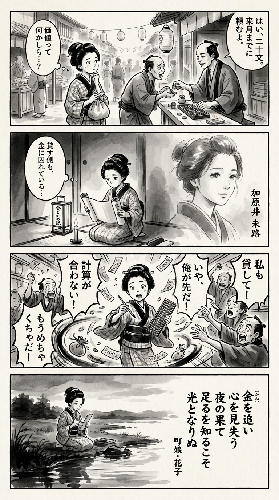

> **Language**: [日本語](../ja/消費者金融ずるずる日記_review.html) | [English](../en/消費者金融ずるずる日記_review.html) | [繁體中文](../zh-tw/消費者金融ずるずる日記_review.html)
>
> [← Top / トップページ](../../)

## 📖 書籍情報
- **タイトル**: 消費者金融ずるずる日記  
- **著者**: 加原井 未路  
- **ASIN**: B0D5L7D2S6  
- **URL**: [https://www.amazon.co.jp/dp/B0D5L7D2S6](https://www.amazon.co.jp/dp/B0D5L7D2S6)

---

<picture>
  <source srcset="../../images/reviews/消費者金融ずるずる日記_4panel.webp" type="image/webp">
  
</picture>
## 🎯 この本の核心
『消費者金融ずるずる日記』は、金銭に取り憑かれた人間模様を、貸す側と借りる側の両視点から描く実録的ドキュメントである。著者自身の体験を通じて、欲望と承認欲求がどのようにして借金という依存構造を生み出すのかを赤裸々に暴く。  

本書の特徴は、単なる「借金地獄記」ではなく、制度・倫理・人間性の三層を同時に描いている点にある。制度が正義を掲げても、現場の人間はその網の目からこぼれ落ちる。著者はその現実を、痛みとともに記録している。  

最終的に彼女は破産と喪失を経て、「足るを知る」生き方にたどり着く。金に支配される生から、金を超えて生きる生への転換が、本書の核心である。

---

## 💡 キーインサイト
- **欲望と金融依存の連鎖**  
  借金は単なる経済行為ではなく、欲望の延長線上にある。承認されたい、もっと良い暮らしをしたいという欲求が、やがて返済不能な依存へと変わる構造を本書は示している。  

- **貸す側もまた囚われている**  
  取立人もまた生活に追われる一人の人間であり、倫理より生存を優先せざるを得ない。貸す側と借りる側の境界は曖昧で、社会構造そのものが両者を同じ檻に閉じ込めている。  

- **制度の正義は現実を救わない**  
  総量規制や法改正といった制度改革が、かえって中小業者や弱者を追い詰める皮肉が描かれる。制度の整備だけでは、人間の苦悩を解消できないという現実が突きつけられる。  

- **破産後の再生は共感から始まる**  
  経験者の言葉が、再生の第一歩となる。理屈ではなく、同じ痛みを知る他者の存在こそが人を立ち直らせる力になることを著者は体現している。  

- **「足るを知る」ことの再発見**  
  金銭的成功ではなく、日常の安定と心の平穏に豊かさを見出す視点が提示される。失って初めて気づく幸福の本質を、読者に静かに問いかける。

---

## 🔍 現代的文脈との関連
近年の日本では、物価高や老後不安の中で家計が圧迫され、短期的な借入やカードローン依存が増加傾向にある。こうした状況は、本書が描く「ずるずると借金に沈む構造」と地続きにある。  

また、借金問題を個人の失敗ではなく、家計の不透明性や社会保障の不安といった構造的要因から捉える視点が強まっている。著者の描く「制度と現実の乖離」は、まさに現代社会の縮図である。  

本書は、金銭依存を社会的病理として描きながら、そこから抜け出すための人間的回復の道を提示する。物価上昇と不安定な労働環境の中で生きる現代人にとって、極めて切実なテーマを投げかける作品である。

---

## 🚀 実践への提案
1. **自分の欲望を定期的に点検する**
   「何を求めて金を使っているのか」を意識化することで、承認欲求や不安に基づく浪費を防ぐ。欲望の構造を可視化することが、依存の連鎖を断つ第一歩となる。

2. **小さな浪費を軽視しない**
   飲みかけのペットボトルや無駄な買い物など、日常の無意識な浪費が生活の歪みを生む。支出を記録し、生活のリズムと金銭感覚を一致させることが重要である。

3. **早期に相談・共有する**
   借金や家計の問題は、放置するほど深刻化する。家族や専門機関に早めに相談し、孤立を防ぐことが再生への鍵となる。

4. **「足るを知る」生活を設計する**
   収入の範囲内で満足する生活を意識的に築く。物質的な豊かさよりも、心の安定と人間関係の充実を重視することが、長期的な幸福につながる。

5. **他者の経験に学ぶ**
   同じ苦しみを経験した人の語りには、理屈を超えた力がある。再生のプロセスを共有することで、自らの立ち直りの道筋を見出せる。

---

## ⭐ 総合評価
『消費者金融ずるずる日記』は、金銭依存という現代的病理を、制度・倫理・人間の三層から描き出した稀有な記録である。著者の筆致は冷徹でありながら、最後には人間の再生への希望を見失わない。  

この本は、借金経験者だけでなく、消費社会の中で「もっと」を追い求め続けるすべての人に向けた警鐘である。読後には、金ではなく生き方そのものを問い直す静かな余韻が残る。

---

&copy; shioki | [CC BY-NC-SA 4.0](https://creativecommons.org/licenses/by-nc-sa/4.0/)
