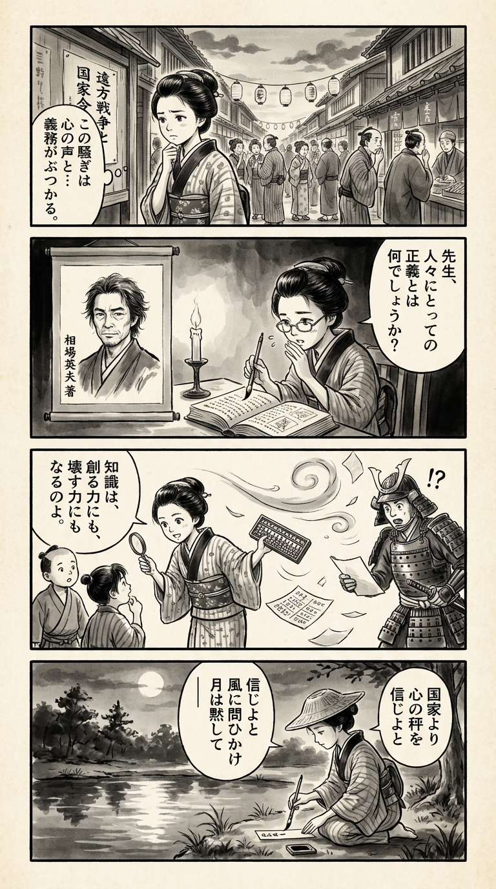

---
---
> **Language**: [日本語](../ja/相場英雄-ブラックスワン_review.html) | [English](../en/相場英雄-ブラックスワン_review.html) | [繁體中文](../zh-tw/相場英雄-ブラックスワン_review.html)
>
> [← Top / トップページ](../../)

## 📖 書籍情報
- **タイトル**: ブラックスワン  
- **著者**: 相場英雄  
- **ASIN**: B0FN67GLSL  
- **URL**: [https://www.amazon.co.jp/dp/B0FN67GLSL](https://www.amazon.co.jp/dp/B0FN67GLSL)

---

<picture>
  <source srcset="../../images/reviews/相場英雄-ブラックスワン_4panel.webp" type="image/webp">
  
</picture>
## 🎯 この本の核心
『ブラックスワン』は、国家の論理と個人の倫理が激しく衝突する現代社会を描いた社会派サスペンスである。元自衛官・城戸が国家の命令に背き、真実を追う姿を通して、「正義とは何か」「国家とは誰のためにあるのか」という根源的な問いを突きつける。  

物語は、公安、CIA、中国大使館といった諜報機関が入り乱れる情報戦の只中で展開する。科学技術の進歩が戦争の形を変え、経済活動が倫理を侵食する現実がリアルに描かれる。  

そして、戦争の記憶を伝える「無言館」の場面では、芸術が人間の尊厳を守る最後の砦として提示される。予測不能な「ブラックスワン」的事象が連鎖する世界で、読者は自らの信念と向き合うことを迫られる。

---

## 💡 キーインサイト
- **国家の論理が個人の正義を押し潰す**  
  城戸が「衝突の事実を墓場まで持っていけ」と命じられ除隊する過去は、国家が真実よりも体面を優先する構造を象徴している。国家への盲信がいかに個人の倫理を破壊するかを読者に痛感させる。

- **情報戦の裏に潜む暴走する正義**  
  公安部の「未然防止」という理念が、時に人間性を犠牲にする暴走へと変わる。正義を掲げる組織が自己目的化する危険を描き、現代社会における権力の腐食を鋭く突く。

- **テクノロジーが倫理を凌駕する現実**  
  全固体電池やドローンの軍事転用の描写は、技術革新が倫理的制御を超えて進む現代の危うさを示す。科学の進歩がもたらす「便利さ」と「暴力性」の両義性を問う。

- **戦争は遠い国の出来事ではない**  
  日本国内の物流に兵器部品が紛れ込む描写は、戦争が私たちの日常と地続きであることを突きつける。無関心でいることが、暴力の連鎖に加担することを示唆している。

- **芸術は人間の尊厳を記録する**  
  無言館で描かれる画学生たちの姿は、戦争の中でも創造を諦めなかった人々の証言である。芸術が歴史の暴力を超えて人間性を伝える力を持つことを静かに訴える。

---

## 🔍 現代的文脈との関連
本書の背景には、東アジアの地政学的緊張と、先端技術をめぐる国家間の覇権争いがある。相場英雄は、応用化学やエネルギー技術といった科学分野が、いかに国家戦略の一部として取り込まれていくかをリアルに描写している。  

2020年代後半の現実世界でも、技術覇権や情報戦は政治・経済の中心課題となっている。『ブラックスワン』は、ニュースの背後に潜む「見えない戦争」を物語として可視化し、読者にその構造を考えさせる。  

さらに、国家による越境的な監視や言論統制の問題は、グローバル社会における個人の自由と倫理の危機を象徴する。作品は、現代の安全保障と人間の尊厳をめぐる最前線を描いたフィクションでありながら、現実そのものへの鋭い批評でもある。

---

## 🚀 実践への提案
1. **情報を鵜呑みにせず、自ら調べる習慣を持つ**
   国家やメディアの発信をそのまま受け取るのではなく、複数の情報源を比較し、自分の頭で考えることが重要だ。情報戦の時代において、思考停止は最大のリスクとなる。

2. **技術の社会的影響を意識する**
   新技術が軍事や監視に転用される可能性を常に考慮すること。開発者・利用者の双方が倫理的責任を意識することで、技術の暴走を防ぐ一歩となる。

3. **戦争の記憶に触れ、平和を再定義する**
   無言館のような場所を訪れ、戦争に奪われた人々の声に耳を傾けること。歴史を知ることが、平和を守るための最も現実的な行動である。

4. **個人の倫理を守る勇気を持つ**
   組織や国家の命令に従うだけではなく、自らの信念に基づいて行動する覚悟を持つ。倫理的判断を他者に委ねないことが、自由社会の根幹を支える。

---

## ⭐ 総合評価
『ブラックスワン』は、社会派ミステリの枠を超えた現代の寓話である。国家、技術、戦争、芸術という異なる領域を一つの物語に結びつけ、読者に「現実をどう見るか」という根源的な問いを突きつける。  

相場英雄の緻密な取材と構成力により、フィクションでありながら現実以上のリアリティを放つ。政治や国際情勢に関心のある読者はもちろん、倫理や人間の尊厳を深く考えたい人にも強く響く一冊である。  

読む者にとって、この物語は単なるサスペンスではなく、「予測不能な時代をどう生き抜くか」を問う知的な挑戦状である。

---

&copy; shioki | [CC BY-NC-SA 4.0](https://creativecommons.org/licenses/by-nc-sa/4.0/)
