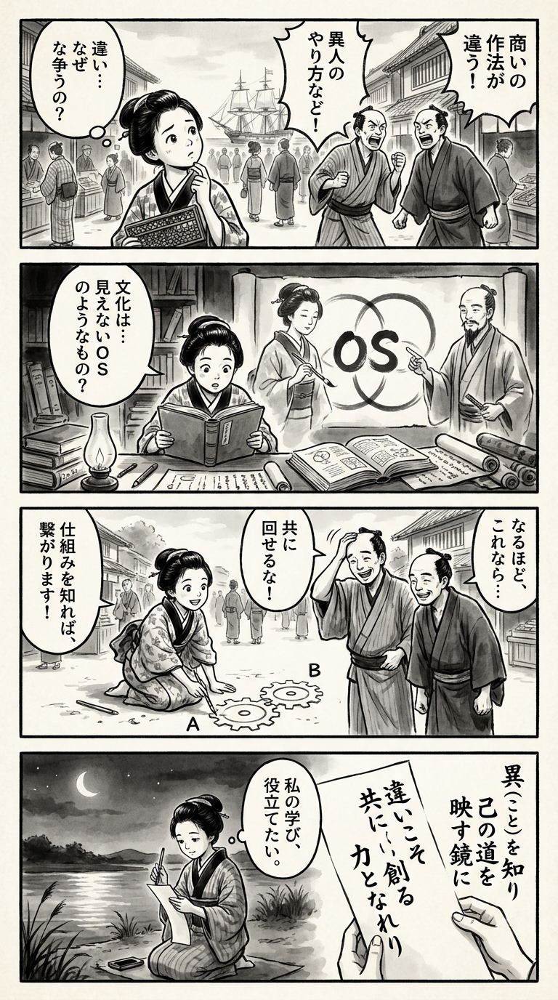

> **Language**: [日本語](../ja/経営戦略としての異文化適応力_review.html) | [English](../en/経営戦略としての異文化適応力_review.html) | [繁體中文](../zh-tw/経営戦略としての異文化適応力_review.html)
>
> [← Top / トップページ](../../)

## 📖 書籍情報
- **タイトル**: 経営戦略としての異文化適応力  
- **著者**: 宮森千嘉子 and 宮林隆吉  
- **ASIN**: B07Q4WJ8WQ  
- **URL**: [https://www.amazon.co.jp/dp/B07Q4WJ8WQ](https://www.amazon.co.jp/dp/B07Q4WJ8WQ)

---

<picture>
  <source srcset="../../images/reviews/経営戦略としての異文化適応力_4panel.webp" type="image/webp">
  
</picture>
## 🎯 この本の核心
『経営戦略としての異文化適応力』は、異文化理解を「個人のマナー」や「海外赴任者の心得」としてではなく、企業の競争力を左右する経営戦略上の能力として再定義している。著者は、海外経験の有無よりも「文化の違いを理解しようとする意識」こそが異文化適応力（CQ）を育むと説く。  

ホフステードの6次元モデルを軸に、文化的価値観が行動や意思決定にどのように影響するかを具体的に分析し、文化を「OS（オペレーティングシステム）」として捉える視点を提示する。自国文化を批判的に見直すだけでなく、その強みを異文化環境で活かす実践的な方法を探求している点が特徴である。  

本書の根底には、「多様性を受け入れ、共に未来を創る」という明確なビジョンがある。異文化適応力は単なるスキルではなく、共生社会を築くための基盤的能力として描かれている。

---

## 💡 キーインサイト
- **海外経験は適応力を保証しない**  
　経験の多寡よりも、文化を理解しようとする「意識と態度」が重要である。異文化適応力は、知識よりも認知の柔軟性によって育まれる。  

- **文化的違いを理解することが問題解決の前提**  
　ビジネス上の摩擦は、しばしば文化的背景の違いから生じる。相手の行動を文化の文脈で読み解くことが、信頼関係構築の第一歩となる。  

- **自国文化の再評価が異文化理解を深める**  
　日本の「稟議」や「合意形成」は非効率と見なされがちだが、実は多様な意見を吸い上げる強みを持つ。自国文化を再定義することが、グローバルな適応力を高める。  

- **文化をOSとして捉える視点**  
　経営理論やマネジメント手法は文化的文脈に依存している。他国の理論を導入する際は、自国の文化的OSに適合させる「翻訳」が必要である。  

- **多様性を受け入れる組織が持続的に成長する**  
　CQの高い組織は「違いを当然」として受け入れる。多様な視点を尊重する文化が、創造性とイノベーションの源泉となる。

---

## 🔍 現代的文脈との関連
本書の主張は、SDGsやパーパス経営の潮流と深く響き合う。企業が利益追求だけでなく、社会課題との共生を求められる時代において、異文化適応力は「共創のための経営資源」として再評価されている。  

また、AIの進化やVUCA化によって、組織は多様な意見を受け入れる柔軟性を求められている。異文化適応力は、変化への耐性と学習速度を高める「文化的筋力」として機能する。  

さらに、人口減少と人材不足が進む日本では、海外人材のみならず、世代・部門・職種間の「文化差」を調整できるリーダーが不可欠である。異文化適応力は、グローバル対応を超えた「組織内の越境能力」として位置づけられつつある。

---

## 🚀 実践への提案
1. **文化理解のツールを活用する**
   ホフステードの6次元モデルなどを用い、相手の行動や意思決定の背景を体系的に理解する。これにより、誤解や衝突を未然に防ぐことができる。

2. **自国文化を強みとして再定義する**
   自国の価値観や習慣を否定するのではなく、異文化環境でどう活かせるかを考える。文化的自覚が、真のグローバル対応力を生む。

3. **相手の物差しで考える**
   自分の常識を相手に押しつけず、相手の文化的背景を前提に意思決定や対話を行う。これが信頼を築く最短経路である。

4. **映画や旅を通じて異文化を学ぶ**
   映画は国民文化の縮図であり、旅は未知への問いを促す。日常的な学びとして異文化を体験的に取り入れることが推奨される。

5. **多様性を受け入れる組織文化を育む**
   「違っていることを当然」とする文化を醸成し、心理的安全性を確保する。これが創造的な議論とイノベーションを支える土台となる。

---

## ⭐ 総合評価
本書は、異文化理解を「経営の中核能力」として再定義した点で、グローバル時代の経営書として特筆に値する。単なる理論書ではなく、文化を実践的に読み解くための具体的なツールと視座を提供している。  

読者は、自身の常識を相対化し、文化を「違い」ではなく「資源」として再発見する経験を得るだろう。経営者、リーダー、人事担当者、そしてグローバルに働くすべての人にとって、組織と個人の変革を促す一冊である。

---

&copy; shioki | [CC BY-NC-SA 4.0](https://creativecommons.org/licenses/by-nc-sa/4.0/)
