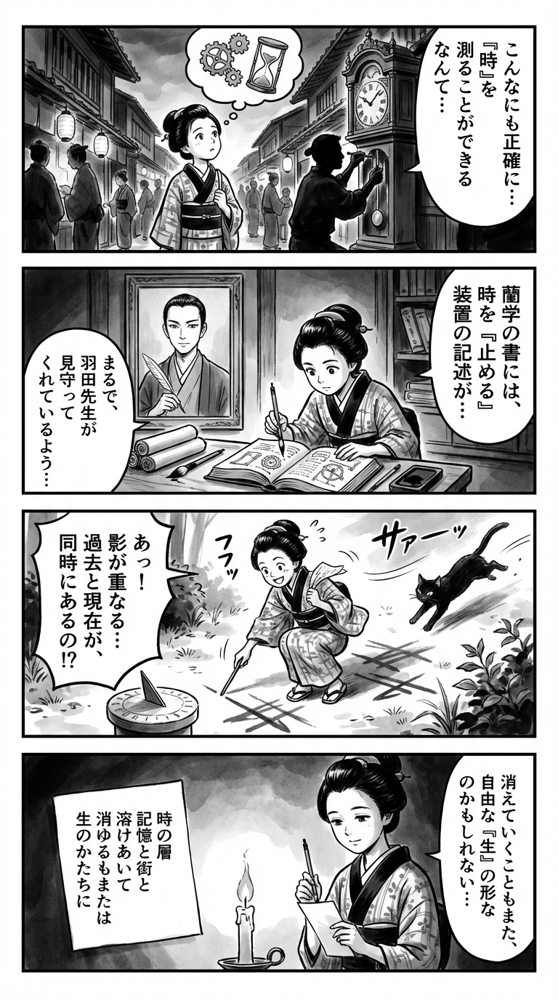

---
---
> **Language**: [日本語](../ja/羽田圭介-その針がさすのは_review.html) | [English](../en/羽田圭介-その針がさすのは_review.html) | [繁體中文](../zh-tw/羽田圭介-その針がさすのは_review.html)
>
> [← Top / トップページ](../../)

## 📖 書籍情報
- **タイトル**: その針がさすのは  
- **著者**: 羽田圭介  
- **ASIN**: B0FTQNPCKP  
- **URL**: [https://www.amazon.co.jp/dp/B0FTQNPCKP](https://www.amazon.co.jp/dp/B0FTQNPCKP)  

---

## 🎯 この本の核心
『その針がさすのは』は、時間・都市・身体・記憶という四つの軸を通じて、現代人の存在の揺らぎを描いた作品である。舞台は東京・中野。変わり続ける街の姿が、主人公の内面や夫婦関係の変化と呼応するように描かれる。  

不妊治療という極めて個人的な経験を通して、羽田圭介は「生の生成」と「時間の歪み」を重ね合わせる。冷凍保存や採精室といった科学的装置が、時間を凍結し、生命を操作する現代の倫理的・哲学的問題を浮かび上がらせる。  

そして、リモートワークやAI対応といった“非接触的な社会”の中で、人が「姿を現さないこと」が常態化する現代の実相を描き出す。時間も身体も、都市の中で溶け合い、やがて「消える」ことが新たな生の形として提示されるのだ。  

---

## 💡 キーインサイト
- **時間は非線形であり、層として存在する**  
  登場する複数の時計や「歪んだ時空」の描写は、人生が一本の線ではなく、重なり合う断片で構成されていることを示す。過去・現在・未来が同時に存在するという感覚は、読者に時間の再定義を迫る。  

- **都市は記憶のアーカイブであり、忘却の装置でもある**  
  中野という街の変化は、人間の記憶の変質を象徴する。街が更新されるたびに、かつての記憶が消えていく様は、現代都市が人間の存在そのものを上書きしていく過程を映し出す。  

- **生殖医療は“時間を凍結する技術”である**  
  冷凍保存によって生命を制御するという行為は、自然な時間の流れを止める試みであり、生命と時間の関係を根底から問い直す。ここに、科学技術が人間の存在論に介入する現代的問題が凝縮されている。  

- **“姿を現さないこと”が常態化する社会**  
  リモートワークやAI対応が当たり前になった現代では、実体を持たない存在が社会を構成している。羽田はその“非実体的な生”のリアリティを、静かな筆致で描き出す。  

- **“消える”ことは新しい自由の形でもある**  
  主人公が社会や家庭から逸脱する瞬間は、喪失であると同時に解放でもある。存在の希薄化を恐れず、むしろそこに自由の可能性を見出す視点が、この作品の核心的な哲学をなしている。  

---

## 🔍 現代的文脈との関連
本作は、第2回東京中野文学賞大賞を受賞し、地域文学と現代社会問題の交差点に立つ作品として注目を集めた。不妊治療というテーマは、2020年代後半の日本社会で少子化対策の一環として公的支援が拡大する中、より現実的な問題として多くの家庭に関わるものとなっている。  

また、都市の変化やリモート社会の描写は、コロナ禍以降の「非接触的な生活様式」を背景にした現代人の孤立感を象徴する。羽田はその孤立を悲劇としてではなく、むしろ“存在の再定義”の契機として描き、現代文学の中で新たな「都市の形」を提示している。  

---

## 🚀 実践への提案
- **自分の時間感覚を観察する**  
  日常を「直線的な時間」ではなく、重なり合う層として捉える練習をしてみよう。過去の記憶や未来への不安を、現在の中に共存させることで、時間に縛られない生き方を模索できる。  

- **都市の変化を記録する**  
  自分の街の変化を写真や日記で記録し、それを過去の記憶と照らし合わせてみる。街の変化を通して、自分自身の変化や記憶の揺らぎを客観的に見つめることができる。  

- **“消える時間”を意識的に持つ**  
  常時接続の社会の中で、意図的にデジタルから離れる時間を設ける。沈黙や孤独を恐れず、自分の存在を再構築するための空白を受け入れることが、現代的な「自由」につながる。  

- **身体を通じて現実を再確認する**  
  情報化社会で忘れられがちな身体感覚を取り戻す。歩く、触れる、呼吸するなど、身体を媒介にして現実を感じることが、存在の実感を回復させる。  

---

## ⭐ 総合評価
『その針がさすのは』は、時間と存在、都市と身体が交錯する現代の“存在の地図”を描いた作品である。羽田圭介は、不妊治療という極めて個人的な経験を通じて、現代社会全体の「実体の喪失」と「再生の可能性」を描き出す。  

読む者は、都市の喧騒の中で自分がどの時間に生きているのか、そして何を「指し示す針」を持っているのかを問われるだろう。静謐でありながら哲学的な余韻を残す一冊であり、現代の「存在することの意味」を考えたいすべての読者に薦めたい。

---

&copy; shioki | [CC BY-NC-SA 4.0](https://creativecommons.org/licenses/by-nc-sa/4.0/)
