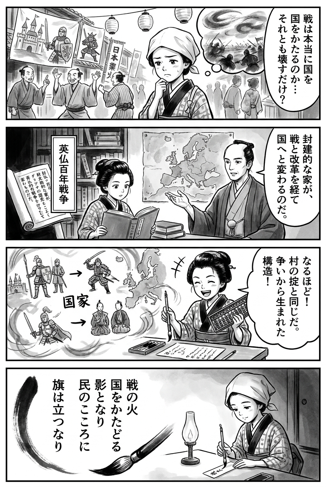

> **Language**: [日本語](../ja/英仏百年戦争_review.html) | [English](../en/英仏百年戦争_review.html) | [繁體中文](../zh-tw/英仏百年戦争_review.html)
>
> [← Top / トップページ](../../)

## 📖 書籍情報
- **タイトル**: 英仏百年戦争  
- **著者**: 佐藤賢一  
- **ASIN**: B014QLR6LY  
- **URL**: [https://www.amazon.co.jp/dp/B014QLR6LY](https://www.amazon.co.jp/dp/B014QLR6LY)

---

<picture>
  <source srcset="../../images/reviews/英仏百年戦争_4panel.webp" type="image/webp">
  
</picture>
## 🎯 この本の核心
『英仏百年戦争』は、単なる中世戦争の記録ではなく、「国家」という概念がいかにして誕生したかを描き出す壮大な文明史的叙述である。佐藤賢一は、封建的な「家」や「領地」をめぐる戦争が、次第に「国」と「国民」を意識した戦いへと変質していく過程を、政治・軍事・思想の三層から描いている。  

本書の中心には、戦争が国家形成を促すという逆説がある。中央集権化の進展、財政と軍制の改革、そして民衆のナショナリズムの芽生えが、百年戦争という長期的な対立の中で絡み合い、近代国家の原型を生み出していく。著者はまた、歴史を「物語」として消費する危険を指摘し、史実を批判的に読み解く視座を提示している。

---

## 💡 キーインサイト
- **戦争は国家を生む装置である**  
  英仏百年戦争は、単なる領土争いではなく、戦争そのものが国家形成を促す原動力となった。戦時の徴税制度や常備軍の整備が、王権の強化と中央集権化をもたらした点は、現代の国家制度の原型を示している。  

- **「上から」と「下から」の意識変革が国家を完成させる**  
  シャルル七世の改革は、支配者の意志だけでなく、民衆が「フランス人としてフランスを思う」意識に支えられた。国家は制度だけでなく、民衆の共感と自己認識によって成立するという洞察が示されている。  

- **技術革新が社会構造を変える**  
  長弓や弩の登場によって、騎士階級の戦闘優位が崩れ、封建的秩序が動揺した。技術は単なる軍事的手段ではなく、社会の階層構造や価値観を根底から変える力を持つ。  

- **歴史の「物語化」を疑う**  
  シェークスピアによるヘンリー五世像のように、後世の文学が史実を歪めることがある。著者は、歴史を読む際に「誰が語っているか」を問う批判的思考の重要性を強調する。  

- **歴史は常に次の分岐点を迎える**  
  結語で著者は「そろそろ次の分岐点が訪れてよい」と述べる。過去の転換点を理解することは、現代社会の変化を見通すための感覚を養う行為である。

---

## 🔍 現代的文脈との関連
近年、英仏百年戦争は単なる戦記ではなく、「国家形成の原点」として再評価されている。英仏関係は、かつての敵対から協調へと変化し、英仏協商や世界大戦での同盟など、長期的な関係史の中で読み直されている。こうした流れの中で、本書は「対立が国家をつくる」という歴史の逆説を現代に照らし出す。  

また、ジャンヌ・ダルクの再評価やナショナリズムの起源をめぐる議論は、グローバル化時代の「アイデンティティの再構築」とも響き合う。佐藤の筆致は、国家や民族の物語を批判的に読み直す契機を与え、現代の政治的・文化的課題に通じる洞察を提示している。

---

## 🚀 実践への提案
1. **歴史を「構造変化」として読む**
   勝敗や英雄譚にとらわれず、社会の制度や意識がどう変わったかに注目することで、現代の政治や社会の根を理解できる。

2. **技術革新の社会的影響を見極める**
   中世の長弓が社会を変えたように、AIや通信技術も現代の秩序を再編している。技術の導入がもたらす制度変化を意識することが重要である。

3. **物語化された歴史を疑う**
   歴史を読む際には、語り手の立場や時代背景を意識し、史実と物語を区別する姿勢を持つべきである。

4. **「上から」と「下から」の変化を両面で考える**
   政治的改革と民衆の意識変革が相互に作用して社会を動かす。現代の改革もこの二重構造を理解することで効果的に進められる。

5. **次の分岐点を意識して行動する**
   歴史の転換点を学ぶことは、未来の変化を見抜く力を養う。社会や組織の「次の転機」を見極める感覚を持つことが、個人の行動を導く。

---

## ⭐ 総合評価
『英仏百年戦争』は、戦争史を超えて「国家とは何か」「国民とは誰か」を問う知的挑戦である。佐藤賢一は、制度・民衆・思想の三位一体的な変化を通して、現代国家の起源を鮮やかに描き出した。  

歴史を単なる過去の出来事ではなく、現在を照らす鏡として読む読者にとって、本書は格好の一冊である。国家や社会の変化を長期的な視野で捉えたい人に、深い洞察と知的刺激を与えるだろう。

---

&copy; shioki | [CC BY-NC-SA 4.0](https://creativecommons.org/licenses/by-nc-sa/4.0/)
